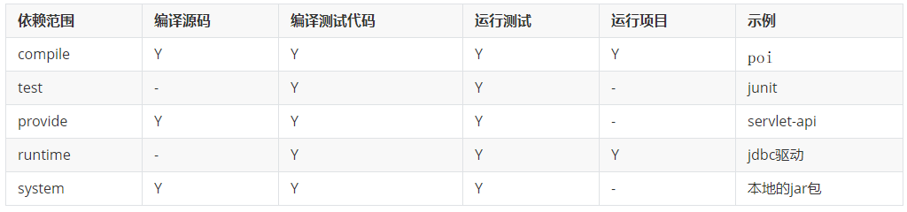
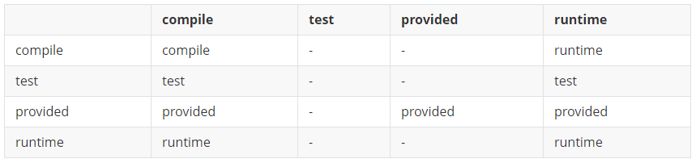

# Maven【上班第一天】

### 0. 为什么我们需要maven?

---

我们没有经历的那个年代,所有项目中需要的jar包都是自己管理的，带来了一堆痛苦的事情...

#### 1.jar包自己管理难难难

- 找包难、冲突难、管理难

#### 2.相关依赖都是手动管理

- A包--》C包----》D包 所有包都是自己手动维护

#### 3.项目目录结构每个公司都不一样

- 每个公司自己维护自己项目，代码存放的习惯和目录不尽相同，换工作需要适应新习惯

​	

### 1. Maven简介？

---

- Apache-maven时一款免费的、java实现的**项目管理**和**构建工具**。

- Maven可以自动下载我们需要的jar包，我们只需要提供jar包的坐标西信息，不再需要手动复制jar包到lib下了。

- Maven还提供了一系列的命令 可以编译、测试、打包、安装 完成对某个工程的操作。

- maven的官网: maven.apache.org 

- maven的中央仓库:mvnrepository.com

- maven管理的jar,每一个jar包都有一个唯一的标识，这个标识叫**坐标**，通过坐标可以唯一定位一个jar包

  ~~~xml
  <dependency>
  	<groupId>mysql</groupId>
  	<artifactId>mysql-connector-java</artifactId>
  	<version>8.0.22</version>
  </dependency>
  ~~~

  

- Maven也会自动管理jar包依赖的其他的jar包，会自动导入，不需要我们再引入关联的其他jar包了

  

### 2. 安装配置?

---

- #### 安装

Maven也是一款绿色软件，解压即安装。把maven解压到一个没有中文的目录下【和Tomcat无关。】

- #### 配置环境变量

  - JAVA_HOME:
  - MAVEN_HOME:MAVEN的解压路径
  - PATH:;%MAVEN_HOME%\bin
  - 检查 ： cmd===> mvn  -v

- #### 配置镜像和本地仓库

  - Maven寻找jar的时候，会首先再本地（开发人员自己电脑上），找不着才去中央仓库，需要配置本地仓库目录地址。

  - Maven的本地仓库默认是:C:\Users\用户名\\.m2下

  - 配置镜像地址
  
    ~~~
    	<mirror>
    	  <id>alimaven</id>  
    	  <name>aliyun maven</name>  
    	  <url> 
    	 http://maven.aliyun.com/nexus/content/groups/public/
    	 </url> 
    	 <mirrorOf>central</mirrorOf>          
  	</mirror>  
    ~~~
  
    

### 3. 创建工程?

---

maven工程的目录结构：


工程名字

​	===src

​		====main

​				===java

​				===resources

​			  ===webapp

​		====test

​			===java

​			===resources

   ===pom.xml

### 4. 核心生命周期命令？

---

maven有三套生命周期，clean\site\default,其中clean是删除target目录，site是把项目部署到远程仓库，default中包含一堆常见命令，常用的如下:

- mvn compile 编译

  ~~~
  1. cmd=>mvn compile
  
  2. 默认到c:\用户\.m2下寻找settings.xml 使用其配置，如果没有，则到maven_home对应的目录中的conf/settings.xml，使用其配置
  
  3. mvn 根据配置到中央仓库寻找compile插件下载，然后运行，编译整个项目
  ~~~

- mvn test 测试: 1.compile 2.test 

- mvn package 打包  1.compile 2.test 3.package

- mvn install 安装:把jar包复制到本地仓库

- mvn clean:删除target

### 5. pom.xml文件的内容介绍?

---

1. 当我们在项目中需要用到maven帮我们解决jar包依赖问题，帮我们解决项目中的编译、测试、打包、部署时，都会去寻找使用pom.xml中的配置，pom.xml相当于前端工程中的package.json。其中包含了项目的基本信息，用于描述项目如何构件，声明项目依赖，等等。

2. 执行任务或目标时，Maven 会在当前目录中查找 POM。它读取 POM，获取所需的配置信息，然后执行目标。

3. POM 中可以指定以下配置：

- 项目依赖
- 插件
- 执行目标
- 项目构件 profile
- 项目版本
- 项目开发者列表

在创建 POM 之前，我们首先需要描述项目组 (groupId)，项目的唯一ID

4.基本结构

~~~xml
<?xml version="1.0" encoding="UTF-8"?>
<project xmlns="http://maven.apache.org/POM/4.0.0"
         xmlns:xsi="http://www.w3.org/2001/XMLSchema-instance"
         xsi:schemaLocation="http://maven.apache.org/POM/4.0.0 http://maven.apache.org/xsd/maven-4.0.0.xsd">
    <!-- 模型版本 默认就是4.0.0 必填 -->
    <modelVersion>4.0.0</modelVersion>
	<!---->
    <!-- 定义当前groupId:通常与域名反过来一一对应 域名倒过来[+项目名] -->
    <groupId>com.etoak</groupId>
    <!--项目的唯一ID，一个groupId下面可能多个项目，就是靠artifactId来区分的不同项目或者模块 项目名字[+模块名字]-->
    <artifactId>student-service</artifactId>

    <!-- 版本号 -->
    <version>1.0-SNAPSHOT</version>
    <!--packaging:打包方式 jar是打jar包 war：打war包放到tomcat等web服务器中运行 pom:父子工程-->
    <packaging>jar</packaging>
<!--我们写这些就是定义坐标，当别人用我们写的jar包时，需要提供以上坐标，就如同我们用别人的jar包，需要提供坐标信息一样-->
     <dependencies>
        <!-- 所有的该项目依赖的坐标的信息都放在这里 -->
        <dependency>
            <groupId>依赖的其他包的groupid</groupId>
            <artifactId>依赖的其他包的artifactId</artifactId>
            <version>版本</version>
            <type>依赖类型默认就是jar 即：jar包</type>
            <scope>依赖范围，在编译源码、编译测试代码、运行测试代码、运行项目等不同阶段所依赖的jar包也不同，所以这个范围用来标注引入的jar包在什么阶段起作用</scope>
            <optional>是否可选</optional>
            <exclusions>
                <exclusion>排除选项</exclusion>
                <exclusion></exclusion>
            </exclusions>
        </dependency>
    </dependencies>
</project>
~~~

### 6. Maven中引入jar包的Scope范围？

---



#### compile

编译依赖范围，如果没有指定，默认使用该依赖范围，**对于编译源码、编译测试代码、测试、运行4种classpath都有效**，比如上面的poi的包。

#### test

测试依赖范围，使用此依赖范围的maven依赖，**只对编译测试、运行测试的classpath有效，在编译主代码、运行项目时无法使用此类依赖**。比如junit，它只有在编译测试代码及运行测试的时候才需要。

#### provide

已提供依赖范围。表示项目的运行环境中已经提供了所需要的构件，对于此依赖范围的maven依赖，**对于编译源码、编译测试、运行测试中classpath有效，但在运行时无效**。比如上面说到的servlet-api，这个在编译和测试的时候需要用到，但是在运行的时候，web容器已经提供了，就不需要maven帮忙引入了。

#### runtime

运行时依赖范围，使用此依赖范围的maven依赖，**对于编译测试、运行测试和运行项目的classpath有效，但在编译主代码时无效**，比如jdbc驱动实现，运行的时候才需要具体的jdbc驱动实现。

#### system【了解】

系统依赖范围，该依赖与3中classpath的关系，和provided依赖范围完全一致。但是，使用system范围的依赖时必须通过systemPath元素显示第指定依赖文件的路径。这种依赖直接依赖于本地路径中的构件，可能每个开发者机器中构件的路径不一致，所以如果使用这种写法，你的机器中可能没有问题，别人的机器中就会有问题，所以不推荐使用。

如下：

```
<dependency>
    <groupId>com.etoak</groupId>
    <artifactId>rt</artifactId>
    <version>1.8</version>
    <scope>system</scope>
    <systemPath>${java.home}/lib/rt.jar</systemPath>
</dependency>
```

### 7. Maven中的依赖传递？

---

假设A依赖于B，B依赖于C，我们说A对于B是直接依赖，B对于C是直接依赖，而A对于C是**传递性依赖**，而直接依赖的scope和间接依赖的scope决定了传递依赖的范围，即决定了A对于C的scope的值。

下面我们用表格来列一下这种依赖的效果，表格最左边一列表示第一直接依赖（即A->B的scope的值）,而表格中的第一行表示第二直接依赖（即B->C的scope的值），行列交叉的值显示的是A对于C最后产生的依赖效果。



> 注意：
>
> 1. 比如A->B的scope是`compile`，而B->C的scope是`test`，那么按照上面表格中，对应第2行第3列的值`-`，那么A对于C是没有依赖的，A对C的依赖没有从B->C传递过来，所以A中是无法使用C的
> 2. 比如A->B的scope是`compile`，而B->C的scope是`runtime`，那么按照上面表格中，对应第2行第5列的值为`runtime`，那么A对于C是的依赖范围是`runtime`，表示A只有在运行的时候C才会被添加到A的classpath中，即对A进行运行打包的时候，C会被打包到A的包中
> 3. 如果此时还有optional属性为true，则A-B-C关系中，C中的依赖不会依赖的A中

### 8. 排除依赖

---

假设:A项目的pom.xml中

```
<dependency>
    <groupId>com.etoak</groupId>
    <artifactId>B</artifactId>
    <version>1.0</version>
</dependency>
```

B项目1.0版本的pom.xml中

```
<dependency>
    <groupId>com.etoak</groupId>
    <artifactId>C</artifactId>
    <version>1.0</version>
</dependency>
```

上面A->B的1.0版本，B->C的1.0版本，而scope都是默认的compile，根据前面讲的依赖传递性，C会传递给A，会被A自动依赖，但是C此时有个更新的版本2.0，A想使用2.0的版本，此时A的pom.xml中可以这么写：

```
<dependency>
    <groupId>com.etoak</groupId>
    <artifactId>B</artifactId>
    <version>1.0</version>
    <exclusions>
        <exclusion>
            <groupId>com.etoak</groupId>
            <artifactId>C</artifactId>
        </exclusion>
    </exclusions>
</dependency>
```

上面使用使用**exclusions元素**排除了B->C依赖的传递，也就是B->C不会被传递到A中。

exclusions中可以有多个`exclusion`元素，可以<u>排除一个或者多个依赖的传递</u>，声明exclusion时只需要写上**groupId**、**artifactId**就可以了，version可以省略。