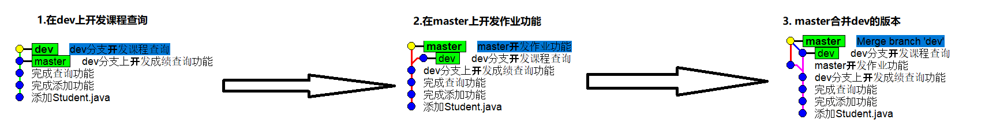

# Day01(git预习)

## 1. Git介绍

- [官方网站](https://git-scm.com)

- [Pro Git书籍地址](https://www.git-scm.com/book/zh/v2)

- [博客：Git十周年，Linus专访](https://blog.csdn.net/AlvinPanda/article/details/77411157)

### 1.1 Git是什么

​		Git是一个免费开源的分布式版本控制系统，可用于高效的处理任何大大小小的项目；

### 1.2 Git出现的背景

​		1991年Linus开发了Linux系统，随后将源代码开放，此后Linux系统不断发展；

​		Linus虽然创建了Linux，但Linux的壮大是靠全世界热心的开发者，这么多人在世界各地为Linux编写代码，那Linux的代码是如何管理的呢？

​		在2002年以前，Linux代码由Linus本人通过手工方式合并代码！

​		Linus坚定地反对CVS和SVN，这些集中式的版本控制系统不但速度慢，而且必须联网才能使用。有一些商用的版本控制系统，虽然比CVS、SVN好用，但那是付费的，与Linux的开源精神不符。

​		到了2002年，Linux系统已经发展了十年了，代码库之大让Linus很难继续通过手工方式管理了，开源社区的精英们也对这种方式表达了强烈不满，于是Linus选择了一个商业的**分布式版本控制系统BitKeeper**，BitKeeper的东家BitMover公司出于人道主义精神，授权Linux开源社区免费使用这个版本控制系统。

​		在2005年，Samba文件服务器开发人Andrew Tridgell试图破解BitKeeper的协议，被BitMover公司发现了，于是BitMover公司想让Linus公开发邮件道歉，保证以后严格约束社区开发者，否则，收回Linux开源社区的免费使用权。Linus迫不得已，自己开发了一个分布式版本控制工具代替了BitKeeper。

​		Git迅速成为最流行的分布式版本控制系统，尤其是2008年，GitHub网站上线了，它为开源项目免费提供Git存储，无数开源项目开始迁移至GitHub。

**Linus在Git十周年专访中的对Git的说明**

​	`我大概花一天让Git能达到自己管理自己的程度（self-hosting），之后我就开始用Git提交程序代码了。我的大部分工作是在白天完成的，不过也有几天工作到深夜。我觉得最有趣的地方在看到Git如何快速的成形。在Git的第一次提交并没有写很多程序，但是已经实现作出提交程序代码的基本功能。写Git并不会很难，比较难的是思考如何Git组织档案的方式。`

​	`我想强调，Git从无到有大概花了我十天（包含我第一次用Git提交核心程序代码），而且我也不是焚膏继晷的完成Git。这都取决于对Git的基本概念是否很清楚，早在着手写Git前，我已经看到其他源代码控制系统的缺陷。我只是不想重蹈覆辙。`

## 2. 版本控制系统的演化 

### 2.1 本地版本控制

​		许多人习惯用复制整个项目目录的方式来保存不同的版本，或许还会改名加上备份时间以示区别。这么做唯一的好处就是简单，但是特别容易犯错，有时候会混淆所在的工作目录，一不小心会写错文件或者覆盖意想外的文件。

​		为了解决这个问题，人们很久以前就开发了许多种本地版本控制系统，大多都是采用某种简单的数据库来记录文件的历次更新差异。

​		其中最流行的一种叫做 RCS，现今许多计算机系统上都还看得到它的踪影。 [RCS](https://www.gnu.org/software/rcs/) 的工作原理是在硬盘上保存补丁集（补丁是指文件修订前后的变化）；通过应用所有的补丁，可以重新计算出各个版本的文件内容。

 

### 2.2 集中式版本控制

​		接下来人们又遇到一个问题，如何让在不同系统上的开发者协同工作？ 于是，集中化的版本控制系统（Centralized Version Control Systems，简称 CVCS）应运而生。 这类系统，诸如CVS、**Subversion**以及 Perforce 等，都有一个单一的集中管理的服务器，保存所有文件的修订版本，而协同工作的人们都通过客户端连到这台服务器，取出最新的文件或者提交更新。 多年以来，这已成为版本控制系统的标准做法。

​		这种做法带来了许多好处，特别是相较于老式的本地 VCS 来说。 现在，每个人都可以在一定程度上看到项目中的其他人正在做些什么。 而管理员也可以轻松掌控每个开发者的权限，并且管理一个 CVCS 要远比在各个客户端上维护本地数据库来得轻松容易。

​		这么做最明显的缺点是**中央服务器的单点故障**， 如果宕机一小时，那么在这一小时内，谁都无法提交更新，也就无法协同工作。 如果中心数据库所在的磁盘发生损坏，又没有做恰当备份，毫无疑问你将丢失所有数据——包括项目的整个变更历史，只剩下人们在各自机器上保留的单独快照。 本地版本控制系统也存在类似问题，只要整个项目的历史记录被保存在单一位置，就有丢失所有历史更新记录的风险。

 

### 2.3 分布式版本控制

​		于是**分布式版本控制系统**（Distributed Version Control System，简称 DVCS）面世了。 在这类系统中，像 Git、Mercurial、Bazaar 以及 Darcs 等，客户端并不只提取最新版本的文件快照， 而是把代码仓库完整地镜像下来，包括完整的历史记录。 这么一来，任何一处协同工作用的服务器发生故障，事后都可以用任何一个镜像出来的本地仓库恢复。 因为每一次的克隆操作，实际上都是一次对代码仓库的完整备份。

​		许多这类系统都可以指定和若干不同的远端代码仓库进行交互。这样就可以在同一个项目中，分别和不同工作小组的人相互协作。 你可以根据需要设定不同的协作流程，比如层次模型式的工作流，而这在以前的集中式系统中是无法实现的。

 

## 3. Git安装 - Windows版

- 下载地址：[地址](https://git-scm.com/download/win)

 

## 4. Git的三大区域

1. 工作区

2. 暂存区（index、stage）

3. 版本库

   本地版本库

   远程版本库

## 5. 掌握几个Linux命令

1、**cd** - 切换目录change directory

- **`绝对路径`**

  Linux、Mac OS：以根目录 / 开始的文件名或目录名称，如/opt、/home

  Windows：C:/windows、D:/java

- **`相对路径`**

  相对于当前路径的文件名写法。

  Linux、Mac OS：如./lib/sudo/ 或 ../lib/sudo/等，可以认为开头不是/就是相对路径；

  Windows：./windows

- **`4个特殊目录`**

  .（或./）: 当前目录

  ..（或../）: 上一级目录

  **~**：用户主目录(用户根目录), C:/users/用户名/

  -：上一次所在目录

2、**pwd** - 显示当前所在目录

3、**ls** - 显示某个目录下的内容

- ls -l：显示详细信息

- ls -a：显示所有文件（包括隐藏文件）

4、**cat** - 查看文件内容

5、**touch** - 创建文件

6、**echo + `>> 或 >`**

​		echo "文件内容" >> 文件

​		echo "文件内容" > 文件

​		**`> 和 >>区别`  **：

​		**`>`**：覆盖原有内容

​		**`>>`**：在原有内容上追加内容

7、**mkdir** - 创建目录

​		参数-p：递归创建子目录

​		`mkdir -p test/test2/test3`

8、**rm** - 删除文件

​		`rm -rf 文件\目录`

9、**mv** - 重命名\移动文件、目录

​		mv   原文件名    新文件名

​		mv   原文件(目录)    指定的目录


---


# Day02(gitee)

## 1. 练习 - 学生管理

### 1.1 创建版本库，在版本库中提交一个文件：Student.java

1. 创建student目录，切换到student目录

    

2. 在student目录中初始化本地版本库

    

3. 配置用户名和邮箱

    

4. 创建Student.java，提交到本地版本库

    

### 1.2 开发添加学生功能

 

### 1.3 开发查询功能 - （向Student.java中写一行注释“//查询学生”），提交到本地版本库


### 1.4 开发聊天功能 - （向Student.java中写一行注释“// 聊天”），提交到本地版本库


## 2. 重置版本

- **前提：要重置的版本不应该推送到远程版本库**

1. **重置版本库、暂存区和工作区**：`git reset --hard 版本记录`

    

2. **重置版本库**，不重置暂存区和工作区：`git reset --soft 版本记录`

3. **重置版本库和暂存区**，不重置工作区：`git reset --mixed 版本记录`

## 3. 撤销暂存区修改

- 实际就是撤销刚执行的`git add`步骤

1. `git reset HEAD 文件...`
2. `git restore --staged 文件... `(git 2.20 +)

## 4. 撤销工作区修改

- 前提：要撤销的文件一定已经生成版本了

1. `git checkout -- 文件...`
2. `git restore 文件...`

## 5. 分支

### 5.1 创建dev分支，在dev分支上开发成绩查询(Score.java)，合并回master分支

1. 创建dev分支，切换到dev分支

    

2. **在dev分支上开发成绩查询功能，提交到本地版本库**

    

3. **切换到master分支，合并dev分支的版本**

    

4. 合并结果展示

   

5. **删除dev分支**

    

### 5.2 创建dev分支并切换到dev分支，在dev和master上分别提交一个版本，将dev分支的版本合并到master上

1. 创建dev分支，并直接切换到dev分支，在dev上开发课程查询（Course.java），提交到本地版本库

    

2. 切换到mster分支分支，在master上开发作业功能（Homework.java），提交到本地版本库

    

3. 在master上合并dev分支的版本

   `git merge dev`

4. 合并结果

   

### 5.3 分支命令

1. 创建分支：`git branch 分支名称`
2. 切换分支：`git checkout 分支名称`
3. 创建并直接切换分支：`git checkout -b 分支名称`
4. 查看本地分支列表：`git branch -l`
5. 查看所有分支列表：`git branch -va`
6. 合并分支：`git merge 分支名称`
7. 删除分支：`git branch -d 分支名称`

## 6. 在gitee.com上注册账号，并配置SSH KEY

### 6.1 配置SSH Key

1. 执行命令

   `ssh-keygen ed25519 xxx@xxx.com`

2. 拷贝用户目录下的`id_算法名.pub`文件的公钥到Gitee


### 6.2 创建远程版本库


### 6.3. 为本地版本库关联刚创建远程版本库，并将本地版本库的版本推送到远程版本库

1. 关联远程版本库

    

2. 推送版本到远程版本库

   `git push origin master`

## 7. 模拟两个用户协同开发

### 7.1 克隆一个远程版本库，并配置用户名为lisi和邮箱lisi@etoak.com

 

 

### 7.2 lisi和zs分别开发一个新的功能，分别向远程版本库库推送

1. lisi先在stu仓库中开发签到功能（Sign.java），推送到远程版本库

    

2. zs在student仓库中开发签退功能（Out.java），推送到远程版本库，但是被远程版本库拒绝了

   **拒绝原因：本地没有远程版本库的所有版本**

    

3. 所以，zs应该先拉取远程版本库的版本，与本地的版本合并之后，再向远程版本库推送

    

    

## 8. 版本冲突说明

- 多个用户同时修改了相同的文件

1. 修改相同文件的不同行：一般情况下，版本控制系统都可以自动合并
2. 修改相同文件的相同行：合并时出现冲突，需要手动解决冲突
3. 既修改了不同行，也修改了相同行：一般情况下不同行自动合并，相同行手动解决冲突

### 8.1 lisi和zs同时修改签到功能

1. lisi先更新最新版本，修改签到功能，推送到远程版本库

    

2. zs在没有更新版本的情况下，也修改签到功能，向远程版本库推送时被拒绝

    

3. 所以，zs先拉取最新的版本，此时，出现版本冲突了

    

4. zs要先解决冲突

5. zs使用`git add 命令`标记解决了冲突（告诉Git冲突解决了）

    

6. zs使用`git commit -m ""命令`完成本次版本的合并

    

7. zs使用`git push`将合并结果推送到远程版本库

   

## 9. IDEA配置Git

 

## 10. 删除文件

- 删除版本库的文件也是对文件的修改，也需要现在本地版本库操作，然后推送到远程版本库

1. 手动删除：右击文件点击删除或者执行`rm -rf 文件`

   先执行`git add .`

   再执行`git commit -m "xx"`

2. 使用`git rm 文件...`

   直接执行`git commit -m "xx"`

## 11. 重命名文件

- 重命名版本库的文件也是对文件的修改，也需要现在本地版本库操作，然后推送到远程版本库

1. 手动重命名：右击文件点击重命名或者执行`mv 旧文件名 新文件名`

   先执行`git add .`

   再执行`git commit -m "xx"`

2. 使用`git mv 旧文件名 新文件名`

   直接执行`git commit -m "xx"`

## 今天练习

 


---


# Day03(SpringMVC处理器适配器)


# 上午内容(git rebase)

1. git rebase命令
2. git diff命令
3. 文件在三大区域穿梭

## 1. git rebase命令

1. 修改提交记录的消息（commit msg）
2. 合并历史记录
3. 合并分支，可以将历史记录合并为一条直线

### 1.1. 修改提交记录的消息（commit msg）

- **<font color="red">前提：要修改的历史记录没有推送到远程版本库</font>**

1. 分三次修改签到功能，向本地版本库提交三个版本

    

2. 使用`git rebase`修改第二次历史记录的消息

    

### 1.2 合并历史记录

- **<font color="red">前提：要修改的历史记录没有推送到远程版本库</font>**

1. 使用`git rebase`合并1.1节中提交的三个版本

    

    

### 1.3 合并本地分支的版本

- **<font color="red">前提：要修改的历史记录没有推送到远程版本库</font>**

1. 创建**test分支**

    

2. 在master分支上修改课程功能（修改Course.java），提交到本地版本库

    

3. 切换**test分支**上修改课程功能（修改Course.java），提交到本地版本库

    

4. 在**test分支，将test分支**的版本rebase到master，此时出现合并冲突

    

5. 手动解决test分支上的冲突

6. 使用`git add`标记冲突解决了（告诉Git冲突解决了）

    

7. 使用`git rebase --continue`完成本次版本的合并（test上现在有master版本，但是master上没有test分支的版本）

    

8. 切换到master分支，对test分支做一次`merge`操作（快进）

    

9. 合并结果展示

    

### 1.4 合并远程分支的版本

1. lisi修改作业功能，推送到远程版本库

    

2. zs在没有更新最新版本的情况下，也修改了作业功能，向远程版本库推送时被拒绝了

    

3. zs先拉取远程版本库的版本（这里使用**`git pull --rebase origin master`**），此时出现版本冲突

    

4. zs手动解决冲突

5. zs使用`git add`标记解决了冲突

    

6. zs使用`git rebase --continue`完成本次版本合并

   

7. zs最后将合并结果推送到远程版本库

   `git push origin master`

## 2. git diff命令 - 对比文件内容差异

1. 对比工作区和暂存区文件差异：`git diff [文件...]`

2. 对比暂存区和版本库文件差异：`git diff --cached [文件...]`

3. 对比工作区和版本库文件差异

   与最新版本对比：`git diff HEAD [文件...]`

   与其它版本对比：`git diff commit [文件...]`

4. 对比版本之间的文件差异

   `git diff commit1 commit2 [文件...]`

## 3. 文件在三大区域穿梭


---


#  下午(Spring  MVC内容)

1. 什么是Web MVC
2. 什么是Spring MVC
3. Spring MVC的核心组件
4. Spring MVC的执行流程
5. Spring MVC的参数传递方式
6. Spring MVC对静态资源的处理
7. Spring MVC如何处理REST（RestFul）风格的请求
8. Spring MVC容器和Spring容器的关系
9. Spring MVC使用MyBatis
10. Spring AOP
11. Spring的事务
    - Spring事务隔离级别
    - **Spring事务传播机制**
    - Spring事务回滚机制
12. Spring MVC使用commons-fileupload实现文件上传
13. Spring MVC使用hibernate-validator实现后端Java Bean校验
14. Spring MVC的全局异常处理
15. Spring MVC的拦截器
16. 使用**Java Config**方式搭建Spring MVC环境
17. 其它知识点
    - 使用**SLF4J + Logback**做**日志记录**
    - Apache Commons的工具类、HuTool（国内的工具类）

## 1. 什么是Web MVC

- **MVC**是一种设计模式，它将应用程序分为**模型、视图、控制器**三部分

1. 模型：Java Bean

   保存数据状态的Java Bean：实体类等

   处理业务逻辑的Java Bean：Service、Dao

2. 视图：与用户交互界面

3. 控制器：实现了模型和视图的解耦

   接收视图发送请求

   委托模型层处理业务

   使用模型数据渲染页面，响应用户请求

## 2. 什么是Spring MVC

1. Spring MVC是建立在**Servlet API**之上的Web框架，从一开始就包含在Spring框架中；
1. 它的正式名称：**Spring Web MVC**（来自于它在Spring框架中的模块名称），通常被称为**Spring MVC**。

## 3. Spring MVC的核心组件

1. **前端控制器DispatcherServlet**：拦截用户请求，将请求转发给其它组件，并负责页面渲染等，是Spring MVC的核心控制器；
2. **处理器映射器HandlerMapping**：映射请求的URI到**处理器**（根据请求的URI查找处理器）
3. **处理器适配器HandlerAdapter**：执行处理器（调用处理器的方法）
4. **视图解析器ViewResolver**：解析**逻辑视图ModelAndView**，创建**View对象**
5. **处理器**：开发者自己编写业务逻辑
6. **拦截器**、MultipartResolver、国际化组件....

## 4. Spring MVC执行流程


1. **<font color="red">客户端发送请求到DispatcherServlet</font>**

2. **<font color="red">DispatcherServlet请求处理器映射器查找处理器</font>**

3. **<font color="red">处理器映射器找到处理器之后，返回一个处理器执行链对象给DispatcherServlet</font>**

4. **<font color="orange">DispatcherServlet请求处理器适配器执行处理器</font>**

5. **<font color="orange">处理器适配器执行处理器</font>**

6. **<font color="orange">处理器执行完成之后返回一个逻辑视图对象给处理器适配器</font>**

7. **<font color="orange">处理器适配器将逻辑视图返回给DispatcherServlet</font>**

8. **<font color="blue">DispatcherServlet请求视图解析器解析逻辑视图</font>**

9. **<font color="blue">视图解析器解析逻辑视图，返回一个View对象给DispatcherServlet</font>**

10. **<font color="blue">DispatcherServlet使用视图对象和模型数据渲染视图，响应客户端请求</font>**

     

## 5. 第一个Spring MVC工程

1. 创建Maven项目，导入Maven依赖

2. 配置DispatcherServlet

   有几种配置Servlet的方式：web.xml、@WebServlet、SPI（Java代码）

3. 配置处理器映射器

4. 配置处理器适配器

5. 配置视图解析器

6. 开发处理器，并配置为Spring容器的对象

7. 开发视图

8. 部署工程到Tomcat，测试请求

## 6. 第二个Spring MVC工程

1. 替换处理器映射器：`SimpleUrlHandlerMapping`

2. 替换处理器适配器：`HttpRequestHandlerAdapter`

    

## 7. 第三个Spring MVC工程

1. 替换处理器映射器：`ReqeustMappingHandlerMapping`
2. 替换处理器适配器：`ReqeustMappingHandlerAdapter`

- 特点：

  1、必须一起使用

  2、不要求处理器实现任何接口（处理器可以自定义）

  3、使用`@ReqeustMapping`注解的path或value属性值映射URI到处理器的方法

## 8. 第四个Spring MVC工程

## 9. `<mvc:annotation-driven>`

​	由`org.springframework.web.servlet.config.AnnotationDrivenBeanDefinitionParser`解析，向Spring容器中注册如下Bean

1. 处理器**映射器**

   `RequestMappingHandlerMapping`、`BeanNameUrlHandlerMapping`

2. 处理器**适配器**

   `RequestMappingHandlerAdapter`、`HttpRequestHandlerAdapter`、`SimpleControllerHandlerAdapter`

3. 异常**解析器**：`ExceptionHandlerExceptionResolver`

4. Java Bean校验器

5. 一组`HttpMessageConverter`

## 10. 今天练习

1. `BeanNameUrlHandlerMapping` + **`SimpleServletHandlerAdapter`**
2. `SimpleUrlHandlerMapping` + `SimpleControllerHanlerAdapter`


---


# Day04(SpringMVC整合Mybatis)

## 今天内容

1. Spring MVC参数传递方式
2. `@RequestParam`注解
3. `@RequestMapping`注解
4. 解决POST请求中文乱码
5. Spring父容器（Spring Root容器）和Spring MVC容器之间的关系
6. Spring整合MyBatis
7. SLF4J + Logback记录日志

## 1. Spring MVC参数传递 - 接收参数

### 1.1 常用的请求参数类型：HTTP请求头的Content-Type表示

1. form表单、key-value键值对：`x-www-form-urlencoded`
2. JSON：`application/json`
3. 文件：`multipart/form-data`

### 1.2 常用的响应结果类型：HTTP响应头的Content-Type表示

1. html：`text/html`
2. 纯文本、字符串：`text/plain`
3. JSON：`application/json`
4. 图片：`image/jpeg`、`image/gif`....
5. 二进制
6. ....

### 1.3 Spring MVC接收参数的方式

1. Servlet API：HttpServletRequest对象

2. String、基本数据类型及其包装类

3. 对象

4. 数组

5. List

    

    

6. Map - 了解

7. JSON

   Spring MVC可以使用**Jackson、GSON、Jsonb**三个框架作为Json的消息转换器

   这里使用Jackson框架作为JSON转换器，需要引入Jackson的jar包

   - jackson-core.jar、jackson-annotations.jar、jackson-databind.jar）

   在Maven项目中，仅需要导入一个**jackson-databind**依赖即可

## 2. @RequestParam注解

- 只能在参数上使用

1. `value属性`：请求参数名称
2. `name属性`：请求参数名称，与value作用一致
3. `required属性`：参数是否为必填项，默认是必填（参数值不能null）
4. `defaultValue属性`：当参数为非必填项时，使用它设置默认值

## 3. @RequestMapping注解

- 可以在类和方法上使用

1. `String[] value属性`：映射URI地址

2. `String[] path属性`：映射URI地址

3. `RequestMethod[] method属性`：设置请求方法

4. `String[] produces属性`：设置响应头的`Content-Type`

5. `String[] consumes属性`：限制请求参数的类型

   ```java
   @PostMapping(value = "/test", consumes = "application/json;charset=utf-8")
   @ResponseBody
   public String test(@RequestBody String str) {
     System.out.println(str);
     return "success";
   }
   ```

## 4. 解决POST请求中文乱码问题

- **Spring Web模块**中提供了`CharacterEncodingFilter`可以解决post请求的中文乱码问题

  ```xml
  <filter>
    <filter-name>encodingFilter</filter-name>
    <filter-class>
      org.springframework.web.filter.CharacterEncodingFilter
    </filter-class>
    <init-param>
      <param-name>encoding</param-name>
      <param-value>utf-8</param-value>
    </init-param>
  </filter>
  <filter-mapping>
    <filter-name>encodingFilter</filter-name>
    <url-pattern>/*</url-pattern>
  </filter-mapping>
  ```

## 5. Spring容器和Spring MVC容器之间的关系


## 6. Spring整合MyBatis

- [MyBatis官网](https://mybatis.org/mybatis-3/zh/)
- [MyBatis-Spring 官网](https://mybatis.org/spring/zh/)

### 6.1 Mybatis、MyBatis-Spring、Spring、JDK版本对应关系

| MyBatis-Spring | MyBatis | Spring Framework | Spring Batch | Java     |
| :------------- | :------ | :--------------- | :----------- | :------- |
| **3.0**        | 3.5+    | 6.0+             | 5.0+         | Java 17+ |
| **2.1**        | 3.5+    | 5.x              | 4.x          | Java 8+  |
| **2.0**        | 3.5+    | 5.x              | 4.x          | Java 8+  |
| **1.3**        | 3.4+    | 3.2.2+           | 2.1+         | Java 6+  |

### 6.2 SqlSessionFactoryBean

​		需要注意的是 `SqlSessionFactoryBean` 实现了 Spring 的 `FactoryBean` 接口（参见 Spring 官方文档：通过工厂 bean 自定义实例化逻辑](https://docs.spring.io/spring/docs/current/spring-framework-reference/core.html#beans-factory-extension-factorybean) ）。 这意味着由 Spring 最终创建的 bean **并不是** `SqlSessionFactoryBean` 本身，而是工厂类（`SqlSessionFactoryBean`）的 getObject() 方法的返回结果。这种情况下，Spring 将会在应用启动时为你创建 `SqlSessionFactory`，并使用 `sqlSessionFactory` 这个名字存储起来。

### 6.3 Maven依赖

​		**spring-jdbc、mysql、druid、mybatis、mybatis-spring、pagehelper**

## 7. 使用SLF4J + Logback记录日志

1. 为什么要记录日志？

   方便查看线上代码的问题

   记录用户的操作行为，方便审计用户行为

2. 日志可以记录在哪里？

   开发阶段一般输出到控制台

   生产阶段一般输出文件、数据库（不一定是关系型数据库，例如：ELK）

3. 常用的日志框架有哪些？

   门面日志框架（接口规范）：Apache Commons Logging、SLF4J

   具体输出日志的框架：Log4J、JUL(Java Util Logging)、Logback、Log4J2...

4. 配置Slf4J + Logback

   `slf4j-api.jar`、`logback-core.jar`、`logback-classic.jar`

5. 日志级别

   `DEBUG  <  INFO   <   WARN   <   ERROR`


## 今天练习

 


---


## 代码补充：

### springMVC参数接收类型

### Fromcontroller.java

```java
package com.etoak.controller;

import com.etoak.bean.Student;
import org.springframework.stereotype.Controller;
import org.springframework.web.bind.annotation.*;

import javax.servlet.http.HttpServletResponse;
import java.io.IOException;
import java.io.PrintWriter;
import java.util.List;
import java.util.Map;

/**
 * 测试接收form表单参数
 */
@Controller
@RequestMapping("/form")
@CrossOrigin
public class FormController {

  /**
   * 使用String类型和基本数据类型接收参数
   */
  @RequestMapping("/simple")
  public String simple(@RequestParam String name,
                       @RequestParam(required = false, defaultValue = "123") int id) {
    System.out.println("name=" + name);
    System.out.println("id=" + id);

    return "hello";
  }

  /**
   * 使用Java Bean接收表单参数
   * 将form参数映射到Java Bean的属性
   */
  @PostMapping("/bean")
  public String bean(Student student) {
    System.out.println(student);
    return "hello";
  }

  @RequestMapping(value = "/array", method = RequestMethod.POST)
  public void array(String[] hobbies, HttpServletResponse response) throws IOException {
    for (String hobby: hobbies) {
      System.out.println(hobby);
    }

    response.setContentType("text/plain;charset=utf-8");
    PrintWriter writer = response.getWriter();
    writer.print("执行成功！");
    writer.flush();
    writer.close();
  }

  /**
   * List接收表单参数
   */
  @RequestMapping(path = "/list", method = RequestMethod.POST,
    produces = "text/plain;charset=utf-8")
  @ResponseBody
  public String testList(@RequestParam List<String> hobbies) {
    hobbies.forEach(x -> System.out.println(x));
    return "执行成功！";
  }

  /**
   * 使用Map接收表单参数
   */
  @RequestMapping(value = "/map", method = {RequestMethod.GET,RequestMethod.POST},
  produces = "text/plain;charset=utf-8")
  @ResponseBody
  public String testMap(@RequestParam Map<String, Object> map) {
    System.out.println(map);
    return "执行成功！";
  }

}
```


### db.properties

```properties
db.driver=com.mysql.cj.jdbc.Driver
db.url=jdbc:mysql:///et2301?serverTimezone=UTC
db.username=root
db.password=etoak
```


### spring-root.xml

```xml
<?xml version="1.0" encoding="UTF-8"?>
<beans xmlns="http://www.springframework.org/schema/beans"
       xmlns:xsi="http://www.w3.org/2001/XMLSchema-instance"
       xmlns:context="http://www.springframework.org/schema/context"
       xsi:schemaLocation="http://www.springframework.org/schema/beans
       http://www.springframework.org/schema/beans/spring-beans.xsd http://www.springframework.org/schema/context https://www.springframework.org/schema/context/spring-context.xsd">

  <context:component-scan base-package="com.etoak.**.service" />

  <!-- 导入db.properties -->
  <context:property-placeholder location="classpath:db.properties" />

  <!-- 数据源 -->
  <bean id="dataSource" class="com.alibaba.druid.pool.DruidDataSource">
    <property name="driverClassName" value="${db.driver}" />
    <property name="url" value="${db.url}" />
    <property name="username" value="${db.username}" />
    <property name="password" value="${db.password}" />
  </bean>

  <bean id="pageInterceptor" class="com.github.pagehelper.PageInterceptor">
    <property name="properties">
      <props>
        <prop key="helperDialect">mysql</prop>
      </props>
    </property>
  </bean>

  <!-- SqlSessionFactoryBean -->
  <bean class="org.mybatis.spring.SqlSessionFactoryBean">
    <property name="dataSource" ref="dataSource" />
    <property name="typeAliasesPackage" value="com.etoak" />
    <!-- Mapper映射文件位置 -->
    <property name="mapperLocations" value="classpath:mapper/**/*.xml" />
    <!-- plugins -->
    <property name="plugins">
      <array>
        <ref bean="pageInterceptor" />
      </array>
    </property>
  </bean>

  <!-- MapperScannerConfigurer
       扫描指定包中的接口, 为接口创建代理对象
   -->
  <bean class="org.mybatis.spring.mapper.MapperScannerConfigurer">
    <property name="basePackage" value="com.etoak.**.mapper" />
  </bean>

</beans>
```


### spring-mvc.xml

```xml
<?xml version="1.0" encoding="UTF-8"?>
<beans xmlns="http://www.springframework.org/schema/beans"
       xmlns:xsi="http://www.w3.org/2001/XMLSchema-instance"
       xmlns:context="http://www.springframework.org/schema/context"
       xmlns:mvc="http://www.springframework.org/schema/mvc"
       xsi:schemaLocation="http://www.springframework.org/schema/beans http://www.springframework.org/schema/beans/spring-beans.xsd http://www.springframework.org/schema/context https://www.springframework.org/schema/context/spring-context.xsd http://www.springframework.org/schema/mvc https://www.springframework.org/schema/mvc/spring-mvc.xsd">
  <!--
     *: 精确一层包结构
     **: 任意层级的包(0、1、2...)
     com.etoak.controller
     com.etoak.system.user.controller
   -->
  <context:component-scan base-package="com.etoak.**.controller" />

  <!-- 处理器映射器、处理器适配器 -->
  <mvc:annotation-driven></mvc:annotation-driven>

  <!-- 视图解析器 -->
  <bean class="org.springframework.web.servlet.view.InternalResourceViewResolver">
    <property name="prefix" value="/pages/" />
    <property name="suffix" value=".jsp" />
  </bean>

</beans>
```


### webapp/WEB-INF/web.xml

```xml
<!DOCTYPE web-app PUBLIC
 "-//Sun Microsystems, Inc.//DTD Web Application 2.3//EN"
 "http://java.sun.com/dtd/web-app_2_3.dtd" >

<web-app>

  <!-- 如果不指定, 父容器配置文件/WEB-INF/applicationContext.xml -->
  <context-param>
    <param-name>contextConfigLocation</param-name>
    <param-value>classpath:spring-root.xml</param-value>
  </context-param>

  <!-- 加载父容器（Root容器） -->
  <listener>
    <listener-class>
      org.springframework.web.context.ContextLoaderListener
    </listener-class>
  </listener>

  <!-- CharacterEncodingFilter -->
  <filter>
    <filter-name>encodingFilter</filter-name>
    <filter-class>
      org.springframework.web.filter.CharacterEncodingFilter
    </filter-class>
    <init-param>
      <param-name>encoding</param-name>
      <param-value>utf-8</param-value>
    </init-param>
  </filter>
  <filter-mapping>
    <filter-name>encodingFilter</filter-name>
    <url-pattern>/*</url-pattern>
  </filter-mapping>

  <!-- DispatcherServlet -->
  <servlet>
    <servlet-name>dispatcher</servlet-name>
    <servlet-class>
      org.springframework.web.servlet.DispatcherServlet
    </servlet-class>
    <init-param>
      <param-name>contextConfigLocation</param-name>
      <param-value>classpath:spring-mvc.xml</param-value>
    </init-param>
    <load-on-startup>1</load-on-startup>
  </servlet>
  <servlet-mapping>
    <servlet-name>dispatcher</servlet-name>
    <url-pattern>/</url-pattern>
  </servlet-mapping>

</web-app>

```


---


# day05


