## 1. 练习 - 学生管理

### 1.1 创建版本库，在版本库中提交一个文件：Student.java

1. 创建student目录，切换到student目录

   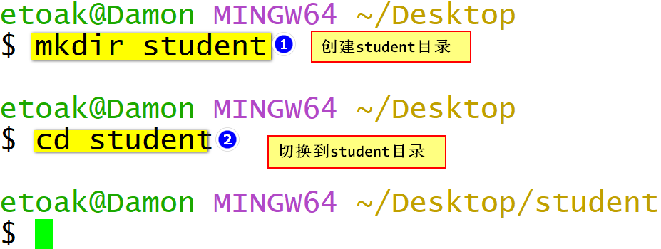 

2. 在student目录中初始化本地版本库

   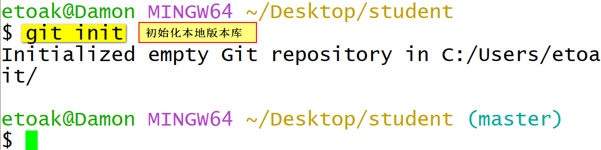 

3. 配置用户名和邮箱

   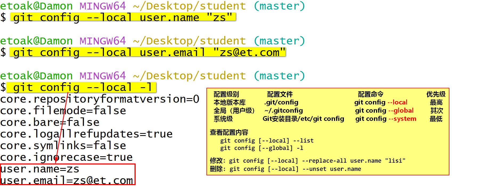 

4. 创建Student.java，提交到本地版本库

   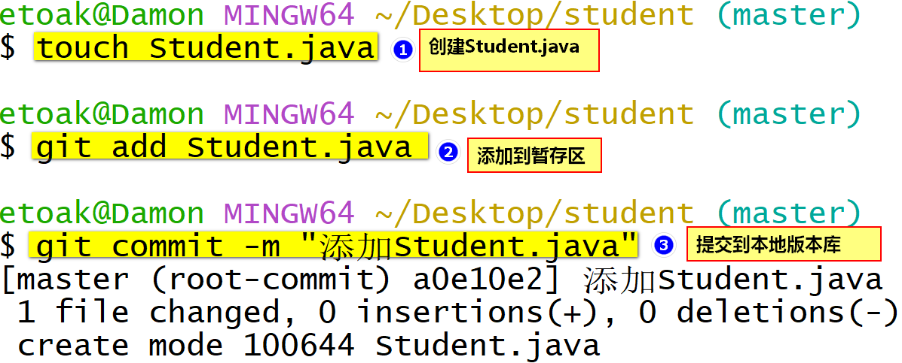 

### 1.2 开发添加学生功能

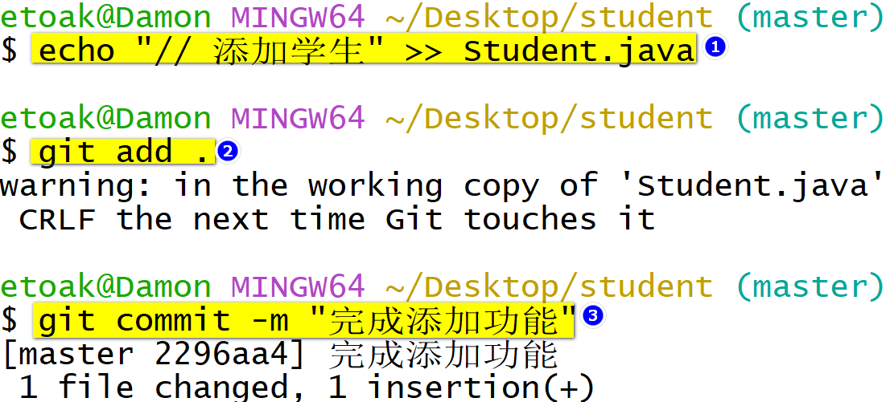 

### 1.3 开发查询功能 - （向Student.java中写一行注释“//查询学生”），提交到本地版本库

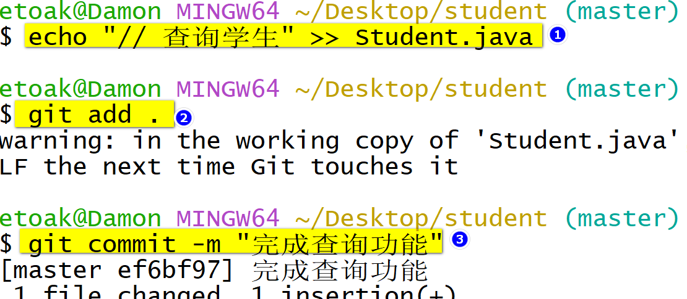

### 1.4 开发聊天功能 - （向Student.java中写一行注释“// 聊天”），提交到本地版本库

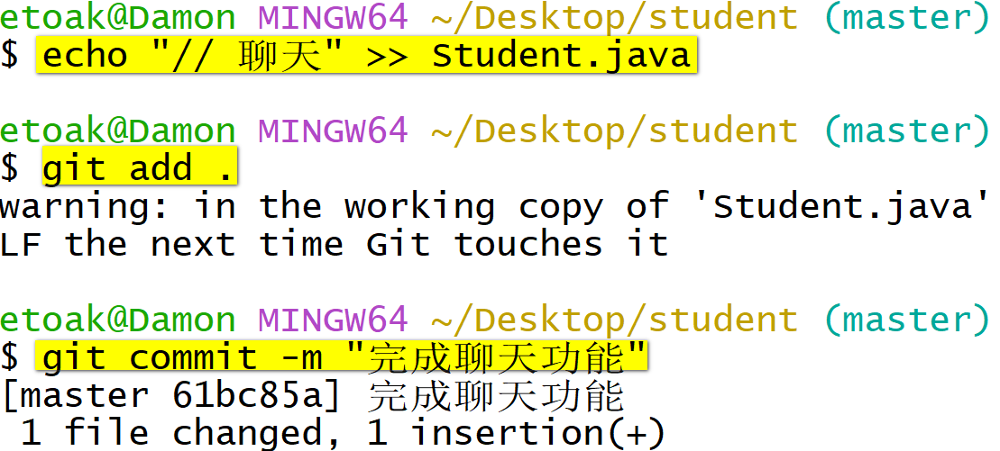

## 2. 重置版本

- **前提：要重置的版本不应该推送到远程版本库**

1. **重置版本库、暂存区和工作区**：`git reset --hard 版本记录`

   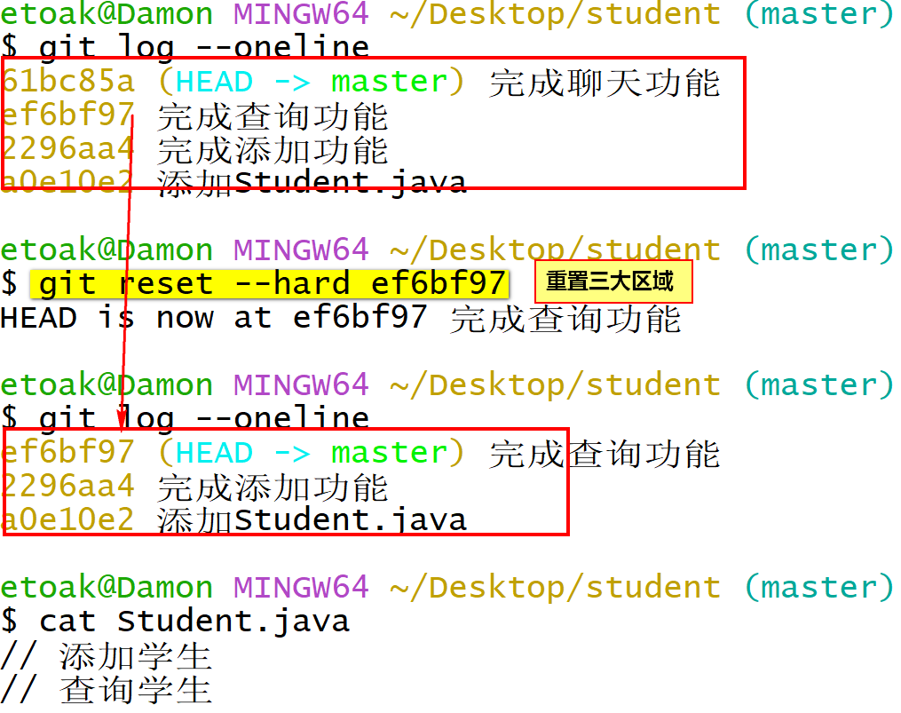 

2. **重置版本库**，不重置暂存区和工作区：`git reset --soft 版本记录`

3. **重置版本库和暂存区**，不重置工作区：`git reset --mixed 版本记录`

## 3. 撤销暂存区修改

- 实际就是撤销刚执行的`git add`步骤

1. `git reset HEAD 文件...`
2. `git restore --staged 文件... `(git 2.20 +)

## 4. 撤销工作区修改

- 前提：要撤销的文件一定已经生成版本了

1. `git checkout -- 文件...`
2. `git restore 文件...`

## 5. 分支

### 5.1 创建dev分支，在dev分支上开发成绩查询(Score.java)，合并回master分支

1. 创建dev分支，切换到dev分支

   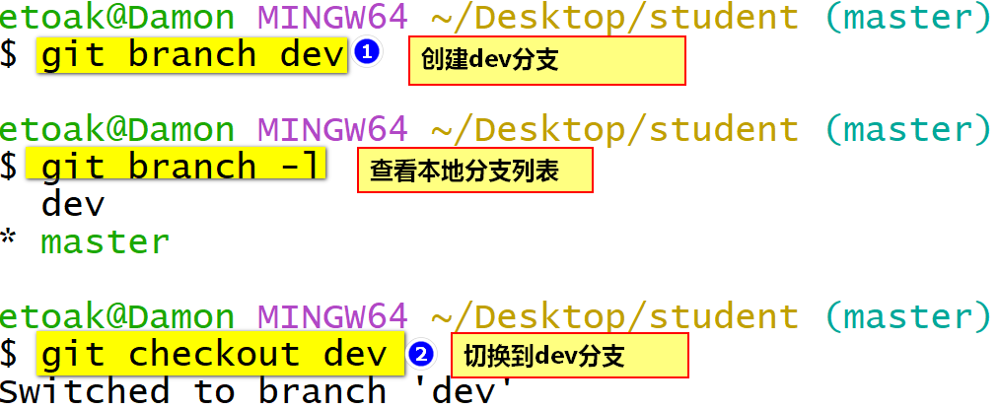 

2. **在dev分支上开发成绩查询功能，提交到本地版本库**

    

3. **切换到master分支，合并dev分支的版本**

   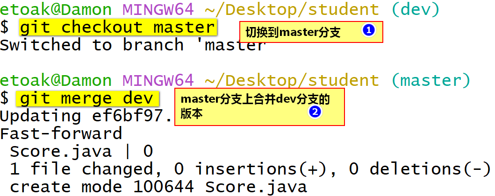 

4. 合并结果展示

   

5. **删除dev分支**

   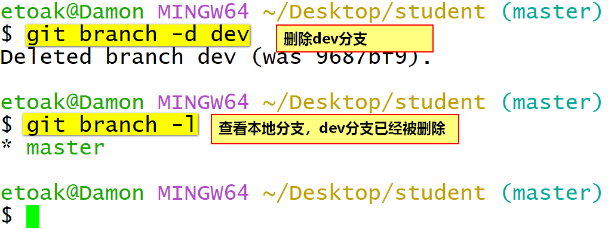 

### 5.2 创建dev分支并切换到dev分支，在dev和master上分别提交一个版本，将dev分支的版本合并到master上

1. 创建dev分支，并直接切换到dev分支，在dev上开发课程查询（Course.java），提交到本地版本库

   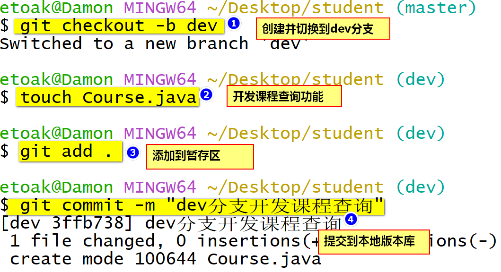 

2. 切换到mster分支分支，在master上开发作业功能（Homework.java），提交到本地版本库

   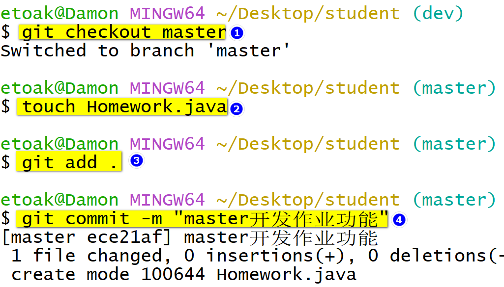 

3. 在master上合并dev分支的版本

   `git merge dev`

4. 合并结果

   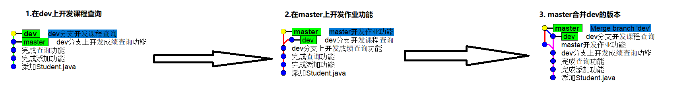

### 5.3 分支命令

1. 创建分支：`git branch 分支名称`
2. 切换分支：`git checkout 分支名称`
3. 创建并直接切换分支：`git checkout -b 分支名称`
4. 查看本地分支列表：`git branch -l`
5. 查看所有分支列表：`git branch -va`
6. 合并分支：`git merge 分支名称`
7. 删除分支：`git branch -d 分支名称`

## 6. 在gitee.com上注册账号，并配置SSH KEY

### 6.1 配置SSH Key

1. 执行命令

   `ssh-keygen ed25519 xxx@xxx.com`

2. 拷贝用户目录下的`id_算法名.pub`文件的公钥到Gitee

### 6.2 创建远程版本库

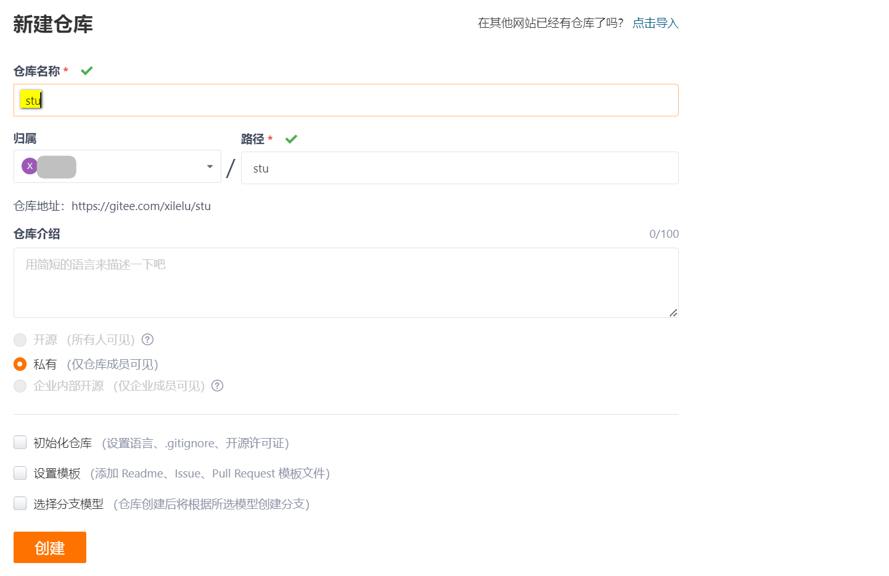

### 6.3. 为本地版本库关联刚创建远程版本库，并将本地版本库的版本推送到远程版本库

1. 关联远程版本库

   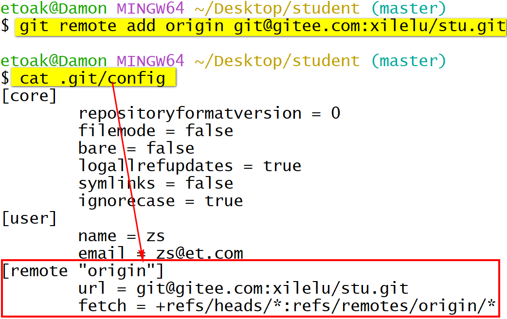 

2. 推送版本到远程版本库

   `git push origin master`

## 7. 模拟两个用户协同开发

### 7.1 克隆一个远程版本库，并配置用户名为lisi和邮箱lisi@etoak.com

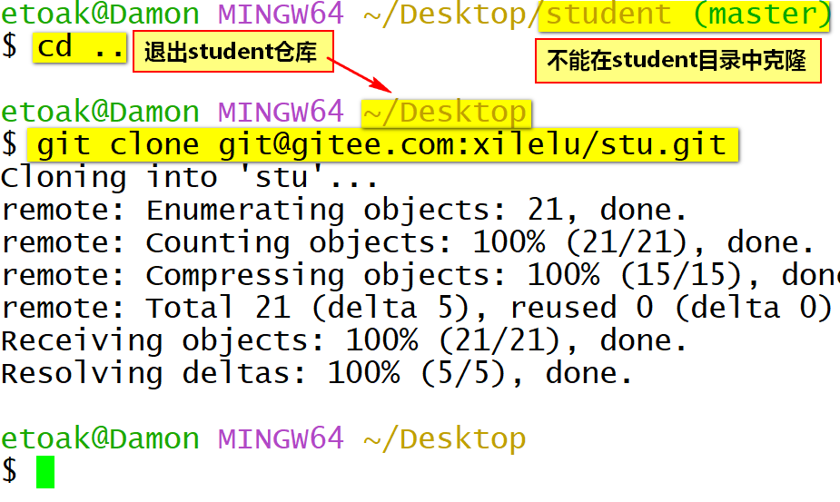 

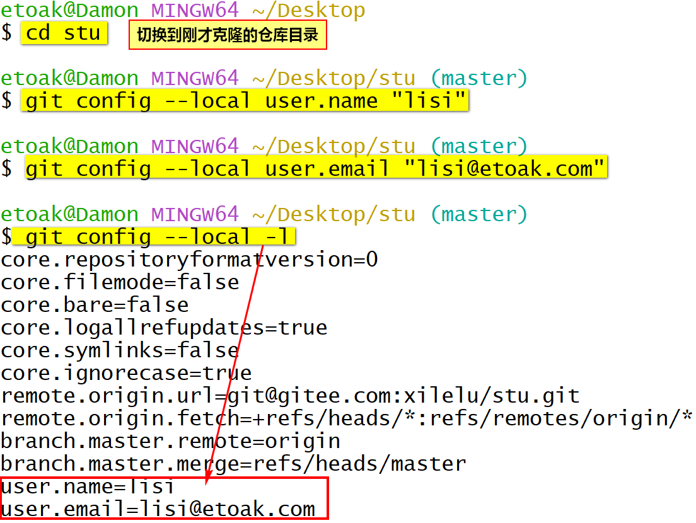 

### 7.2 lisi和zs分别开发一个新的功能，分别向远程版本库库推送

1. lisi先在stu仓库中开发签到功能（Sign.java），推送到远程版本库

   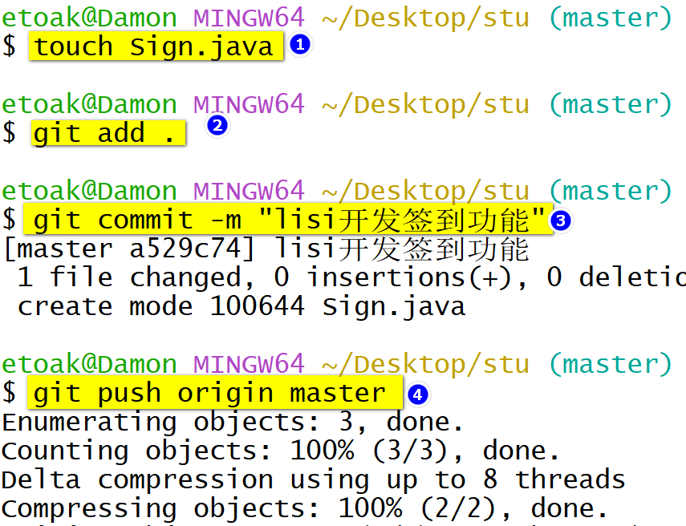 

2. zs在student仓库中开发签退功能（Out.java），推送到远程版本库，但是被远程版本库拒绝了

   **拒绝原因：本地没有远程版本库的所有版本**

   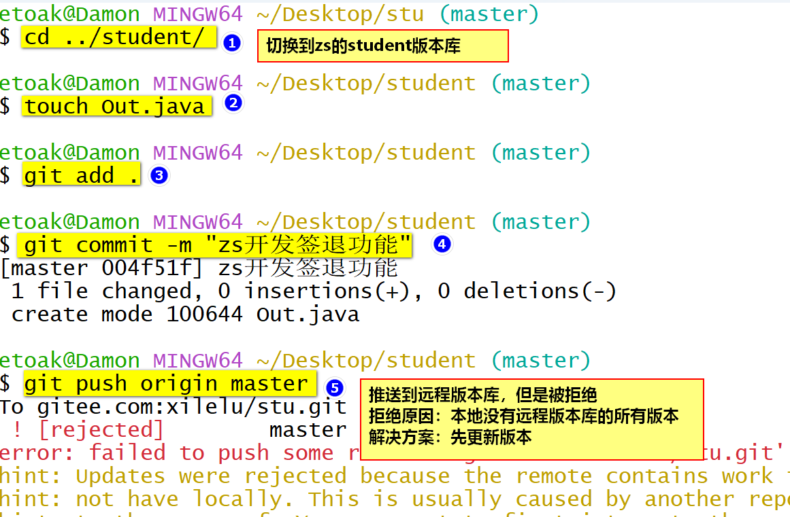 

3. 所以，zs应该先拉取远程版本库的版本，与本地的版本合并之后，再向远程版本库推送

   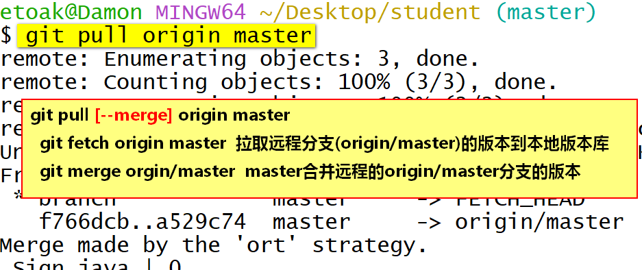 

   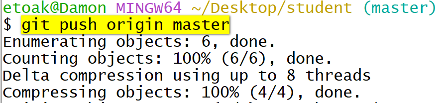 

## 8. 版本冲突说明

- 多个用户同时修改了相同的文件

1. 修改相同文件的不同行：一般情况下，版本控制系统都可以自动合并
2. 修改相同文件的相同行：合并时出现冲突，需要手动解决冲突
3. 既修改了不同行，也修改了相同行：一般情况下不同行自动合并，相同行手动解决冲突

### 8.1 lisi和zs同时修改签到功能

1. lisi先更新最新版本，修改签到功能，推送到远程版本库

   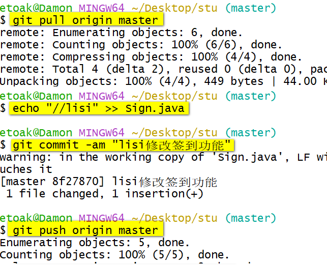 

2. zs在没有更新版本的情况下，也修改签到功能，向远程版本库推送时被拒绝

   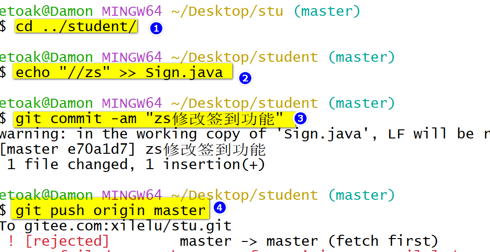 

3. 所以，zs先拉取最新的版本，此时，出现版本冲突了

   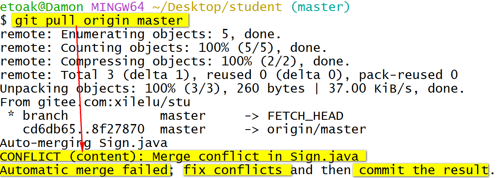 

4. zs要先解决冲突

5. zs使用`git add 命令`标记解决了冲突（告诉Git冲突解决了）

   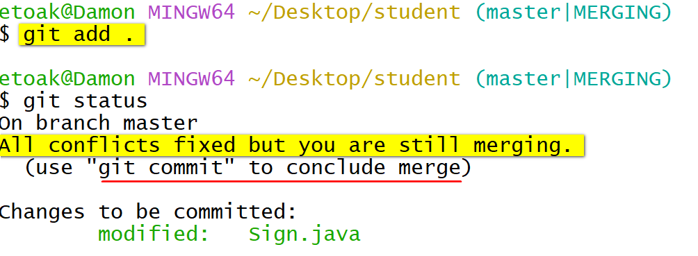 

6. zs使用`git commit -m ""命令`完成本次版本的合并

   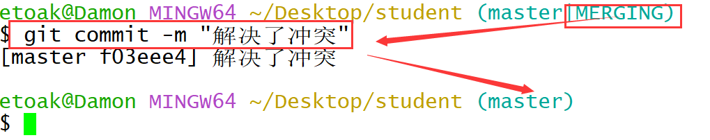 

7. zs使用`git push`将合并结果推送到远程版本库

   

## 9. IDEA配置Git

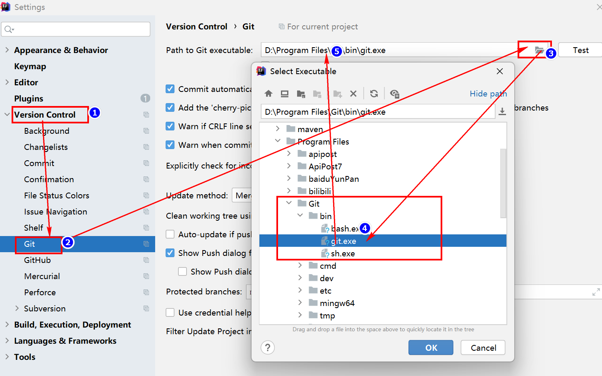 

## 10. 删除文件

- 删除版本库的文件也是对文件的修改，也需要现在本地版本库操作，然后推送到远程版本库

1. 手动删除：右击文件点击删除或者执行`rm -rf 文件`

   先执行`git add .`

   再执行`git commit -m "xx"`

2. 使用`git rm 文件...`

   直接执行`git commit -m "xx"`

## 11. 重命名文件

- 重命名版本库的文件也是对文件的修改，也需要现在本地版本库操作，然后推送到远程版本库

1. 手动重命名：右击文件点击重命名或者执行`mv 旧文件名 新文件名`

   先执行`git add .`

   再执行`git commit -m "xx"`

2. 使用`git mv 旧文件名 新文件名`

   直接执行`git commit -m "xx"`

## 今天练习

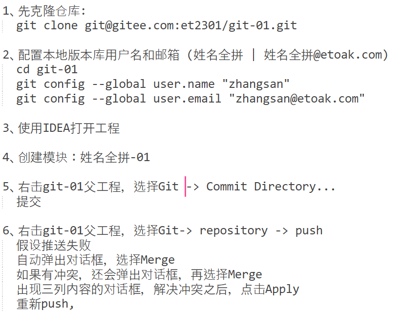 
