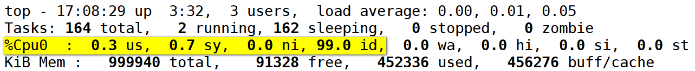
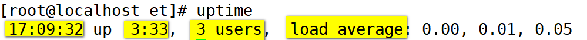
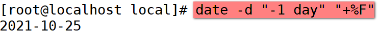

## 1. Linux简单介绍

​		Linux是1991年由芬兰人**林纳斯·托瓦兹**（Linus Torvalds）在赫尔辛基大学上学时出于个人爱好而编写的；

​		Linux是一个自由免费的，开放源代码的操作系统；

​		Linux是一个多用户、多任务、支持多线程和多cpu的操作系统；

## 2. 安装XShell

​		SSH客户端：Putty、SecureCRT(收费)、XShell等

​		XShell 是一个强大的安全终端模拟软件，它支持SSH1，SSH2，以及微软平台的Telnet协议。

​		XShell 是一个非常好用的SSH客户端，可以作为 Telnet、Rlogin、SSH、SFTP 等协议的安全终端模拟软件，可以让你轻松管理远程主机。

​		XShell特色功能包括标签化管理远程会话、动态端口转发、自定义键盘映射、VB脚本支持、完全的 Unicode 支持等。

## 3. Linux的目录

### 3.1 绝对路径和相对路径

​		Linux中没有C盘、D盘等盘符；Linux的根目录是：**/**

1. **绝对路径**

   从根目录**`/`**开始写起的文件名或者目录名称，比如：`/opt/jdk1.8`

2. **相对路径**

   相对于当前路径的文件名或目录名的写法

#### 3.1.1 特殊目录

1. <font color="red" size="5">.</font>：表示当前目录，也可以用./表示
2. <font color="red"  size="5">..</font>：表示上一级目录，也可以用../表示
3. <font color="red"  size="5">~</font>：表示用户主目录，相当于与Windows的C:/users/lenovo
4. <font color="red"  size="5">-</font>：上一次所在目录

### 3.2 Centos的目录

1. **/bin：binary二进制，存放二进制可执行的文件（比如cd）**

2. **/boot：存放开机时用到的各种文件；**

3. /dev：用于存放设备文件

4. **/etc：存放系统配置文件，如用户密码等（在/etc/passwd文件中）**

5. **/home：普通用户的用户主目录，相当于Windows的C:/Users目录**

6. /lib：存放系统中的运行程序所需要的函式库和其它模块；

8. /mnt：系统管理员安装临时文件系统的安装点；

9. **/opt：可选应用程序包所放置的位置；**

10. /proc：虚拟文件系统，它存的数据都在内存中，如系统核心、进程信息等；

11. **/root：超级管理员用户root的用户目录；**

12. /run：存放系统开机时所产生的各项信息；

13. **/sbin：super binary，存放超级管理员root用户可以执行的二进制文件**

14. /srv：service的缩写，网络服务所需要的的数据目录

15. /sys：虚拟文件系统，存放与硬件相关的信息，与/proc类似

16. /tmp：存放临时文件

17. **/usr：用于存放系统应用程序，其中**

    /usr/bin就是/bin

    /usr/lib就是/lib

    /usr/sbin就是/sbin

    /usr/local：一般用于安装软件

18. /var：主要针对常态性变动的文件，包括缓存以及某些软件运作所产生的文件


## 4. 用户管理和用户组管理

​		登录Linux系统需要账号和密码

### 4.1 用户管理

​		任何一个需要使用Linux系统资源的用户，都需要用于一个账号，每个账号都有唯一的用户名和密码，管理用户的文件：`/etc/passwd`

#### 4.1.1 添加用户：`useradd`

​		添加用户就是在系统中创建一个新用户，然后为新用户分配用户名、用户组、主目录和登录Shell等资源。**刚添加的账号是被锁定的，无法使用。**

1. 添加用户

   ```
   [root@192 ~]# useradd etoak
   ```

   - 默认创建名称为etoak的用户和用户组

   - 默认在/home下创建一个etoak的用户目录

   - 在用户文件/etc/passwd中添加etoak用户这一行

     

2. 几个参数说明

   ```
   -d:指定用户的家目录
   -u:指定用户的id
   -g:指定用户组（可以是名称，也可以是用户组id）
   ```
   

  


#### 4.1.2 设置密码：`passwd`

- 用法：passwd 用户名

   

#### 4.1.3 切换用户：`su`

- switch user
- su 用户名

   - su - 用户名

   - `su`和`su -`区别：

     ```
     su：只是切换了用户身份，但Shell环境仍然是切换之前的用户的Shell；
     "su -"：同时切换了用户身份和Shell环境；
     只有切换了Shell环境才不会出现PATH环境变量错误；
     ```


#### 4.1.4 其它相关命令
- whoami：查看我是谁

- id命令：查看用户的基本信息，包括用户id、组id等

#### 4.1.5 修改用户：`usermod`

​		修改用户账号就是根据实际情况更改用户的有关属性，如用户id、主目录、用户组、登录Shell等。

- 几个参数说明

  ```
  -u:修改用户的id
  -g:修改用户组（可以是名称，也可以是用户组id）
  -l:修改用户名
    usermod -l 新用户名 旧用户名
    usermod -l et etoak
  ```

 

#### 4.1.6 删除用户：userdel

​		如果一个用户的账号不再使用，可以从系统中删除。删除用户账号就是要将/etc/passwd等系统文件中的该用户记录删除，必要时还删除用户的主目录。

- 参数说明

  `-r：表示删除用户的同时删除用户的家目录`

### 4.2 用户组管理

​		每个用户都有一个用户组，系统可以对一个用户组中的所有用户进行集中管理。不同Linux 系统对用户组的规定有所不同，Linux下的用户一般属于与它同名的用户组，这个用户组在创建用户时同时创建。

#### 4.2.1 添加用户组：`groupadd`

- 参数说明

  ```
  -g:指定用户组id，与useradd的-u参数类似
  ```

#### 4.2.2 修改用户组：`groupmod`

- 参数说明

  ```
  -g:修改用户组id
  -n:修该用户组名；与usermod的-l参数类似
  ```
#### 4.2.3 删除用户组：`groupdel`

- 删除刚刚创建的用户组
  `[root@192 home]# groupdel et1`

  
  
- 删除已包含用户的用户组
  `[root@192 home]# groupdel etoak`
  `groupdel: cannot remove the primary group of user 'et'`

  
  
- 解决办法：先删除用户组下的用户，然后删除用户组
  `[root@192 home]# userdel -r et`
  `[root@192 home]# groupdel etoak`
  `[root@192 home]# `

## 5. 文件类型与权限问题


## 6. 修改文件权限、所属用户和组

- 详见：`文件权限与修改文件拥有者.pdf文档`

## 7. Linux常用命令

### 7.1 pwd

- `print working directory`：显示当前所在目录

- 举例

  ```bash
  [root@localhost etoak]# pwd
  /home/etoak
  ```

### 7.2. cd

- change directory

- cd 目录名

- 举例

  1、绝对路径方式进入/opt目录
   
  
  2、在/opt目录下以相对路径的方式进入/home
  
   

- 特殊用法举例

  ```
  1. 进入上一级目录
  [root@192 home]# cd ..
  [root@192 /]#
  ```

  ```
  2. 返回上一次所在目录
  [root@192 /]# cd -
  /home
  ```

  ```
  3. 直接进入用户根目录，切换到root用户的根目录
  [root@192 home]# cd ~
  [root@192 ~]# pwd
  /root
  ```


### 7.3 ls

- list：列出某个目录下的文件和目录

- `ls [参数] [目录]`

- 举例

  1. 参数-l：详细列出某个目录的文件，使用ls -l 或者 ll.
  
  2. 列出指定目录下的文件和目录，列出/home目录的下的文件和目录
  
  3. 参数-a：列出目录下所有文件和目录(包括隐藏文件)
  
     
### 7.4 mkdir

- make directory：创建目录

- **创建单个目录**

   

- **创建多个目录**

   
  
- **递归创建子目录**：需要在创建目录的前边加一个 `-p参数`

   

### 7.5 rm

- 用法：rm [OPTION]... 文件或目录

  -r：递归删除

  -f：force，强制删除

  

- 示例1：不使用任何参数，直接删除文件

  ```
  [root@192 etoak]# rm 1.txt 
  rm: remove regular empty file ‘1.txt’? y
  [root@192 etoak]# ls -l
  total 4
  lrwxrwxrwx. 1 root root  16 Apr  7 16:33 dat -> /home/etoak/data
  drwxr-xr-x. 2 root root   6 Dec 28 16:14 data
  -rw-r--r--. 1 root root 109 Dec 28 16:14 Hello.java
  ```

  

- 示例2：递归强制删除目录

  `[root@192 etoak]# rm -rf data2`

  

- 示例3：强制删除文件

  `rm -f 文件名`

### 7.6 mv

1. **重命名**

   把/home/et目录下的data2目录修改为data3
   
    
   
   把/home/et目录下的1.txt文件修改为2.txt
   
    

2. **移动文件或目录**

   `mv 文件/目录 已存在的目录`

### 7.7 文件相关命令

#### 7.7.1 touch：创建文件

1. 创建单个文件

   `[root@192 etoak]# touch a.html`

2. 创建多个文件

   ```
   [root@192 etoak]# touch a.txt b.txt
   [root@192 etoak]# ls -l
   total 4
   -rw-r--r--. 1 root root   0 Apr  8 09:39 a.html
   -rw-r--r--. 1 root root   0 Apr  8 09:39 a.txt
   -rw-r--r--. 1 root root   0 Apr  8 09:39 b.txt
   ```
   

#### 7.7.2 输出重定向

1. **>**

   这个符号会覆盖之前的内容

   覆盖输出

2. **>>**

   这个符号会将新内容追加到原内容之后

   追加输出
   
   

#### 7.7.3 cat

1. 查看文件内容

   ```
   [root@192 etoak]# cat a.txt 
   1.txt
   a
   a.html
   ```

2. 合并文件内容

   ```
   [root@192 etoak]# cat 1.txt a.txt > b.txt
   [root@192 etoak]# ls -l
   -rw-r--r--. 1 root root 498 Apr  8 09:44 1.txt
   -rw-r--r--. 1 root root  60 Apr  8 09:45 a.txt
   -rw-r--r--. 1 root root 558 Apr  8 09:46 b.txt
   ```

#### 7.7.4 head

- 显示文件开头某个数量的文件内容，显示前多少行内容

- 默认显示前10行

- 显示b.txt的前3行内容

   ```
  [root@192 etoak]# head -3 b.txt 
  123123
  123123qwd
  1.txt
  ```


#### 7.7.5 tail

1. 查看文件末尾某个数量的文件内容

   - 直接使用`tail 文件名`，默认显示最后10行内容

   - 指定显示最后多少行内容，使用`-n参数`

     `tail -n 5 b.txt`

     `tail -5 b.txt`

   

2. **动态查看(循环读取)文件内容，常用于查看线上日志**

   使用`-f参数`，非常非常非常重要

   **<font color="red">循环显示，但是显示最后5行</font>**

   `tail -f -n 5 b.txt `

   `tail -5f b.txt`


#### 7.7.6 more

- 查看文件内容

  如果文件内容过大，会按百分比显示，与cat区分（cat会显示所有文件内容）

  **按d：**向下查看文件内容
  
  **按b：**向上查看文件内容
  
  **按q**：退出


#### 7.7.7 <font color="red">less</font>

- 查看文件内容

  less 文件名
  **按d：**向下查看文件内容
  **按b：**向上查看文件内容
  **按q：**退出less命令
  
  

- 搜索文件内容

  `/字符`内容：向下搜索"字符内容"
  `?字符`内容：向上搜索"字符内容"
  一般使用?的时候，都需要到达文件末尾，按G可以到达文件末尾

  n：重复上一个搜锁操作，向前搜索
  N：重复上一个搜索操作，向后搜索

#### 7.7.8 wc

1. 统计行数：`wc -l b.txt`

   ```bash
   [root@192 etoak]# wc -l b.txt 
   34 b.txt
   ```

2. 统计单词数 - 了解：`wc -w b.txt`

   ```bash
   [root@192 etoak]# wc -w b.txt 
   126 b.txt
   ```
   
3. 统计字节数 - 了解：`wc -c b.txt`


### 7.8 free

- 查看内存使用情况

- `free -m`

- `free -h`

   

- `free -g`：以GB的方式显示

- 以1000来计算内存，而不是以1024计算，增加参数：`--si`

   


### 7.9 df

- 显示文件系统磁盘的使用情况

- `df -h`

   


### 7.10 du

- 查看指定目录或文件大小
- 参数-s：汇总大小
- 参数-h：以可读性较高的方式显示

- `du -h`：分别显示所有的文件大小，最后显示汇总大小

   

- `du -sh`：以较高可读性方式，仅显示**汇总大小**

   

### 7.11 top

- 查看进程资源使用率，相当于windows中的任务管理器

- 执行top

   

- 常用操作

  1. 按内存使用率降序排序：输入top命令之后，按下M即可

      

  2. 按CPU使用率降序排序：输入top命令之后，按下P即可

      

  3. 查看每个CPU使用情况：输入top命令之后，按下`1`即可

      


### 7.12 uptime

- 打印系统总共运行了多长时间和系统的平均负载

   

-  参数

  -p：显示系统运行时长

  -s：显示系统何时运行的

   ```
  [root@192 home]# uptime -p
  up 1 hour, 50 minutes
  [root@192 home]# uptime --pretty
  up 1 hour, 51 minutes
   ```

### 7.13 find

- 用来在指定目录下查找文件、目录...

- 语法：**find   查找目录 (选项)    查找内容**

- 选项

    -name：搜索文件名称

    -type：搜索的文件类型

    ```
    -type f: 搜索文件
    -type d: 搜索目录
    -type l: 搜索软连接
    ```

    

- 示例1：从根目录查找Hello.java文件

  `find / -name "Hello.java"`

- 示例2：从当前目录下查找以`.java`结尾的文件

  `find ./ -name "*.java"`

- 示例3：从/home目录下查找所有的带java的文件

  `[root@192 ~]# find /home -type f -name "*java"`

   

- 示例4：从/home目录下下查找所有带java的目录

  `[root@192 et1910]# find /home -type d -name "*java"`

### 7.14 netstat

- 打印Linux中网络系统的状态信息

- 参数

  ```
  -t: 显示使用TCP协议端口的连接状况；
  -p: 显示进程号和程序名称；
  -l: 显示处于监听状态的连接；
  -n: 使用IP和端口号显示，不使用域名与服务名；
  
  -u:显示udp连接
  ```


### 7.15 ps

- 查看进程状态

- 参数

  ```
  -e: 显示所有进程
  -f: 显示UID, PPIP等字段
  
  -----------------------
  UID     ：程序执行UID
  PID     ：进程的ID 
  PPID    ：父进程ID
  C       ：CPU使用的资源百分比
  STIME   ：启动时间
  TTY     ：终端机位置
  TIME    ：使用掉的CPU时间
  CMD     ：执行指令
  ```
  
   
  
  ```
  a: 显示一个终端所有的进程。
  u: 显示进程归属用户等
  x: 显示没有关联控制终端的进程
  ```
  
   

### 7.16 kill

- 终止进程
- `kill 进程号`
- `kill -9 进程号`：强制终止进程

### 7.17 cp：文件拷贝

- cp 【参数】 源文件  目标文件（目录）

- 拷贝文件

- 拷贝目录

  `-R\-r`：拷贝目录必须要使用的参数，同时可以递归拷贝

### 7.18 scp：远程拷贝（走ssh协议）

1. **拷贝文件到远程机器**

    

2. **递归拷贝目录远程机器**

   `-r:以递归的方式拷贝`

    

3. **拷贝远程文件到本地**

   `scp root@192.168.85.133:/home/et/hello.py ./` 

4. **拷贝远程目录到本地**

    

### 7.19 tar

- 压缩和解压tar.gz文件

- 解压

  ```
  -z:通过gzip指令处理备份文件
  -x:提取文件
  -v:显示解压过程
  -f:指定解压文件
  -C:指定解压目录
  ```
  
  `tar -zxvf 文件名 [-C /opt]`

### 7.20 ln

- 创建软连接（相当于windows的快捷方式）

- -s：对源文件建立软连接

   

### 7.21 date

- 显示时间

   

- 以"年-月-日 时:分:秒"显示时间

   

- 使用`date "+%F"`显示年月日

   

- 显示昨天的日期

   


- 显示上一个月的今天今天

   


### 7.22 clear

- 清除屏幕内容：相当于windows中cls命令


### 7.23  shutdown

- 系统关机命令

- shutdown -h now：立即关机

- shutdown -h 17:00 "系统将在17:00关机"

  ```
  [root@192 ~]# shutdown -h 17:00 "系统将要关机"
  Shutdown scheduled for Wed 2020-04-08 17:00:00 CST, use 'shutdown -c' to cancel.
  
  [root@192 ~]# shutdown -c
  Broadcast message from root@192.168.189.130 (Wed 2020-04-08 16:32:36 CST):
  The system shutdown has been cancelled at Wed 2020-04-08 16:33:36 CST!
  ```


### 5.24 reboot

- 系统重启命令

## 8. 安装vim编辑器

`yum install -y vim`

## 9. 安装JDK

1. 解压jdk

   `tar -zxvf jdk-8u201-linux-x64.tar.gz` 

2. 创建了一个软连接

   `ln -s jdk1.8.0_102 java`

3. 修改`/etc/profile`文件

   ```bash
   export JAVA_HOME=/usr/local/java
   export PATH=$PATH:$JAVA_HOME/bin
   ```

4. source /etc/profile

5. java -version
