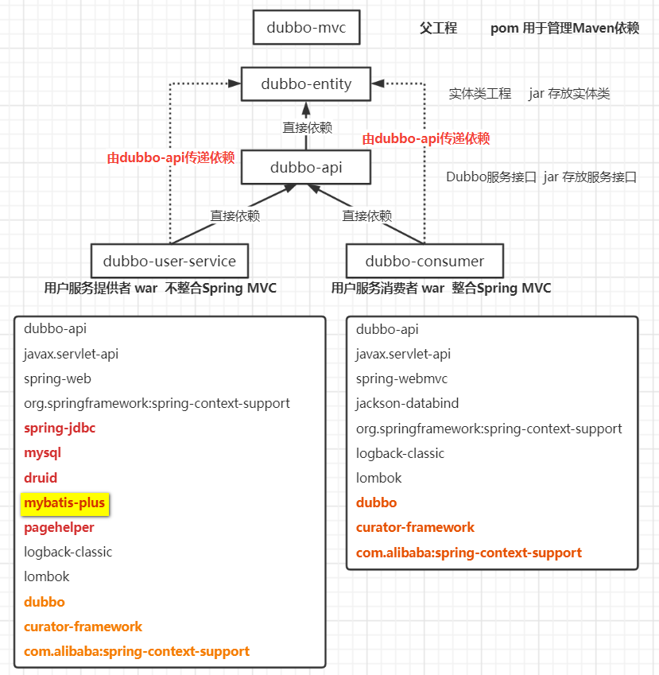
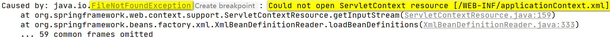
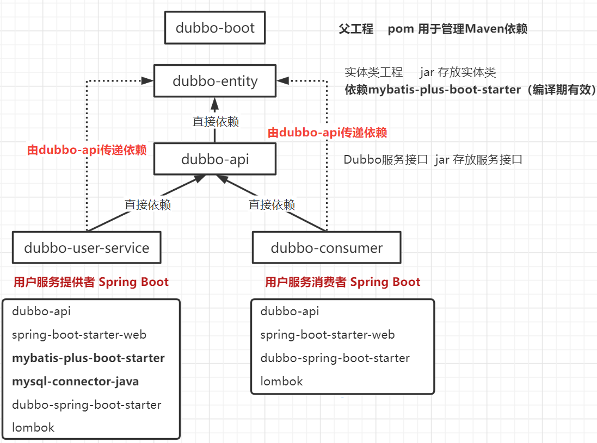

## 今天内容

1. Spring MVC中使用Dubbo
2. Spring Boot整合Dubbo

## 1. Spring MVC中使用Dubbo

- 创建工程，工程间依赖关系如下图

   

### 整合Spring MVC时出现的问题

1. 整合出现的问题：找不到`Root WebApplicationContext`（找不到父容器）

    

2. 错误原因：导入了Dubbo框架导致的

   为什么导入Dubbo框架就报错？为什么Dubbo启动不找Spring MVC容器呢？

   Dubbo不想与Spring MVC强耦合

## 2. Spring Boot整合Dubbo

 