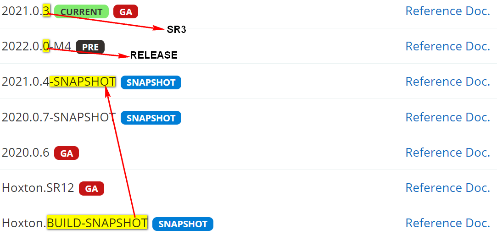
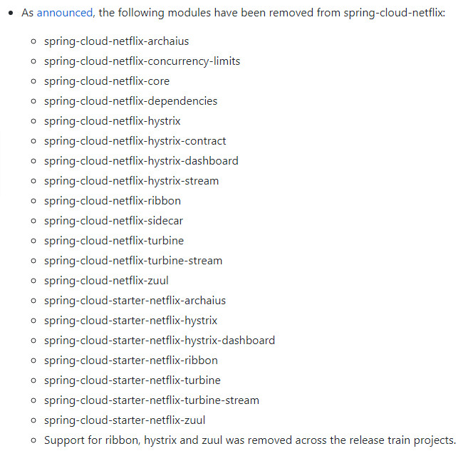

<b>Spring Cloud</b>

- [Spring Cloud官网](https://spring.io/projects/spring-cloud)

- [Spring Cloud中文网](https://www.springcloud.cc/)

- [Spring Cloud、Spring Boot版本对应](https://start.spring.io/actuator/info)

## 1. Spring Cloud是什么

​		Spring Cloud为开发人员提供了快速构建**分布式系统**中一些常见模式的工具，例如：**配置管理**、**服务发现**、**断路器**、智能路由、微代理、控制总线、一次性令牌、全局锁、主节点选举、分布式会话、集群状态。

​		分布式系统的协调导致了`样板式`的模式，使用Spring Cloud，开发人员可以快速地创建支持这些模式的服务和应用程序。它们可以运行在任何分布式环境中，包括开发人员的笔记本电脑、裸机数据中心和云平台等。

​		Spring Cloud是在2014年由Spring团队推出，基于Spring Boot开发，提供了一套完整的微服务解决方案，包括：服务注册与发现、配置中心、Api网关、断路器、全链路监控、控制总线、智能路由等，并可以根据需要进行扩展和替换，它的目标是使其成为Java领域的微服务架构落地标准；

## 2. Spring Cloud版本号

### 2.1 早期版本号命名规则

​		早期Spring Cloud的版本号名称没有采用数字，而是采用**`伦敦地铁站`**作为版本号；

### 2.2 Spring Cloud发行版本

1. **Angel**：天使站（这个站名来源于大北方之路过去一家名为“天使”驿站，可以追溯到17世纪）。 
2. **Brixton**：布里克斯顿站（位于伦敦南二区，是伦敦地铁Victoria line（浅蓝色线）南边的最后一站）。
3. **Camden**：卡姆登镇（伦敦必逛的集市，它是伦敦北部重要的集市之一，临近摄政运河(Regent’s Canal)，1791年开始发展到现在） 
4. **Dalston**：多斯顿王领地站
5. **Edgware**：埃奇韦尔 
6. **Finchley**：芬奇利
7. **Greenwich**：格林威治（Finchley第一个次要版本）
8. **Hoxton**: 霍克斯顿（Finchley第二个次要版本）
9. **2020.0.x** - 代号Ilford：伊尔福德（版本变化比较大）
9. **2021.0.x - 代号Jubilee**
9. **2022.0.x - 代号Kilburn（2022.12.16发布，基于Spring Boot 3.0开发）**

### 2.3 现行版本号命名规则 

1. Spring Cloud目前最新版本是**2022.0.3**版本。

2. Spring Cloud更改了发行版本号方案，后面将遵循**`YYYY.MINOR.MICRO`**模式，其中：

- **`MINOR`**是一个递增数字，每年从 0 开始。

- **`MICRO`**对应先前使用的后缀：如**`.0`**类似**`.RELEASE`**，而**`.2`**类似于**`.SR2`**。

- 预发行后缀也将从使用**`.`**作为分隔符改为使用 **`-`**

  例如：**`2020.0.0-M1`**和**`2020.0.0-RC2`**。另外，还将停止为快照添加前缀**`BUILD-`**，例如**`2020.0.4-SNAPSHOT`**。

      

- 发行代号将继续使用伦敦地铁站名称，当前的代号是Kilburn。

## 3. Spring Cloud常用组件

​		Spring Cloud将其它公司开发的比较成熟、经得起考验的服务框架组合起来，通过了Spring Boot风格进行封装，并屏蔽掉复杂的配置和实现原理，最终呈现给开发者一套简单易懂、易于部署和维护的分布式系统开发工具包。

​		下图列举了Spring Cloud常用组件

## 4. Spring Cloud版本号与SpringBoot版本对应

| SpringCloud版本 | SpringBoot版本                      |
| --------------- | ----------------------------------- |
| Angel           | 1.2.x                               |
| Brixton         | 1.3.x                               |
| Camden          | 1.4.x                               |
| Dalston         | 1.5.x                               |
| Edgware         | 1.5.x                               |
| Finchley        | 2.0.x                               |
| Greenwich       | 2.1.x                               |
| Hoxton          | 2.2.x - 2.3.x                       |
| 2020.0.x        | 2.4.x、2.5.x                        |
| 2021.0.x        | 2.6.1+、2.7.x                       |
| **2022.0.x**    | Spring Boot >= 3.0.0 and < 3.1.0-M1 |

## 5. Spring Cloud 2020.0.0 版本开始删除的Netflix组件

- Spring Cloud 2020.0.x 版本变更说明：

  [版本变更说明](https://github.com/spring-cloud/spring-cloud-release/wiki/Spring-Cloud-2020.0-Release-Notes#breaking-changes)

 

## 6. Spring Cloud Alibaba

1. [Github地址](https://github.com/alibaba/spring-cloud-alibaba)

2. [Github中文说明地址](https://github.com/alibaba/spring-cloud-alibaba/blob/master/README-zh.md)
3. 2018年10月31日，Spring Cloud Alibaba入驻Spring Cloud官方孵化器，并在Maven中央库发布了第一个版本。
4. Spring Cloud Alibaba 致力于提供微服务开发的一站式解决方案。此项目包含开发分布式应用微服务的必需组件，方便开发者通过 Spring Cloud 编程模型轻松使用这些组件来开发分布式应用服务。
5. 依托 Spring Cloud Alibaba，您只需要添加一些注解和少量配置，就可以将 Spring Cloud 应用接入阿里微服务解决方案，通过阿里中间件来迅速搭建分布式应用系统。

### 6.1 主要功能

- **服务限流降级**：默认支持 WebServlet、WebFlux, OpenFeign、RestTemplate、Spring Cloud Gateway, Zuul, Dubbo 和 RocketMQ 限流降级功能的接入，可以在运行时通过控制台实时修改限流降级规则，还支持查看限流降级 Metrics 监控。
- **服务注册与发现**：适配 Spring Cloud 服务注册与发现标准，默认集成了 Ribbon 的支持。
- **分布式配置管理**：支持分布式系统中的外部化配置，配置更改时自动刷新。
- **消息驱动能力**：基于 Spring Cloud Stream 为微服务应用构建消息驱动能力。
- **分布式事务**：使用 @GlobalTransactional 注解， 高效并且对业务零侵入地解决分布式事务问题。
- **阿里云对象存储**：阿里云提供的海量、安全、低成本、高可靠的云存储服务。支持在任何应用、任何时间、任何地点存储和访问任意类型的数据。
- **分布式任务调度**：提供秒级、精准、高可靠、高可用的定时（基于 Cron 表达式）任务调度服务。同时提供分布式的任务执行模型，如网格任务。网格任务支持海量子任务均匀分配到所有 Worker（schedulerx-client）上执行。
- **阿里云短信服务**：覆盖全球的短信服务，友好、高效、智能的互联化通讯能力，帮助企业迅速搭建客户触达通道。

### 6.2 主要组件

- **Sentinel：把流量作为切入点，从流量控制、熔断降级、系统负载保护等多个维度保护服务的稳定性。**

- **Nacos：一个更易于构建云原生应用的动态服务发现、配置管理和服务管理平台。**

- **RocketMQ**：一款开源的分布式消息系统，基于高可用分布式集群技术，提供低延时的、高可靠的消息发布与订阅服务。

- **Dubbo**：Apache Dubbo™ 是一款高性能 Java RPC 框架。

- **Seata**：阿里巴巴开源产品，一个易于使用的高性能微服务分布式事务解决方案。

- **Alibaba Cloud OSS**: 阿里云对象存储服务（Object Storage Service，简称 OSS），是阿里云提供的海量、安全、低成本、高可靠的云存储服务。您可以在任何应用、任何时间、任何地点存储和访问任意类型的数据。

- **Alibaba Cloud SchedulerX**: 阿里中间件团队开发的一款分布式任务调度产品，提供秒级、精准、高可靠、高可用的定时（基于 Cron 表达式）任务调度服务。

- **Alibaba Cloud SMS**: 覆盖全球的短信服务，友好、高效、智能的互联化通讯能力，帮助企业迅速搭建客户触达通道。

### 6.3 Spring Cloud Alibaba、Spring Cloud、Spring Boot版本对应关系

[版本对应关系](https://github.com/alibaba/spring-cloud-alibaba/wiki/版本说明)

| Spring Cloud Alibaba Version | Spring Cloud Version        | Spring Boot Version |
| :--------------------------- | :-------------------------- | :------------------ |
| `2021.0.5`.0                 | **Spring Cloud `2021.0.5`** | 2.6.13              |
| `2021.0.4`.0                 | **Spring Cloud `2021.0.4`** | 2.6.11              |
| `2021.0.1`.0                 | **Spring Cloud `2021.0.1`** | 2.6.x               |
| 2021.1                       | Spring Cloud 2020.0.1       | 2.4.2               |
| 2.2.9.RELEASE                | Spring Cloud Hoxton.SR12    | 2.3.12.RELEASE      |
| 2.2.1.RELEASE                | Spring Cloud Hoxton.SR3     | 2.2.5.RELEASE       |
| 2.2.0.RELEASE                | Spring Cloud Hoxton.RELEASE | 2.2.X.RELEASE       |
| 2.1.4.RELEASE                | Spring Cloud Greenwich.SR6  | 2.1.13.RELEASE      |
| 2.1.2.RELEASE                | Spring Cloud Greenwich      | 2.1.X.RELEASE       |
| 2.0.4.RELEASE(停止维护)      | Spring Cloud Finchley       | 2.0.X.RELEASE       |
| 1.5.1.RELEASE(停止维护)      | Spring Cloud Edgware        | 1.5.X.RELEASE       |
