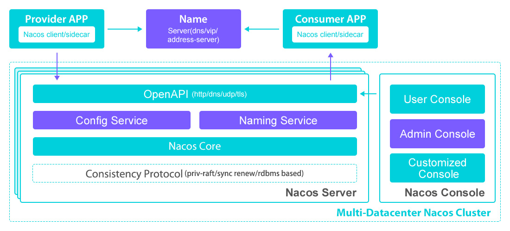

##   1. Nacos [nɑ:kəʊs] 概述

​		一个更易于构建云原生应用的动态服务发现、配置管理和服务管理平台。

### 1.2 相关网址

1. 官网地址：https://nacos.io/zh-cn
2. GitHub代码地址：https://github.com/alibaba/nacos

### 1.2 Nacos全称

1. 全称：`Dynamic Naming and Configuration Service`
2. **Na指`Naming、NameServer`即注册中心**
3. **Co指`Configuration`即配置中心**
4. Service是指注册中心/配置中心都是以服务为核心。

### 1.3 Nacos功能

1. **服务发现及管理**

   动态服务发现对以服务为中心的（例如微服务和云原生）应用架构方式非常关键。Nacos支持DNS-Based和RPC-Based（Dubbo、gRPC）模式的服务发现。Nacos也提供实时健康检查，以防止将请求发往不健康的主机或服务实例。借助Nacos，您可以更容易地为您的服务实现断路器。

2. **动态配置服务**

   动态配置服务让您能够以中心化、外部化和动态化的方式管理所有环境的配置。动态配置消除了配置变更时重新部署应用和服务的需要。配置中心化管理让实现无状态服务更简单，也让按需弹性扩展服务更容易。

3. **动态DNS服务**

   通过支持权重路由，动态DNS服务能让您轻松实现中间层负载均衡、更灵活的路由策略、流量控制以及简单数据中心内网的简单DNS解析服务。动态DNS服务还能让您更容易地实现以DNS协议为基础的服务发现，以消除耦合到厂商私有服务发现API上的风险。

### 1.4 Nacos基本架构及概念

 

#### 1.4.1 服务 (Service)

​		服务是指一个或一组软件功能（例如特定信息的检索或一组操作的执行），其目的是不同的客户端可以为不同的目的重用（例如通过跨进程的网络调用）。Nacos 支持主流的服务生态，如 Kubernetes Service、gRPC | Dubbo RPC Service 或者 **Spring Cloud RESTful Service.**

#### 1.4.2  服务注册中心 (Service Registry)

​		存储服务实例和服务负载均衡策略的数据库。服务实例在启动时注册到服务注册表，并在关闭时注销。服务和路由器的客户端查询服务注册表以查找服务的可用实例。服务注册中心可能会调用服务实例的健康检查 API 来验证它是否能够处理请求。

#### 1.4.3  服务元数据 (Service Metadata)

​		服务元数据是指包括服务端点(endpoints)、服务标签、服务版本号、服务实例权重、路由规则、安全策略等描述服务的数据

#### 1.4.4  服务提供方 (Service Provider)

​		是指提供可复用和可调用服务的应用方

#### 1.4.5  服务消费方 (Service Consumer)

​		是指会发起对某个服务调用的应用方

#### 1.4.6  配置 (Configuration)

​		在系统开发过程中通常会将一些需要变更的参数、变量等从代码中分离出来独立管理，以独立的配置文件的形式存在。目的是让静态的系统工件或者交付物（如 WAR，JAR 包等）更好地和实际的物理运行环境进行适配。配置管理一般包含在系统部署的过程中，由系统管理员或者运维人员完成这个步骤。配置变更是调整系统运行时的行为的有效手段之一。

#### 1.4.7  配置管理 (Configuration Management)

​		在数据中心中，系统中所有配置的编辑、存储、分发、变更管理、历史版本管理、变更审计等所有与配置相关的活动统称为配置管理。

## 2. Nacos控制台下载与安装

### 2.1 Nacos控制台下载

1. 本次使用Nacos 2.1.0 版本

2. Windows版本下载地址

   https://github.com/alibaba/nacos/releases/download/2.1.0/nacos-server-2.1.0.zip

   也可以使用下面地址查找其它版本进行下载

   https://github.com/alibaba/nacos/releases

### 2.1 Nacos安装与启动

1. 解压`nacos-server-2.1.0.zip`到当前目录

   **注意：目录不能有中文、空格**

2. 使用cmd进入 bin目录，找到startup.cmd

3. 使用下面的命令进行单机启动

   `startup.cmd -m standalone` 

4. 控制台地址：http://localhost:8848/nacos

5. 用户名和密码默认都是nacos

    

