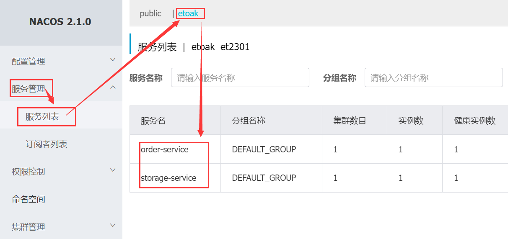

# Spring Cloud

## 1. 将库存服务、订单服务注册到Nacos

1. 在`cloud-services`父工程中引入Nacos注册中心整合Spring Cloud之后的依赖

   ```xml
   <!-- spring-cloud-starter-alibaba-nacos-discovery -->
   <dependency>
     <groupId>com.alibaba.cloud</groupId>
     <artifactId>spring-cloud-starter-alibaba-nacos-discovery</artifactId>
   </dependency>
   ```

2. 在两个服务的`application.yml`中配置`服务名称`、`Nacos注册中心地址`

   ```yaml
   spring:
     application:
       name: order-service
   
     cloud:
       nacos:
         discovery:
           # 注册中心地址
           server-addr: 127.0.0.1:8848
           # 命名空间
           namespace: et2301
   ```

3. 启动服务后，查看Nacos控制台的服务列表

    

## 2. 使用OpenFeign实现订单服务调用库存服务

​		OpenFeign是Spring Cloud在`Feign`框架的基础上支持了Spring MVC。

1. 在`cloud-services`父工程中引入依赖

   OpenFeign

   LoadBalancer：负载均衡器，代替Ribbon框架

   ```xml
   <!-- 声明式HTTP客户端: spring-cloud-starter-openfeign -->
   <dependency>
     <groupId>org.springframework.cloud</groupId>
     <artifactId>spring-cloud-starter-openfeign</artifactId>
   </dependency>
   
   <!-- 负载均衡器: spring-cloud-starter-loadbalancer -->
   <dependency>
     <groupId>org.springframework.cloud</groupId>
     <artifactId>spring-cloud-starter-loadbalancer</artifactId>
   </dependency>
   ```

   

2. 修改`order-service`

   1、在启动类上增加注解：`@EnableFignClients`

   2、创建远程服务接口，OpenFeign会自动为接口创建代理对象，并使用负载均衡方式调用远程的Rest服务

   3、在`OrderServiceImpl`调用远程服务

   
