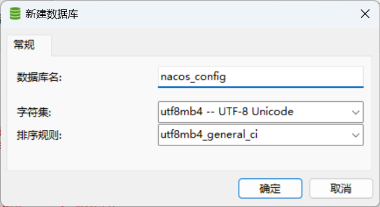
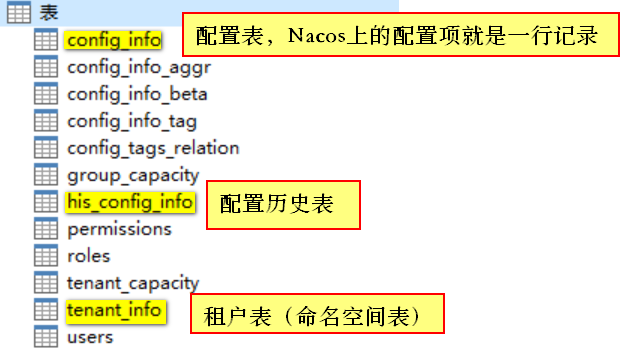
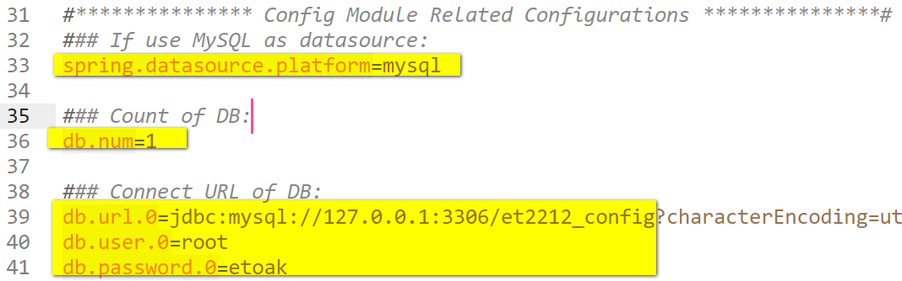

## 1. Nacos配置中心

​		在系统开发过程中，开发者通常会将一些需要变更的参数、变量等从代码中分离出来独立管理，以独立的配置文件的形式存在。目的是让静态的系统工件或者交付物（如 WAR，JAR 包等）更好地和实际的物理运行环境进行适配。

​		配置管理一般包含在系统部署的过程中，由系统管理员或者运维人员完成。配置变更是调整系统运行时的行为的有效手段。

### 1.1 配置项

​				一个具体的可配置的参数与其值域，通常以 param-key=param-value 的形式存在。例如我们常配置系统的日志输出级别（logLevel=INFO|WARN|ERROR） 就是一个配置项。

### 1.2 配置集

​		一组相关或者不相关的配置项的集合称为配置集。在系统中，一个配置文件通常就是一个配置集，包含了系统各个方面的配置。例如，一个配置集可能包含了数据源、线程池、日志级别等配置项。

### 1.3 配置集 ID

​		Nacos 中的某个配置集的 ID。配置集 ID 是组织划分配置的维度之一。Data ID 通常用于组织划分系统的配置集。一个系统或者应用可以包含多个配置集，每个配置集都可以被一个有意义的名称标识。Data ID 通常采用类 Java 包（如 com.taobao.tc.refund.log.level）的命名规则保证全局唯一性。此命名规则非强制。

### 1.4 配置分组

​		Nacos 中的一组配置集，是组织配置的维度之一。通过一个有意义的字符串（如 Buy 或 Trade ）对配置集进行分组，从而区分 Data ID 相同的配置集。当您在 Nacos 上创建一个配置时，如果未填写配置分组的名称，则配置分组的名称默认采用DEFAULT_GROUP 。配置分组的常见场景：不同的应用或组件使用了相同的配置类型，如 database_url 配置和 MQ_topic 配置。

## 2. Data ID命名格式

- 命名格式：**`${prefix}-${spring.profiles.active}.${file-extension}`**
- 官方文档地址：https://nacos.io/zh-cn/docs/v2/ecology/use-nacos-with-spring-cloud.html

### 2.1 `${prefix}`

​		**默认值**：服务名称，配置项`${spring.application.name}`的值

​		**如何修改：**通过`spring.cloud.nacos.config.prefix`配置项修改

### 2.2 `${spring.profiles.active}`

​		**没有默认值**

​		如果没有配置这一项，那么前边的`-`也没有，此时的Data Id：`${prefix}.${file-extension}`

### 2.3 `${file-extension}`

​		**默认值**：`properties`

​		**如何修改：**通过`spring.cloud.nacos.config.file-extension`配置项修改

## 3. Nacos持久化

1. **创建数据库**

      

2. **在`nacos_config`数据中创建表，表结构脚本文件：`nacos/conf/nacos-mysql.sql`**

    

3. **修改`nacos/conf/application.properties`**

     

4. **重启Nacos**

## 4. 动态刷新配置中心的配置项

- 使用@RefreshScope

  ```java
  @RestController
  @RefreshScope // 自动刷新注册中心的配置项
  public class TestController {
  
      @Value("${user.id}")
      private int id;
  
      @Value("${user.name}")
      private String name;
  
      @RequestMapping("/test")
      public Object test() {
          return "user id=" + id + "; user name=" + name;
      }
  }
  ```

  

- 通过`@ConfigurationProperties`注解获取的配置，可以自动刷新

  ```java
  @ConfigurationProperties(prefix = "user")
  @Component
  @Data
  public class UserProperties {
    
      private int id;
    
      private String name;
  }
  ```

  
