## 1. Sentinel介绍

​		Sentinel是面向分布式、多语言异构化服务架构的流量治理组件，主要以流量为切入点，从`流量控制`、`流量路由`、`熔断降级`、`系统自适应保护`等多个维度来帮助用户保障微服务的稳定性。

1. 官网地址：https://sentinelguard.io/zh-cn/
2. 文档地址：https://sentinelguard.io/zh-cn/docs/introduction.html
3. 源码地址：https://github.com/alibaba/Sentinel

## 2. Sentinel特性

- **丰富的应用场景**：Sentinel 承接了阿里巴巴近 10 年的双十一大促流量的核心场景，例如秒杀（即突发流量o/C++ 等多语言的原生实现。
- **完善的 SPI 扩展机制**：Sentinel 提供简单易用、完善的 SPI 扩展接口。您可以通过实现扩展接口来快速地定制逻辑。例如定制规则管理、适配动态数据源等。

### 2.1 Sentinel主要特性


## 3. Sentinel的开源生态


## 4. Sentinel的组成

- 核心库（Java 客户端）不依赖任何框架/库，能够运行于所有 Java 运行时环境，同时对 Dubbo / Spring Cloud 等框架也有较好的支持。
- 控制台（Dashboard）基于 Spring Boot 开发，打包后可以直接运行，不需要额外的 Tomcat 等应用容器。

## 5. Sentinel 基本概念

### 5.1 资源

​		资源是 Sentinel 的关键概念。它可以是 Java 应用程序中的任何内容，例如，由应用程序提供的服务，或由应用程序调用的其它应用提供的服务，甚至可以是一段代码。

​		只要通过 Sentinel API 定义的代码，就是资源，就能够被 Sentinel 保护起来。大部分情况下，可以使用方法签名，URL，甚至服务名称作为资源名来标示资源。

### 5.2 规则

​		围绕资源的实时状态设定的规则，可以包括流量控制规则、熔断降级规则以及系统保护规则。所有规则可以动态实时调整。

## 6. Sentinel功能和设计理念

### 6.1 流量控制

​		流量控制在网络传输中是一个常用的概念，它用于调整网络包的发送数据。然而，从系统稳定性角度考虑，在处理请求的速度上，也有非常多的讲究。任意时间到来的请求往往是随机不可控的，而系统的处理能力是有限的。我们需要根据系统的处理能力对流量进行控制。Sentinel 作为一个调配器，可以根据需要把随机的请求调整成合适的形状，如下图所示：

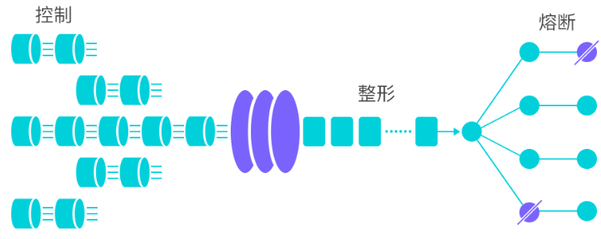 

### 6.2 熔断降级

​		除了流量控制以外，降低调用链路中的不稳定资源也是 Sentinel 的使命之一。由于调用关系的复杂性，如果调用链路中的某个资源出现了不稳定，最终会导致请求发生堆积。

​		当调用链路中某个资源出现不稳定，例如，表现为 timeout，异常比例升高的时候，则对这个资源的调用进行限制，并让请求快速失败，避免影响到其它的资源，最终产生雪崩的效果。

1. **通过并发线程数进行限制**

   和资源池隔离的方法不同，Sentinel 通过限制资源并发线程的数量，来减少不稳定资源对其它资源的影响。这样不但没有线程切换的损耗，也不需要您预先分配线程池的大小。当某个资源出现不稳定的情况下，例如响应时间变长，对资源的直接影响就是会造成线程数的逐步堆积。当线程数在特定资源上堆积到一定的数量之后，对该资源的新请求就会被拒绝。堆积的线程完成任务后才开始继续接收请求。

2. **通过响应时间对资源进行降级**

   除了对并发线程数进行控制以外，Sentinel 还可以通过响应时间来快速降级不稳定的资源。当依赖的资源出现响应时间过长后，所有对该资源的访问都会被直接拒绝，直到过了指定的时间窗口之后才重新恢复。

### 6.3 系统负载保护

​		Sentinel 同时提供[系统维度的自适应保护能力](https://sentinelguard.io/zh-cn/docs/system-adaptive-protection.html)。防止雪崩，是系统防护中重要的一环。当系统负载较高的时候，如果还持续让请求进入，可能会导致系统崩溃，无法响应。在集群环境下，网络负载均衡会把本应这台机器承载的流量转发到其它的机器上去。如果这个时候其它的机器也处在一个边缘状态的时候，这个增加的流量就会导致这台机器也崩溃，最后导致整个集群不可用。

​		针对这个情况，Sentinel 提供了对应的保护机制，让系统的入口流量和系统的负载达到一个平衡，保证系统在能力范围之内处理最多的请求。

## 7. Sentinel快速开始

1. 创建项目

2. 导入Maven依赖

   ```xml
   <dependency>
     <groupId>com.alibaba.csp</groupId>
     <artifactId>sentinel-core</artifactId>
   </dependency>
   ```

3. 编写application.yml

   ```yaml
   server:
     port: xxxx
   ```

4. 编写启动类

   ```java
   package com.etoak;
   
   import com.alibaba.csp.sentinel.slots.block.RuleConstant;
   import com.alibaba.csp.sentinel.slots.block.flow.FlowRule;
   import com.alibaba.csp.sentinel.slots.block.flow.FlowRuleManager;
   import org.springframework.boot.SpringApplication;
   import org.springframework.boot.autoconfigure.SpringBootApplication;
   
   import java.util.ArrayList;
   import java.util.List;
   
   @SpringBootApplication
   public class SentinelApp {
   
     public static void main(String[] args) {
       // 初始化限流规则
       initFlowRules();
       SpringApplication.run(SentinelApp.class, args);
     }
   
     /**
      * 初始化限流规则
      */
     public static void initFlowRules() {
       List<FlowRule> rules = new ArrayList<>();
       // 限流规则
       FlowRule rule = new FlowRule();
       // 设置限流资源: "hello"
       rule.setResource("hello");
       // 设置阈值类型: QPS
       rule.setGrade(RuleConstant.FLOW_GRADE_QPS);
       // 设置单机阈值: 1, 表示 1秒1个请求
       rule.setCount(1);
       rules.add(rule);
       FlowRuleManager.loadRules(rules);
     }
   }
   ```

   

5. 编写HelloController进行测试

   ```java
   @RestController
   public class HelloController {
   
     @RequestMapping("hello")
     public String hello() {
       Entry entry = null;
       try {
         // 资源
         entry = SphU.entry("hello");
         return "success: " + LocalDateTime.now();
       } catch (Exception e) {
         return "限流: " + LocalDateTime.now();
       } finally {
         if (entry != null) {
           entry.exit();
         }
       }
     }
   }
   ```


## 8. Sentinel控制台

​		Sentinel 提供一个轻量级的开源控制台，它提供机器发现以及健康情况管理、监控（单机和集群），规则管理和推送的功能。

​		Sentinel 控制台是流量控制、熔断降级规则统一配置和管理的入口，它为用户提供了机器自发现、簇点链路自发现、监控、规则配置等功能。在 Sentinel 控制台上，我们可以配置规则并实时查看流量控制效果。

### 8.1 功能

- [**查看机器列表以及健康情况**](https://github.com/alibaba/Sentinel/wiki/控制台#4-查看机器列表以及健康情况)：收集 Sentinel 客户端发送的心跳包，用于判断机器是否在线。
- [**监控 (单机和集群聚合)**](https://github.com/alibaba/Sentinel/wiki/控制台#5-监控)：通过 Sentinel 客户端暴露的监控 API，定期拉取并且聚合应用监控信息，最终可以实现秒级的实时监控。
- [**规则管理和推送**](https://github.com/alibaba/Sentinel/wiki/控制台#6-规则管理及推送)：统一管理推送规则。
- [**鉴权**](https://github.com/alibaba/Sentinel/wiki/控制台#鉴权)：生产环境中鉴权非常重要。这里每个开发者需要根据自己的实际情况进行定制。

​		**注意**：Sentinel 控制台目前仅支持单机部署。Sentinel 控制台项目提供 Sentinel 功能全集示例，不作为开箱即用的生产环境控制台，不提供安全可靠保障。若希望在生产环境使用请根据[文档](https://github.com/alibaba/Sentinel/wiki/在生产环境中使用-Sentinel)自行进行定制和改造。

### 8.2 启动控制台

1. [**获取控制台**](https://github.com/alibaba/Sentinel/releases)：https://github.com/alibaba/Sentinel/releases

2. 下载源码，自行编译

   控制台源码地址：https://github.com/alibaba/Sentinel/tree/master/sentinel-dashboard

   下载后编译：`mvn clean package`

3. 运行控制台

   ```bash
   java -jar sentinel-dashboard-x.x.x.jar
   ```

4. 访问控制台

   **默认端口号：8080**

   可以通过`java -jar -Dserver.port=9999 sentinel-dashboard-x.x.x.jar`修改端口号

   浏览器输入http://localhost:9999

   用户名：`sentinel`

   密码：`sentinel`
   
   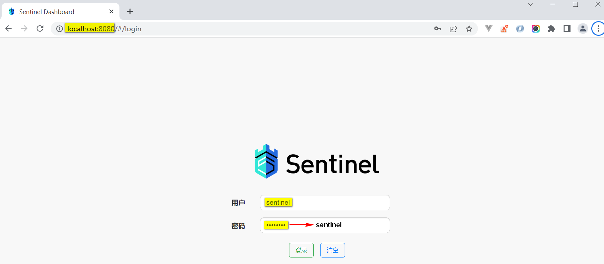

## 9. 流量控制（限流）

### 9.1 限流阈值类型（grade）- 流量控制的两种统计类型

1. **基于QPS/并发数限流**

   QPS（Queries Per Second）：每秒钟请求数

   由 `FlowRule.grade` 字段来定义。**其中，0 代表根据并发数量来限流，1 代表根据 QPS 来进行流量控制。**

   当请求该资源的的QPS达到设定阈值时，进行限流

   

2. **基于线程数限流**

   当请求该资源的线程数达到阈值时，进行限流

   允许请求进入，但是如果没有空闲线程，则失败

### 9.2  流量控制概述

​		一条限流规则主要由下面几个因素组成，我们可以组合这些元素来实现不同的限流效果：

- **`resource`**：资源名，即限流规则的作用对象
- **`grade`**: 限流阈值类型，QPS 或线程数
- **`count`**: 限流阈值
- **`strategy`**: 根据调用关系选择策略

###  9.3  限流策略（strategy）- 流控模式

1. **直接**

   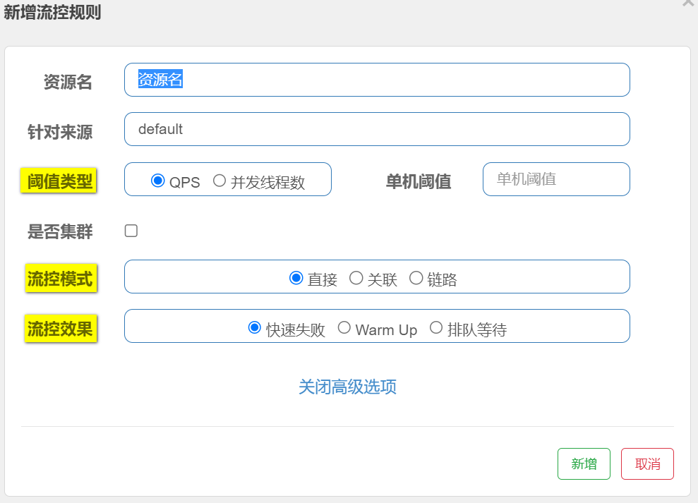

2. **关联**

   ​		当两个资源之间具有资源争抢或者依赖关系的时候，这两个资源便具有了关联。

   ​		比如对数据库同一个字段的读操作和写操作存在争抢，读的速度过高会影响写得速度，写的速度过高会影响读的速度。如果放任读写操作争抢资源，则争抢本身带来的开销会降低整体的吞吐量。

   ​		可使用关联限流来避免具有关联关系的资源之间过度的争抢，举例来说，`read_db` 和 `write_db` 这两个资源分别代表数据库读写，我们可以给 `read_db` 设置限流规则来达到写优先的目的，这样当写库操作过于频繁时，读数据的请求会被限流。

   ​		**简单来说**：就是当与`A资源（read_db）`关联的`B资源(write_db)`的请求达到阈值时，对`A资源(read_db)`进行流控；

   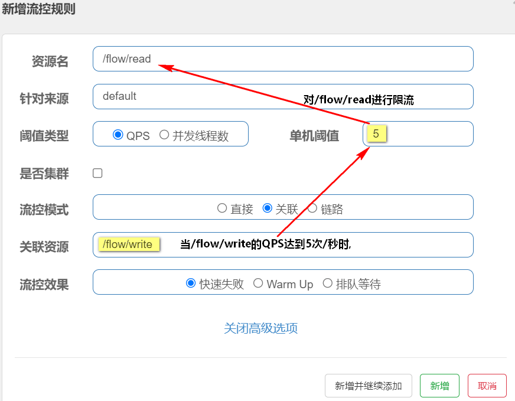  

   

3. **链路**

   ```
             		  machine-root
                       /       \
                      /         \
                Entrance1     Entrance2
                   /              \
                  /                \
         DefaultNode(nodeA)   DefaultNode(nodeA)
   ```

   上图中来自入口 `Entrance1` 和 `Entrance2` 的请求都调用到了资源 `NodeA`，Sentinel 允许**只根据某个入口**的统计信息对资源限流。

   比如我们可以设置 `FlowRule.strategy` 为 `RuleConstant.CHAIN`，同时设置 `FlowRule.ref_identity` 为 `Entrance1` 来表示只有从入口 `Entrance1` 的调用才会记录到 `NodeA` 的限流统计当中，而对来自 `Entrance2` 的调用漠不关心。

   **从Entrance1请求nodeA的QPS达到`10次/s`时，nodeA对来自Entrance1的请求限流**（nodeA限制Entrance1的请求）
   
   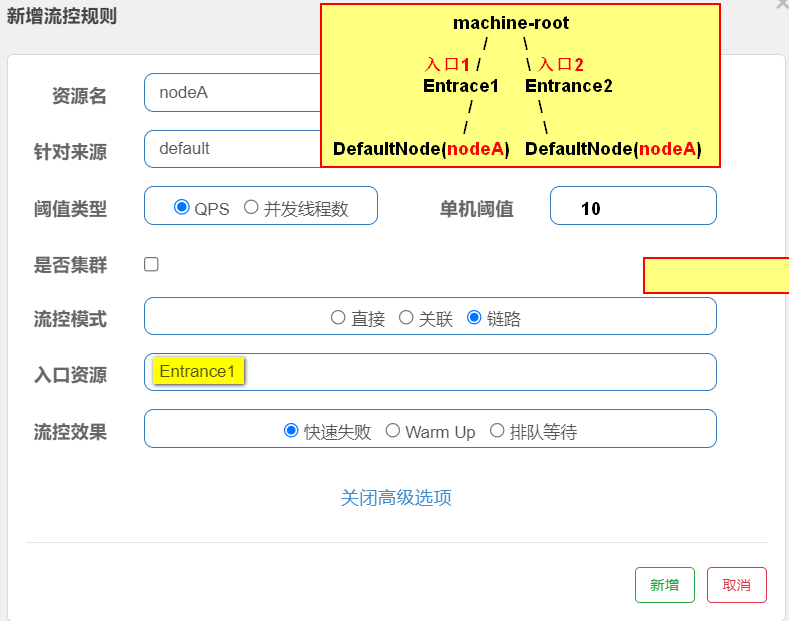

1. **在yml在增加` web-context-unify: false`配置**

   ```yaml
   spring:
     cloud:
       sentinel:
         transport:
           # sentinel控制台
           dashboard: localhost:8000
         # 所有资源不挂在sentinel_spring_web_context资源下
         web-context-unify: false
   ```

2. **配置`web-context-unify: false`前后对比**

   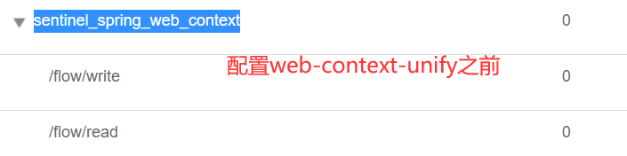 

   

   

   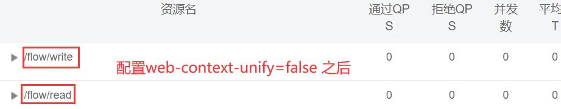 

   

6. **代码**

   ```java
   @RestController
   @RequestMapping("/flow")
   public class FlowController {
     
     /****** 流控模式: 链路模式 start ******/
     @Autowired
     FlowService flowService;
   
     @RequestMapping("/entrance1")
     public String entrance1() {
       // 调用nodeA资源
       return flowService.nodeA("entrance1");
     }
   
     @RequestMapping("/entrance2")
     public String entrance2() {
       // 调用nodeA资源
       return flowService.nodeA("entrance2");
     }
     /****** 流控模式: 链路模式 end ******/
   }
   ```

   ```java
   @Service
   public class FlowService {
   
     // entrance1和entrance2共同调用的资源nodeA
     @SentinelResource(value = "nodeA", blockHandler = "nodeBlockHandler")
     public String nodeA(String from) {
       System.out.println("from==" + from);
       return from;
     }
   
     public String nodeBlockHandler(String from, BlockException e) {
       return from + " - 被限流了！";
     }
   
   }
   
   ```

   

4. **规则配置**

   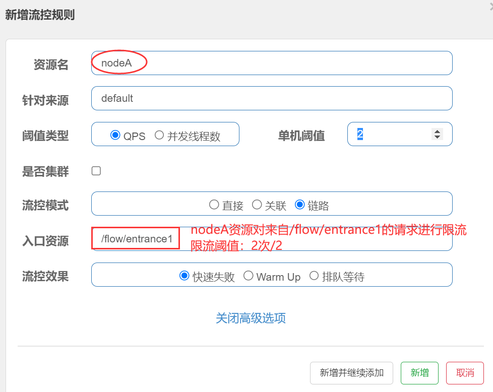 

   

5. **测试结果**

   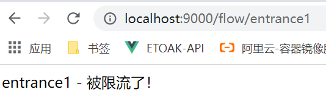 


### 9.4  流控效果

1. **直接拒绝 - 快速失败 （RuleConstant.CONTROL_BEHAVIOR_DEFAULT）**

   ​		该方式是默认的流量控制方式，当QPS超过任意规则的阈值后，新的请求就会被立即拒绝，拒绝方式为抛出`FlowException`。这种方式适用于对系统处理能力确切已知的情况下，比如通过压测确定了系统的准确水位时。

   

2. **Warm Up - 冷启动（RuleConstant.CONTROL_BEHAVIOR_WARM_UP）方式**

   ​		该方式主要用于系统长期处于低水位的情况下，当流量突然增加时，直接把系统拉升到高水位可能瞬间把系统压垮。通过**"冷启动"**，让通过的流量缓慢增加，在一定时间内逐渐增加到阈值上限，给冷系统一个预热的时间，避免冷系统被压垮的情况。

   ​		<font style="border-radius:5px; box-shadow: 0px 0px 15px #cacaca; padding:2px;" >**sentinel客户端的默认冷加载因子coldFactor为3，即请求QPS从 threshold / 3 开始，经预热时长逐渐升至设定的QPS阈值。**</font>

   

   **1、Sentinel控制台设置预热**

   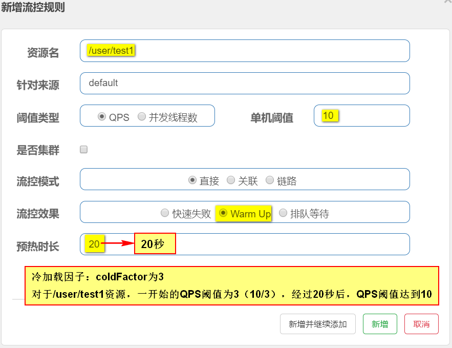

   **2、流控效果**

   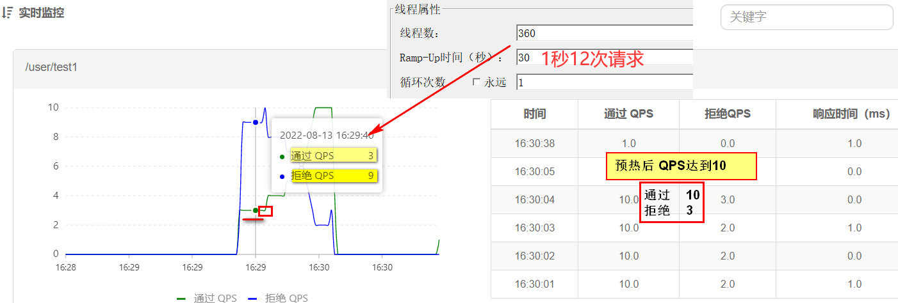

   

3. **排队等待 - 匀速器（RuleConstant.CONTROL_BEHAVIOR_RATE_LIMITER）方式**

   排队等待方式不会拒绝请求，而是严格控制请求通过的间隔时间，也就是让请求匀速通过;

   <font style="border-radius:5px; box-shadow: 0px 0px 15px #cacaca; padding:6px;" >**1、在Sentinel控制台设置排队等待**</font>

   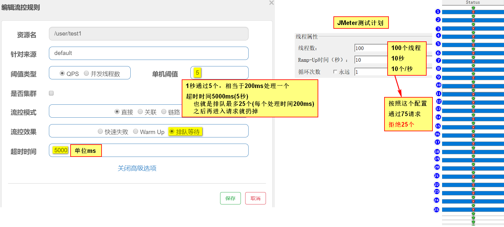

   <font style="border-radius:5px; box-shadow: 0px 0px 15px #cacaca; padding:6px;" >**2、流控效果**</font>

   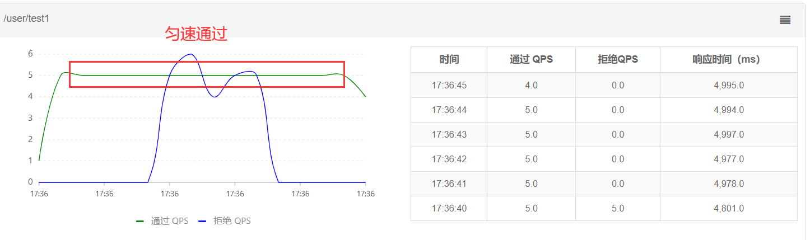

## 10. 熔断降级

​		除了流量控制以外，对调用链路中不稳定的资源进行熔断降级也是保障高可用的重要措施之一。

​		一个服务常常会调用别的模块，可能是另外的一个远程服务、数据库，或者第三方 API 等。

​		**例如：支付的时候，可能需要远程调用银联提供的 API；查询某个商品的价格，可能需要进行数据库查询。**

​		然而，被依赖服务的稳定性是不能保证的。

​		如果依赖的服务出现了不稳定的情况，请求的响应时间变长，那么调用服务的方法的响应时间也会变长，线程会产生堆积，最终可能耗尽业务自身的线程池，服务本身也变得不可用。

​		现代微服务架构都是分布式的，由非常多的服务组成。不同服务之间相互调用，组成复杂的调用链路，**以上的问题在链路调用中会产生放大的效果。**

​		复杂链路上的某一环不稳定，就可能会层层级联，最终导致整个链路都不可用。因此我们需要对不稳定的**弱依赖服务调用**进行熔断降级，暂时切断不稳定调用，避免局部不稳定因素导致整体的雪崩。

### 10.1 熔断策略

- <font style="border-radius:5px; box-shadow: 0px 0px 15px #cacaca; padding:6px;" >**慢调用比例 (`SLOW_REQUEST_RATIO`)**</font>

  ​		选择以慢调用比例作为阈值，需要设置允许的慢调用 RT（即最大的响应时间），请求的响应时间大于该值则统计为慢调用。当单位统计时长（`statIntervalMs`）内请求数目大于设置的最小请求数目，并且慢调用的比例大于阈值，则接下来的熔断时长内请求会自动被熔断。经过熔断时长后熔断器会进入探测恢复状态（HALF-OPEN 状态），若接下来的一个请求响应时间小于设置的慢调用 RT 则结束熔断，若大于设置的慢调用 RT 则会再次被熔断。

  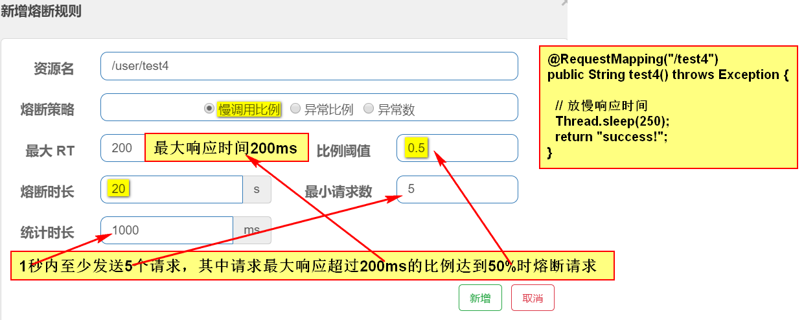

  

- <font style="border-radius:5px; box-shadow: 0px 0px 15px #cacaca; padding:6px;" >**异常比例 (`ERROR_RATIO`)**</font>

  ​		当单位统计时长（`statIntervalMs`）内请求数目大于设置的最小请求数目，并且异常的比例大于阈值，则接下来的熔断时长内请求会自动被熔断。经过熔断时长后熔断器会进入探测恢复状态（HALF-OPEN 状态），若接下来的一个请求成功完成（没有错误）则结束熔断，否则会再次被熔断。异常比率的阈值范围是 `[0.0, 1.0]`，代表 0% - 100%。

  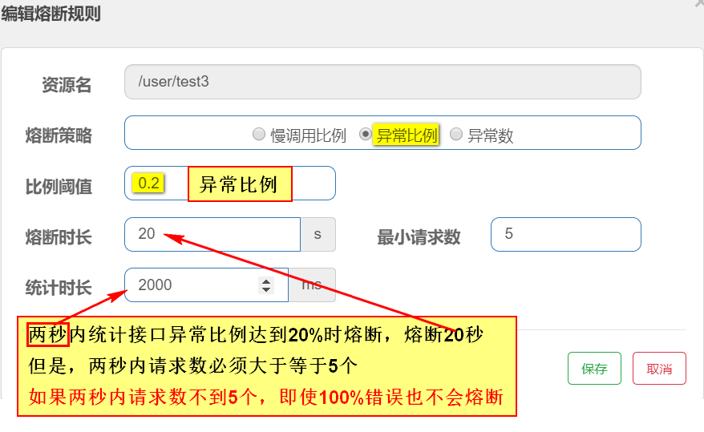

- <font style="border-radius:5px; box-shadow: 0px 0px 15px #cacaca; padding:6px;" >**异常数 (`ERROR_COUNT`)**</font>

  ​		当单位统计时长内的异常数目超过阈值之后会自动进行熔断。经过熔断时长后熔断器会进入探测恢复状态（HALF-OPEN 状态），若接下来的一个请求成功完成（没有错误）则结束熔断，否则会再次被熔断。

  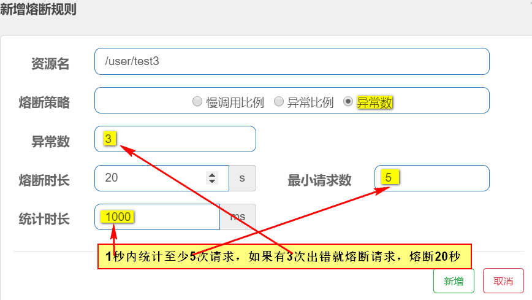

## 11. 热点参数限流

​		何为热点？热点即经常访问的数据。很多时候我们希望统计某个热点数据中访问频次最高的 Top K 数据，并对其访问进行限制。比如：

- 商品 ID 为参数，统计一段时间内最常购买的商品 ID 并进行限制
- 用户 ID 为参数，针对一段时间内频繁访问的用户 ID 进行限制

​		热点参数限流会统计传入参数中的热点参数，并根据配置的限流阈值与模式，对包含热点参数的资源调用进行限流。热点参数限流可以看做是一种特殊的流量控制，仅对包含热点参数的资源调用生效。

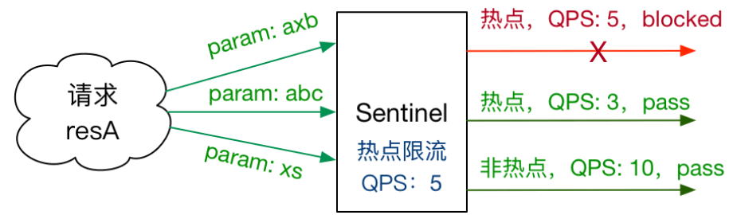


1. **代码编写**

   ```java
   @RestController
   @RequestMapping("/order")
   public class HotParamFlowController {
   
       @SentinelResource(value = "order")
       @RequestMapping("/{id}")
       public String getOrder(@PathVariable long id) {
           return "Order id : " + id;
       }
   }
   ```

   

2. **控制台配置**

   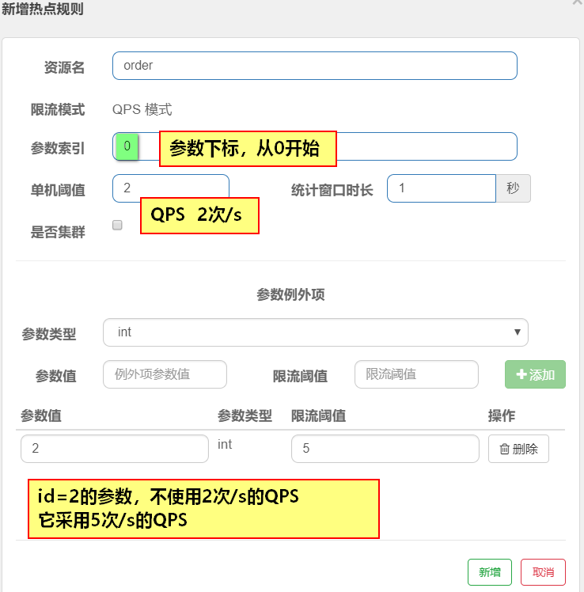 

## 12. 自定义限流或降级返回结果

1. 对于使用`@SentinelResource`注解定义的资源，使用它的`blockHandler`属性即可
2. 对于`Spring MVC 请求URL`的资源可以实现`BlockExceptionHandler`

## 13. 在order-service开启Feign对Sentinel的支持

1. **在order-service项目中增加如下Maven依赖：spring-cloud-starter-sentinel**

   ```xml
   <dependency>
     <groupId>com.alibaba.cloud</groupId>
     <artifactId>spring-cloud-starter-alibaba-sentinel</artifactId>
   </dependency>
   ```

2. **在application.yml中配置sentinel控制台地址，并开启feign对sentinel支持**

    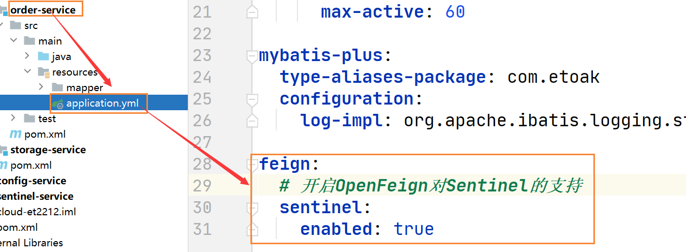 

3. **为Feign接口StorageService上的@FeignClient注解添加`fallback属性`（属性值是一个实现了Feign接口的实现类）**

## 14. [持久化限流规则](https://sentinelguard.io/zh-cn/docs/dynamic-rule-configuration.html)

​		Sentinel 的理念是**开发者只需要关注资源的定义**，当资源定义成功后可以动态增加各种流控降级规则。

​		Sentinel 提供两种方式修改规则：

- 通过 API 直接修改 (`loadRules`)
- 通过 `DataSource` 适配不同数据源修改

​	手动修改规则（硬编码方式）一般仅用于测试和演示，生产上一般通过动态规则源的方式来动态管理规则。

​	我们推荐**通过控制台设置规则后将规则推送到统一的规则中心，客户端实现** `ReadableDataSource` **接口端监听规则中心实时获取变更**，流程如下：

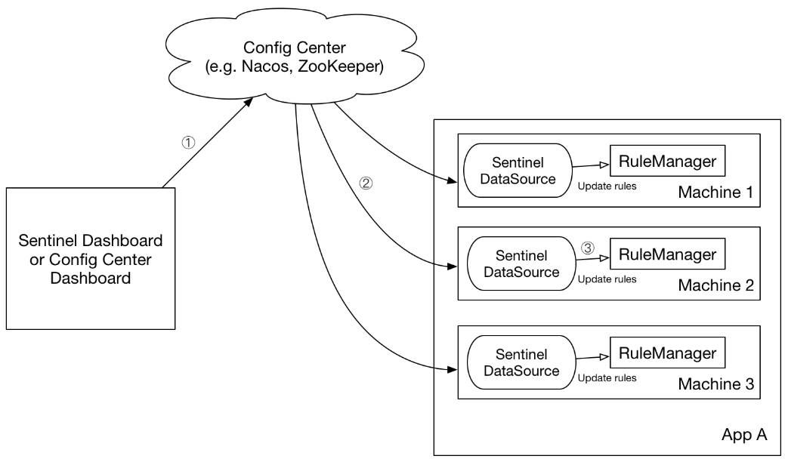 


`DataSource` 扩展常见的实现方式有:

- **拉模式**：客户端主动向某个规则管理中心定期轮询拉取规则，这个规则中心可以是 RDBMS、文件，甚至是 VCS 等。这样做的方式是简单，缺点是无法及时获取变更；
- **推模式**：规则中心统一推送，客户端通过注册监听器的方式时刻监听变化，比如使用 [Nacos](https://github.com/alibaba/nacos)、Zookeeper 等配置中心。这种方式有更好的实时性和一致性保证。

Sentinel 目前支持以下数据源扩展：

- Pull-based: 动态文件数据源、[Consul](https://github.com/alibaba/Sentinel/tree/master/sentinel-extension/sentinel-datasource-consul), [Eureka](https://github.com/alibaba/Sentinel/tree/master/sentinel-extension/sentinel-datasource-eureka)
- Push-based: [ZooKeeper](https://github.com/alibaba/Sentinel/tree/master/sentinel-extension/sentinel-datasource-zookeeper), [Redis](https://github.com/alibaba/Sentinel/tree/master/sentinel-extension/sentinel-datasource-redis), [Nacos](https://github.com/alibaba/Sentinel/tree/master/sentinel-extension/sentinel-datasource-nacos), [Apollo](https://github.com/alibaba/Sentinel/tree/master/sentinel-extension/sentinel-datasource-apollo), [etcd](https://github.com/alibaba/Sentinel/tree/master/sentinel-extension/sentinel-datasource-etcd)

### 14.1 使用 Nacos 配置规则实施步骤

​		Nacos是阿里中间件团队开源的服务发现和动态配置中心。Sentinel 针对 Nacos 作了适配，底层可以采用 Nacos 作为规则配置数据源。

1. 添加Maven依赖

   ```xml
   <dependency>
     <groupId>com.alibaba.csp</groupId>
     <artifactId>sentinel-datasource-nacos</artifactId>
     <version>x.y.z</version>
   </dependency>
   ```

2. 在yml中配置nacos持久化

   ```yaml
   server:
     port: 8000
   
   spring:
     application:
       name: sentinel-nacos-service
       
     cloud:
       nacos:
         discovery:
           server-addr: localhost:8848
           namespace: et2212
   
   
       sentinel:
         transport:
           dashboard: localhost:8080
         eager: true
         web-context-unify: false
   
         datasource:
           et2212:
             nacos:
               server-addr: ${spring.cloud.nacos.discovery.server-addr}
               namespace: ${spring.cloud.nacos.discovery.namespace}
               # 配置集ID名称
               data-id: sentinel-flow
               # data id类型
               data-type: json
               # 规则类型
               rule-type: flow
   ```

   

3. 在nacos控制增加配置

    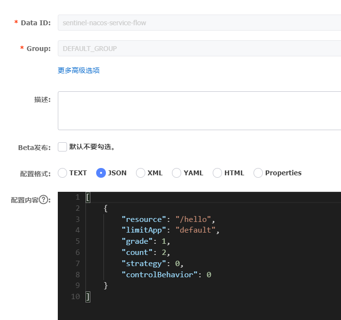 

   ```json
   [
     {
       "resource": "/hello", // 资源名
       "limitApp": "default", // 针对来源
       "grade": 1,    // 阈值类型 1：QPS; 0: 并发线程数
       "count": 2,    // 单机阈值
       "strategy": 0, // 流控模式 0:直接, 1:关联，2:链路
       "controlBehavior": 0 // 流控效果 0: 快速失败, 1: warm up，2:排队等待
     }
   ]
   ```
   
     


