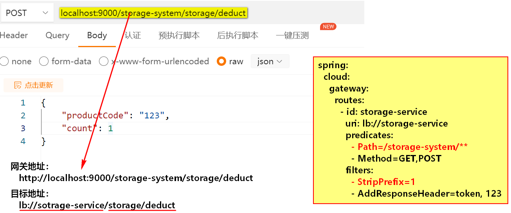

## 1. Spring Cloud Gateway

​		Spring Cloud Gateway项目是一个基于Spring WebFlux开发的API 网关的框架，它的目标是为微服务架构提供⼀种简单、有效的统⼀的API路由管理方式，且基于 Filter 链的方式提供了网关基本的功能，例如：安全、限流、熔断、路径重写、日志监控等功能。

## 2. Spring Cloud Gateway术语

- **Route**: The basic building block of the gateway. It is defined by **an ID, a destination URI,** a collection of predicates, and a collection of filters. A route is matched if the aggregate predicate is true.

  构建网关的基本模块；

  **它由ID、URI、一组断言集合、一组过滤器集合组成；**

  当所有的predicate返回true时，则进行路由匹配；

  

- **Predicate**: This is a [Java 8 Function Predicate](https://docs.oracle.com/javase/8/docs/api/java/util/function/Predicate.html). The input type is a [Spring Framework `ServerWebExchange`](https://docs.spring.io/spring/docs/5.0.x/javadoc-api/org/springframework/web/server/ServerWebExchange.html). This lets you match on anything from the HTTP request, such as headers or parameters.

  JDK8的函数式编程模型；

  它判断类型是ServerWebExchange；

  它可以匹配http请求的所有内容，例如请求头、请求参数等；

  

- **Filter**: These are instances of [`GatewayFilter`](https://github.com/spring-cloud/spring-cloud-gateway/tree/main/spring-cloud-gateway-server/src/main/java/org/springframework/cloud/gateway/filter/GatewayFilter.java) that have been constructed with a specific factory. Here, you can modify requests and responses before or after sending the downstream request.

  通过特定的过滤器工厂创建GatewayFilter；

  可以在请求和响应前后对请求进行修改（增加请求参数、设置响应内容）；

## 3. Spring Cloud Gateway 功能、特点

- Built on Spring Framework 5, Project Reactor and Spring Boot 2.0

  建立在Spring 5.0 、Project Reactor（Spring WebFlux）、Spring Boot 2.0之上

- Able to match routes on any request attribute.

  可以对所有的请求属性进行路由匹配

- Predicates and filters are specific to routes.

  可以对特定路由进行断言和过滤

- Circuit Breaker integration.

  集成断路器（做服务保护【限流、熔断、降级】）

- Spring Cloud DiscoveryClient integration

  集成服务发现

- Easy to write Predicates and Filters

  容易编写断言和过滤器（通过配置文件编写、通过代码编写）

- Request Rate Limiting

  请求限流

- Path Rewriting

  路径重写

## 4. 开发网关，让网关代理到old.etoak.com

1. 创建项目`gateway-01`，导入Maven依赖

   ```xml
   <dependencies>
     <dependency>
       <groupId>org.springframework.cloud</groupId>
       <artifactId>spring-cloud-starter-gateway</artifactId>
     </dependency>
   </dependencies>
   ```

2. **在`src/main/resources`下创建application.yml**

   ```yaml
   server:
     port: 9000
   
   # 浏览器输入http://localhost:9003时访问http://old.etoak.com
   spring:
     cloud:
       gateway:
         # List<RouteDefinition>
         routes:
           - id: et
             uri: http://old.etoak.com
             predicates:
               # http://localhost:9003 => http://old.etoak.com
               # http://localhost:9003/assets/etoak.json => http://old.etoak.com/assets/etoak.json
               - Path=/**
   ```

   

3. 开发启动类

   ```java
   @SpringBootApplication
   public class GatewayApplication {
   
       public static void main(String[] args) {
           SpringApplication.run(GatewayApplication.class, args);
       }
   }
   ```


## 5. Gateway代理Spring Cloud服务

1. 创建gateway-02工程，引入Maven依赖

   ```xml
   <dependencies>
     <dependency>
       <groupId>com.etoak.et2301.cloud</groupId>
       <artifactId>cloud-common</artifactId>
       <version>1.0-SNAPSHOT</version>
     </dependency>
   
     <dependency>
       <groupId>org.springframework.cloud</groupId>
       <artifactId>spring-cloud-starter-gateway</artifactId>
     </dependency>
   
     <dependency>
       <groupId>com.alibaba.cloud</groupId>
       <artifactId>spring-cloud-starter-alibaba-nacos-discovery</artifactId>
     </dependency>
   
     <dependency>
       <groupId>org.springframework.cloud</groupId>
       <artifactId>spring-cloud-starter-loadbalancer</artifactId>
     </dependency>
   </dependencies>
   ```

   

2. 配置application.yml

   ```yaml
   server:
     port: 9000
   
   spring:
     application:
       name: gateway
   
     cloud:
       nacos:
         discovery:
           server-addr: localhost:8848
           namespace: et2301
       gateway:
         routes:
           # 第一个Route
           - id: storage-service
             # uri: http://localhost:8000
             # lb: load balance
             # lb://要路由的服务的服务名称
             uri: lb://storage-service
             predicates:
               # 没有StripPrefix过滤器修改前的路由转发情况
               # localhost:9000/storage-system/storage/deduct 
               # => localhost:8000/storage-system/storage/deduct
               - Path=/storage-system/**
               - Method=GET,POST
             filters:
               # 修改请求路径, 去除第一层请求后再进行路由转发
               # 增加了StripPrefix过滤器之后的路由转发情况
               # localhost:9000/storage-system/storage/deduct => localhost:8000/storage/deduct
               - StripPrefix=1
               - AddResponseHeader=token, 123
   
           # 第二个Route
           - id: order-service
             uri: lb://order-service
             predicates:
               - Path=/order-system/**
             filters:
               - StripPrefix=1
   ```

   

3. 编写启动类

   ```java
   @SpringBootApplication
   public class Gateway02Application {
   
     public static void main(String[] args) {
       SpringApplication.run(Gateway02Application.class, args);
     }
   }
   ```

   

4. 测试结果

    


