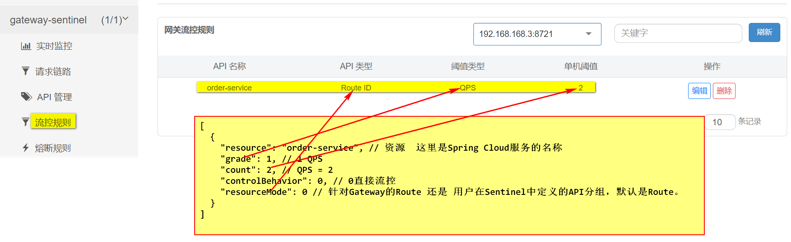
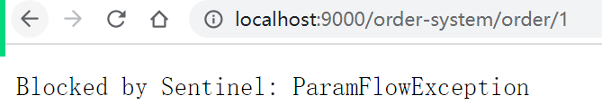
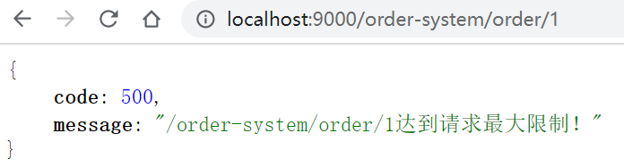

## 网关使用Sentinel实现服务限流（Nacos配置限流规则）

1. **创建新的项目`gateway-03-sentinel`，引入Maven依赖**

   ```xml
   
   <dependencies>
     <!-- cloud-common -->
     <dependency>
       <groupId>com.etoak.et2301.cloud</groupId>
       <artifactId>cloud-common</artifactId>
       <version>1.0-SNAPSHOT</version>
     </dependency>
   
     <!-- spring-cloud-starter-gateway -->
     <dependency>
       <groupId>org.springframework.cloud</groupId>
       <artifactId>spring-cloud-starter-gateway</artifactId>
     </dependency>
   
     <!-- nacos注册中心 -->
     <dependency>
       <groupId>com.alibaba.cloud</groupId>
       <artifactId>spring-cloud-starter-alibaba-nacos-discovery</artifactId>
     </dependency>
   
     <!-- loadbalancer -->
     <dependency>
       <groupId>org.springframework.cloud</groupId>
       <artifactId>spring-cloud-starter-loadbalancer</artifactId>
     </dependency>
   
     <!-- Sentinel整合Spring Cloud -->
     <dependency>
       <groupId>com.alibaba.cloud</groupId>
       <artifactId>spring-cloud-starter-alibaba-sentinel</artifactId>
     </dependency>
   
     <!-- Nacos持久化Sentinel规则：sentinel-datasource-nacos -->
     <dependency>
       <groupId>com.alibaba.csp</groupId>
       <artifactId>sentinel-datasource-nacos</artifactId>
     </dependency>
   
     <!--Sentinel与Gateway网关整合 -->
     <dependency>
       <groupId>com.alibaba.cloud</groupId>
       <artifactId>spring-cloud-alibaba-sentinel-gateway</artifactId>
     </dependency>
   </dependencies>
   ```

   

2. **在src/main/resources下创建application.yml，并填写如下内容**

   ```yaml
   server:
     port: 9000
   
   spring:
     application:
       name: gateway-sentinel
   
     cloud:
       nacos:
         discovery:
           server-addr: localhost:8848
           namespace: et2301
   
       gateway:
         routes:
           - id: order-service
             uri: lb://order-service
             predicates:
               - Path=/order-system/**
             filters:
               # 转发请求时删除第一层请求(/order-system)
               - StripPrefix=1
   
       sentinel:
         transport:
           dashboard: localhost:8080
         eager: true
   
         # 链路限流时必须设置为false
         web-context-unify: false
         datasource:
           et:
             nacos:
               server-addr: ${spring.cloud.nacos.discovery.server-addr}
               namespace: ${spring.cloud.nacos.discovery.namespace}
               # json是默认值, 不写也可以
               data-type: json
               data-id: ${spring.application.name}-flow
               # gw-flow: 网关限流(com.alibaba.cloud.sentinel.datasource.RuleType)
               rule-type: gw-flow
   ```
   
   
   
3. **在Nacos控制配置限流规则，对order-service进行限流**

     

   ```json
   [
     {
       "resource": "order-service", // 资源  这里是Spring Cloud服务的名称
       "grade": 1, // 1 QPS
       "count": 2, // QPS = 5
       "controlBehavior": 0, // 0直接流控
       "resourceMode": 0 // 针对Gateway的Route 还是 用户在Sentinel中定义的API分组，默认是Route。
     }
   ]
   ```

4. **启动项目，查看sentinel控制台配置**

      

5. **测试限流**

      

### 1.1 **自定义限流后的结果**

1. **实现WebExceptionHandler接口**

   ```java
   @Service
   // 执行顺序  最高优先级
   @Order(Ordered.HIGHEST_PRECEDENCE)
   public class MySentinelHandler implements WebExceptionHandler {
   
     @Override
     public Mono<Void> handle(ServerWebExchange exchange, Throwable ex) {
       // 请求路径
       String path = exchange.getRequest().getPath().value();
   
       ResultVO<Object> resultVO = ResultVO.failed(path + "达到请求最大限制！");
       String json = JSONUtil.toJsonStr(resultVO);
   
       ServerHttpResponse response = exchange.getResponse();
       response.setStatusCode(HttpStatus.OK);
       // 设置Content-Type
       response.getHeaders().set(HttpHeaders.CONTENT_TYPE, "application/json;charset=utf-8");
   
       DataBuffer dataBuffer = response.bufferFactory().wrap(json.getBytes());
       return response.writeWith(Mono.just(dataBuffer));
     }
   }
   ```
   
   
   
2. **测试结果**

     


