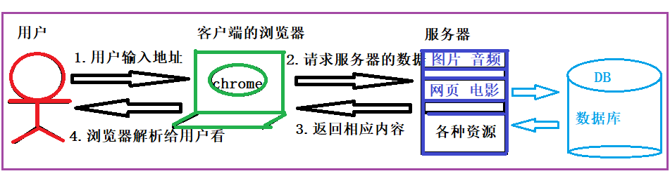
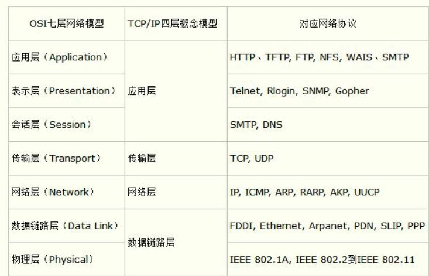
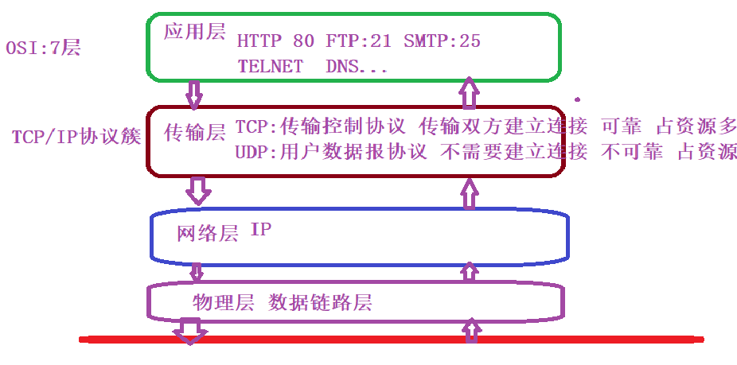
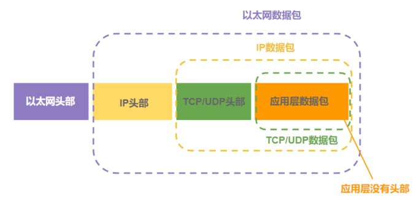

## JAVAWEB开发基础

[TOC]

### WEB基本知识

---

#### 1.1. 两种软件架构：B/S 和 C/S

1. C/S: Client / Server 客户端 、服务器     360  qq  大型网游

2. ##### B/S: Browser/Server 浏览器 、服务器   页游   网站     应用系统

#### 1.2. 用户访问网络资源的总体流程

### 2.HTTP协议？

---

#### 2.0. 网络协议:网络中的计算机进行数据交互，遵循规范。

#### 2.1. TCP/IP协议簇？

#### 2.2 HTTP协议？

HTTP协议:[超文本传输协议]，是建立在TCP协议基础之上的【需要建立连接】，基于请求、响应模式的无状态的应用层协议。默认端口80

无状态:多次请求之间不会保存任何的状态信息。【Cookie和Session 实现保持会话】

#### 2.3. 请求

1. 定义:从客户端【浏览器】发送到服务器端的报文【有格式字符串】

2. 格式：

   1. 请求行： 请求方法[GET/POST/PUT/DELETE]   请求资源 /index.html  协议版本 HTTP/1.1

   2. 请求头     Host Accept Accept-language cookie..

      

   3. 消息体 参数 key=value&key1=value1  {"key":"value"}

3. 案例：

   ~~~http
   GET【方法】 /资源? HTTP/1.1【协议版本】
   Host: www.baidu.com 【 请求的主机地址 域名==》DNS==》IP】
   Connection: keep-alive 【连接是否关闭】 
   Cache-Control: max-age=0
   sec-ch-ua: " Not A;Brand";v="99", "Chromium";v="96", "Google Chrome";v="96"
   sec-ch-ua-mobile: ?0
   sec-ch-ua-platform: "Windows"
   Upgrade-Insecure-Requests: 1
   User-Agent: Mozilla/5.0 (Windows NT 10.0; Win64; x64) AppleWebKit/537.36 (KHTML, like Gecko) Chrome/96.0.4664.45 Safari/537.36 【浏览器内核和操作系统内核】
   Accept: text/html,application/xhtml+xml,application/xml;q=0.9,image/avif,image/webp,image/apng,*/*;q=0.8,application/signed-exchange;v=b3;q=0.9 【当前浏览器能够接受的内容类型】
   Sec-Fetch-Site: none
   Sec-Fetch-Mode: navigate
   Sec-Fetch-User: ?1
   Sec-Fetch-Dest: document
   Accept-Encoding: gzip, deflate, br【 压缩编码】
   Accept-Language: zh-CN,zh;q=0.9 【 语言】
   
   key=value
   ~~~

   

#### 2.4. 响应

1. 定义:从服务器回送给客户端【浏览器】的 报文。

2. 格式:

   1. 状态行  协议版本  状态码  字符串

   2. 响应头 。。。。。

      

   3. 响应正文 <html>xx</html>

3. 案例:

   ~~~http
   HTTP/1.1 200 OK===========>状态行
   Bdpagetype: 1
   Bdqid: 0xa321f361000c9491
   Cache-Control: private
   Connection: keep-alive
   Content-Encoding: gzip
   Content-Type: text/html;charset=utf-8
   Date: Wed, 16 Feb 2022 06:51:37 GMT
   Expires: Wed, 16 Feb 2022 06:51:31 GMT
   Server: BWS/1.1
   Set-Cookie: BDSVRTM=0; path=/
   Set-Cookie: BD_HOME=1; path=/
   Set-Cookie: H_PS_PSSID=35105_31254_34584_35491_35871_35796_35318_26350_35746; path=/; domain=.baidu.com
   Strict-Transport-Security: max-age=172800
   Traceid: 1644994297037802215411754944100351906961
   X-Frame-Options: sameorigin
   X-Ua-Compatible: IE=Edge,chrome=1
   Transfer-Encoding: chunked
   
   <HTML></HTML>
   ~~~

   

### 3.浏览器【客户端】？

---

#### 定义:

能够发出标准的HTTP请求，接收并解析标准的HTTP响应的软件【不是我们写的】

### 4.WEB服务器？

---

#### 4.1.概念:

WEB服务器是能够接收并解析标准的HTTP请求，返回标准的HTTP响应报文软件。

#### 4.2. tomcat?

1.  Apache-Tomcat就是一款免费的、开源的、纯JAVA实现的WEB服务器.
2. Servlet容器: 提供了Servlet的运行环境，管理Servlet的生命周期的类库【一堆类、jar包】叫Servlet容器。通常Servlet容器和WEB服务器在一起。 如：Tomcat中就有一款Servlet容器叫catalina

#### 4.3. Tomcat安装配置

1. 安装：

   Tomcat是一款绿色软件,解压即安装，不用安装。 把Tomcat解压到一个没有中文的目录下。

2. 配置: 

   Tomcat是一款纯JAVA实现的服务器，需要JAVA_HOME环境变量的支持。

#### 4.4. Tomcat的目录结构

1. **bin: 开关服务器 工具**
2. **conf: 配置文件**
3. lib: jar包
4. logs:日志
5. temp:临时文件
6. **webapps:我们建立的web工程放在该目录**
7. work:运行期自动生成的目录

#### 4.5. 第一个web工程

1. WEB工程的基本目录结构

   项目名字

   ​		====> WEB-INF

   ​			===>lib [存放项目运行的jar包]

   ​			===>classes [存放classes文件]

   ​			===>web.xml [项目的部署描述文件 servlet filter listener等需要在该文件的声明]

### 5.从浏览器地址栏输入地址到看到页面的过程？

---

#### 5.1 服务器启动阶段：开猫阶段

1. Tomcat 读取自身配置文件，主要是conf目录。 有问题，退下，无法启动。
2. 没有问题，继续读取webapps下的每一个工程中的web.xml,有错误，报错，但是服务器可以启动。【不但读取webapps下的工程，也会读取热部署指定的目录中的工程。】
3. 启动成功！！！

#### 5.2 请求到达阶段

1. 浏览器地址栏输入地址:http://localhost:9999/et2111/hello.html 回车
2. 浏览器把地址，打包成标准HTTP请求报文，通过网络发送。DNS: 域名--ip
3. 指定的目标主机上相应的web服务器监听到请求。【Tomcat接收到了客户端发送过来的请求报文】
4. Tomcat创建请求对象和响应对象【ServletRequest+ServletResponse】,使用ServletRequest对象存放本次请求报文中的所有内容,使用response对象存放即将生成的响应的内容。【字符串--》对象】
5. Tomcat 根据本次请求的地址判断请求的是一个静态资源还是动态资源。
   1. 静态资源: .html /.js/.css/.png/.jpg..千人一面
   2. 动态资源：servlet / jsp 千人千面
6. 本次请求是hello.html,则是一个静态资源，Tomcat会把请求交给一个叫DefaultServlet的类处理。【这个类不是我们写的，是Tomcat提供的。】
7. DefaultServlet类根据请求的地址，寻找指定的资源【hello.html】:
   1. 找到了： 通过IO把指定的资源写出到response的缓冲区中
   2. 找不到：通过IO把标准的404页面写出repsonse的缓冲区
8. Tomcat根据DefaultServlet中生成的响应对象生成标准的HTTP响应报文。【JAVA对象---》HTTP响应报文】，通过网络发送到客户端【浏览器】。
9. 浏览器接收的标准的响应报文，解析，显示响应的正文。

### 6. 第一个Servlet程序？

---

#### 6.1. 什么是Servlet类？

1. 必须实现javax.servlet.Servlet接口
2. 必须把Servlet类交给Tomcat[即Servlet容器]管理

#### 6.2. 使用ServletResponse给客户端响应内容？

1. ##### 响应字符内容使用getWriter()方法

   ~~~java
   response.setContentType("text/html;charset=UTF-8");
   //获得【向客户端输出内容】输出字符流
   PrintWriter out = response.getWriter();
   out.println("<H2>大家好</H2>");
   out.close();
   ~~~

2. ##### 响应字节内容使用getOutputStream方法

   1.getOutputStream可以向客户端输出任意数据。

   2.扩展:JAVAWEB中的文件下载？

   ~~~
   0.文件下载是同步的。
   1.原理: 通过IO的方式把服务器上的文件赋值客户端。
   2.	//响应内容不再直接打开，而是以文件的形式返回给客户端
   	resp.setHeader("Content-Disposition","attachment;filename="+
   		URLEncoder.encode("吴老师","UTF-8")+"ABC.jpg");
   		
   ·		InputStream is = new FileInputStream("058.jpg");
   		//向客户端输出字节内容
   		OutputStream os = resp.getOutputStream();
   		byte[] data  = new byte[1024];
   		int len;
   		while((len = is.read(data))!=-1){
   			os.write(data,0,len);
   		}
   		is.close();
   		os.close();
   ~~~

3. ##### 修改响应编码？

   1. 原则:一定要在getWriter之前设置响应编码

   2. 普通网页:response.setContentType("text/html;charset=UTF-8")

   3. ###### JSON:response.setContentType("text/plain;charset=UTF-8")

   4. JPG:response.setContentType("image/jpeg")

   5. 未知：Tomcat/conf/web.xml中搜索

4. ##### 通过init方法 测试ServletConfig中的四个方法。

### 7. Servlet核心API？

---

#### 7.1. javax.servlet.Servlet接口

1. 该接口定义了所有的Servlet都必须实现的方法。【只要是Servlet都必须实现该接口】

2. Servlet是运行在WEB服务器端的小的JAVA程序，可以接收和响应来自客户端的请求，通常的基于HTTP协议的请求。

3. 实现该接口可以继承GenericServlet，也可以继承javax.servlet.http.HttpServlet.

   1. GenericServlet impl Servlet,ServletConfig 
      1. 实现了9个方法中的8个 ，service没有实现，又加了一个空参的init()方法
   2. HttpServlet extends GenericServlet
      1. public service(ServletRequest,ServletResponse)
      2. protected service(HttpServletReqeust,HttpServletResponse)
      3. doXXX

   

4. Servlet提供了 初始化、服务请求、销毁的方法，这些方法被称作“生命周期”方法。并且以如下的顺序调用:【Tomcat会自动的寻找Servlet ,构造Servlet ,调用Servlet生命周期方法】

   1. Servlet被构造，然后调用init(ServletConfig)方法初始化。
   2. 所有的来自客户端的请求都交给Service方法处理。
   3. 当请求处理完毕之后，调用destroy方法销毁，然后等待GC回收【关服务器即销毁】

5. 除了生命周期方法之外，该接口还提供getServletConfig()，可以获得ServletConfig对象，而ServletConfig对象中一般存放着Servlet的初始化信息。【Servlet和ServletConfig相当于我们每一个人和自己的身份证的关系 一一对应。】 

6. 还有一个不需要掌握的方法 getServletInfo 

7. ##### Servlet类默认是请求到达服务器时才会构造对象并初始化。而且只会创建一次。【Servlet是单实例的以多线程的方式服务器客户端的请求】，<load-on-startup>表示可以让Servlet类在开服务器时立刻创建对象并初始化。

#### 7.2. javax.servlet.ServletConfig 

1. ServletConfig对象主要用来存放Servlet的一些初始化信息，参数信息等。
2. Servlet容器/Tomcat 构造该接口的对象通过init方法的参数传递给Servlet.
3. 方法列表:
   1. getInitParameter(String):根据名字获得初始化参数的值
   2. getInitParameterNames()：获得初始化参数的名字
   3. getServletContext():ServletContext对象
   4. getServletName():返回<servlet-name></servlet-name>中的内容

#### 7.3. javax.servlet.ServletContext

1. ​	Servlet的上下文环境对象，容器在启动时构造ServletContext对象，用来存放Servlet和容器通信的一些方法，如：获得本工程在服务器上的绝对路径

### 8. 从浏览器地址栏输入内容【servlet】 到看到Servlet返回的数据的过程？

---

####  8.1. 服务器启动阶段：开猫阶段

1. Tomcat 读取自身配置文件，主要是conf目录。 有问题，退下，无法启动。
2. 没有问题，继续读取webapps下的每一个工程中的web.xml,有错误，报错，但是服务器可以启动。【不但读取webapps下的工程，也会读取热部署指定的目录中的工程。】
3. 启动成功！！！

#### 8.2 请求到达阶段

1. 浏览器地址栏输入地址:http://localhost:9999/et2111/hello回车
2. 浏览器把地址，打包成标准HTTP请求报文，通过网络发送。DNS: 域名--ip
3. 指定的目标主机上相应的web服务器监听到请求。【Tomcat接收到了客户端发送过来的请求报文】
4. Tomcat创建请求对象和响应对象【ServletRequest+ServletResponse】,使用ServletRequest对象存放本次请求报文中的所有内容,使用response对象存放即将生成的响应的内容。【字符串--》对象】
5. Tomcat 根据本次请求的地址判断请求的是一个静态资源还是动态资源。
   1. 静态资源: .html /.js/.css/.png/.jpg..千人一面
   2. 动态资源：servlet / jsp 千人千面

6. ##### Tomcat根据web.xml中的url-pattern,寻找合适的servlet-name,根据servlet-name找到对应Servlet-class,从而找到了本次请求处理类。

7. ##### 首先查看内存中是否有对应的Servlet对象，如果有，则使用原来的，如果没有，则创建新的Servlet对象【底层通过反射实现】===》Servlet是单实例的  该阶段叫实例化 

8. ##### Tomcat调用init(ServletConfig)进行初始化，并且传入事先创建好 的ServletConfig对象。【初始化】

9. ##### Tomcat 调用 service(),并且传入 request和response,  doXXX方法最终被调用。我们重写doxxx方法，实现我们的业务逻辑，生成响应。

10. Tomcat根据response对象，打包标准的http响应报文，回送给客户端，浏览器解析显示。

11. 当服务器关闭时，Tomcat调用destroy方法，在真正销毁对象之前，首先回收资源。

### 9. Servlet核心API的构造、调用和实现？

---

| API名字             | 构造者new | 调用者. | 实现者{}         |
| ------------------- | --------- | ------- | ---------------- |
| Servlet类【唯一】   | 容器      | 容器    | 我们【处理请求】 |
| ServletConfig       | 容器      | 我们    | 容器             |
| ServletContext      | 容器      | 我们    | 容器             |
| HttpServletRequest  | 容器      | 我们    | 容器             |
| HttpServletResponse | 同上      |         |                  |

### 10. request对象中的内容【获得客户端传递过来的请求报文】?

----

#### 10.1. 测试request对象中的各种方法？

​	getMethod getProtocol getHeader getContent-Type getContentLength ...

~~~java
//请求的方法 GET /POST
        String method = req.getMethod();
        //请求的完整地址 http://localhost:9999/first/et
        String url = req.getRequestURL().toString();
        //获得uri /first/et
        String uri = req.getRequestURI();
        Enumeration<String> headerNames = req.getHeaderNames();
        while(headerNames.hasMoreElements()){
            String header = headerNames.nextElement();
            String value = req.getHeader(header);
            System.out.print(header+"="+value+";");
        }
        System.out.println();
        // /工程名字
        String contextPath = req.getContextPath();
        //获得GET请求中的?后边的参数
        String queryString = req.getQueryString();
        //获得消息体中参数的长度 没有返回-1
        int cl = req.getContentLength();
        ServletContext ctx= req.getServletContext();
        //获得Content-Type请求头 a连接 返回null 没有Content-Type
        String ct = req.getContentType();
        //获得编码
        String encoding = req.getCharacterEncoding();
        //协议、版本 HTTP/1.1
        String protocol = req.getProtocol();
        //ServletPath ===url-pattern /et
        String servletPath = req.getServletPath();
        req.setCharacterEncoding("UTF-8");
~~~

#### 10.2 测试的获得参数？

​	getParameter /getParameterValues()/getParameterMap

~~~java
 //获得参数 根据参数名字[参数名字就是控件名字]获得参数值
        String username = req.getParameter("username");
        String pwd = req.getParameter("pwd");
        String gender = req.getParameter("gender");
        //getParameterValues：一般用来获得复选框
        String addr[] = req.getParameterValues("addr");
        String level = req.getParameter("level");
        System.out.println(username+"\t"+pwd+"\t"+gender+"\t"+addr+"\t"+level);
~~~

### 11. 客户端向服务器发送请求的方式？

---

#### 11.1. 同步

1. ​	<a href="xxx"> JSP

2. form 表单 action="" method="GET/POST">

3. JS的方式实现 a连接或者 form表单提交

   ​	function tijiao(){

   ​		document.getElementById("xxxForm").submit() ；相当于表单提交

   ​	}

   ​	function tijiao1(){

   ​		window.location.href="xxx"; 相当于A连接

   ​	}

#### 11.2. 异步

1. jquery  $.ajax $.post..
2. axios .post /get

### 12.贯穿案例:学生管理

---

~~~
1.建工程 maven版 web工程

1.1 导入需要的jar包的坐标

2.建包
	com.etoak.student  entity factory utils controller service
	
3.后台整体分为三层:
	controller层 ：控制器层 控制程序的整体流程 调用service层 对前端提供接口
	
	service层:服务层 调用DAO层，给controller提供数据支持，一般还会有一些数据转换、事务管理等其他功能
	dao层: Data Accss Object 该层的类都是用来存放访问数据库的代码的。一般由接口+实现类 +entity
	IStudentDao + StudentDaoImpl

  List<Student> result = new ArrayList<>();
        String sql="select " +
                " s.id as stuid, s.name as stuname, age, birth, email, schid, " +
                " sch.id as schoolid, sch.name as schoolname, phone, " +
                " concat_ws('-',pro.name,city.name,area.name,info) info " +
                " from student s left join school sch " +
                " on s.schid = sch.id " +
                " left join locations pro on pro.id = sch.proid " +
                " left join locations city on city.id = sch.cityid " +
                " left join locations area on area.id = sch.areaid  where 1=1 " ;

        if(vo!=null&& vo.getName()!=null && !vo.getName().equals("")){
            sql+=" and  s.name like '%"+vo.getName()+"%'";
        }
        if(vo!=null && vo.getSchid()!=null && !vo.getSchid().equals("")){
            sql+=" and s.schid="+vo.getSchid();
        }
        if(vo!=null && vo.getStartbirth()!=null && !vo.getStartbirth().equals("")){
            sql+=" and s.birth >=date_format('"+vo.getStartbirth()+"','%Y-%m-%d')";
        }
        if(vo!=null && vo.getEndbirth()!=null && !vo.getEndbirth().equals("")){
            sql+=" and s.birth <=date_format('"+vo.getEndbirth()+"','%Y-%m-%d')";
        }
           sql+=   " limit ?,?";

        try(Connection con = CF.getConnection();
        PreparedStatement pst = con.prepareStatement(sql)){
            int pageNumber = vo.getPageNumber();
            int pageSize = vo.getPageSize();
            int start = (pageNumber-1)*pageSize;
            pst.setInt(1,start);//起始位置
            pst.setInt(2,pageSize);//每页记录数

            ResultSet rs = pst.executeQuery();
            while(rs.next()){
                Student stu = new Student();
                stu.setId(rs.getInt("stuid"));
                stu.setName(rs.getString("stuname"));
                stu.setAge(rs.getInt("age"));
                stu.setBirth(rs.getDate("birth"));
                stu.setEmail(rs.getString("email"));
                stu.setSchid(rs.getInt("schid"));

                School sch  = new School();
                sch.setId(rs.getInt("schoolid"));
                sch.setName(rs.getString("schoolname"));
                sch.setPhone(rs.getString("phone"));
                sch.setInfo(rs.getString("info"));
                //一个学生对应一个学校
                stu.setSch(sch);

                result.add(stu);
            }

        }catch(Exception e){
            e.printStackTrace();
        }
        return result;
	
~~~

