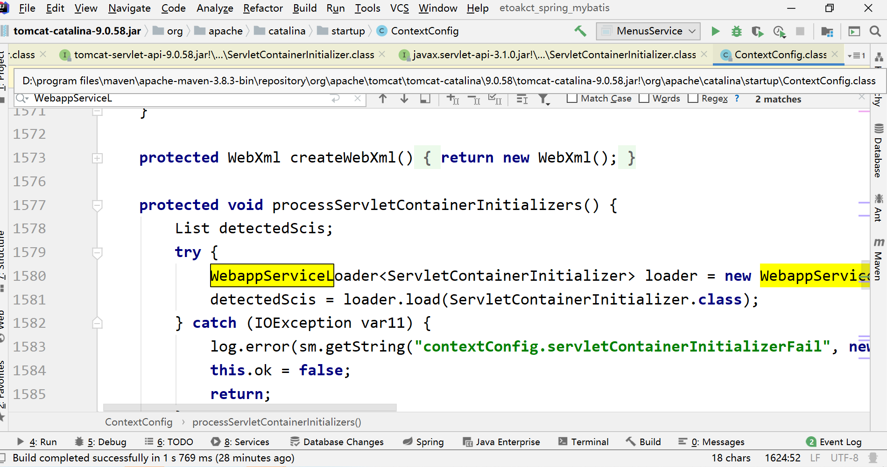
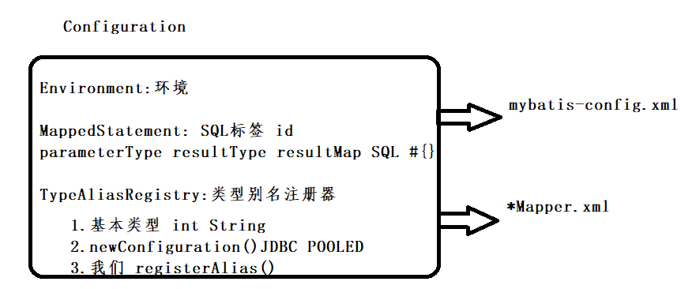
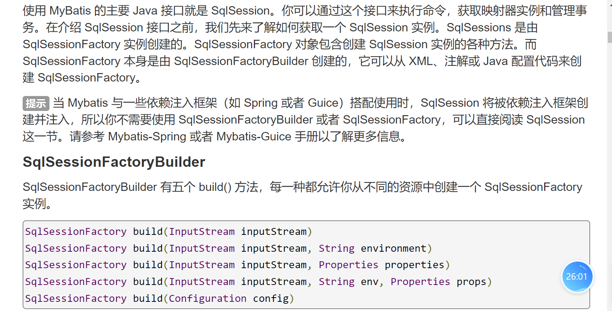

# day01（JDBC）

## 1. 时间分布？

day1~day2: JDBC

day2~day4: javaweb 打通前后台

day5~day6: 案例项目 学生选课

day7~day8: 反射 案例 maven 

day8:学生选课改造---》引入spring

day9~12:Spring IOC  MVC 案例改造

day12~day15:mybatis 后端框架+spring整合 +案例改造

day16~day19:综合项目 WEB版+模拟

## 2. JDBC(Java Database Connectivity)的简介？

1. JDBC是JAVA语言提供的一套访问和处理数据库中数据的API（应用程序编程接口 application programming interfaces）。**API:类库**

   

2. JDBC这套API在JDK中java.sql.包和javax.sql.包。

   

3. JDBC是一套工具。我们需要连接工具的各部分。

## 3. 三方的分工（责任）？

- 数据库厂商：

  - 实现JAVA语言连接各自的数据库，叫驱动。我们可以在数据库厂商的官方的获取驱动信息。

    

- JAVA官方：

  - 制定一套JAVA语言连接数据库的标准，各个厂商实现JAVA连接各自数据库的同时，实现标准。

  - JAVA官方制定的标准包：java.sql.包和javax.sql包

    

- 我们（开发者）：

  - 我们学习标准，使用真正的驱动程序完成CRUD操作。


## 4. JDBC的核心API？

1. `java.sql.Driver`【接口】【造桥的人】

   1. 驱动标准，所有的驱动jar包中都需要提供该接口的实现，该接口也是真正创建连接的。
   2. 

2. `java.sql.DriverManager`:【类】【造桥指挥部】

   1. 驱动管理器，主要用来管理驱动【注册、注销、存放驱动对象】
   2. 对外获取连接
   3. 
   4. 

3. `java.sql.Connection`:【接口】【桥】

   1. 构造SQL语句的执行器

      

      

      

   2. 管理事务

      

      

      

   3. 对于连接的一些设置相关属性。

      

      

4. `java.sql.Statement`:【接口】【车】

   1. 负责向数据库中运行SQL，以及返回从数据库中查询的结果

      

      

   2. 一些执行器的设置

5. `ResultSet`:【接口】【存放从数据库中查询的结果的对象】

   1. 获取数据的方法

      

   2. 可滚动 、可更新特性

      

      

## 5. JDBC程序helloworld:对数据库的CRUD？

- 注册驱动：告诉驱动管理器有哪些驱动可以使用 

- 获取连接

- 创建运送SQL的Statement对象

- 执行SQL返回结果

- 处理结果

- 关闭资源

  ~~~java
  import java.sql.*;//Connection Driver DriverManager Statement ResultSet
  //测试JDBC程序
  public class Test{
  	public static void main(String args[])throws Exception{
  		//1.注册驱动
  		Class.forName("com.mysql.cj.jdbc.Driver");
  		//2.获取连接
  		String url="jdbc:mysql://localhost:3309/et2301?"+
  		"characterEncoding=utf8&useSSL=false&"+
  		"serverTimezone=Asia/Shanghai"+
  		"&rewriteBatchedStatements=true&allowPublicKeyRetrieval=true";
  		Connection con = DriverManager.getConnection(url,"root","etoak");
  		//3.创建执行SQL的Statement
  		Statement sta= con.createStatement();
  		//4.执行SQL返回结果
  		ResultSet rs = sta.executeQuery("select * from student");
  		while(rs.next()){
  			int id = rs.getInt("id");
  			String name = rs.getString("name");
  			int age = rs.getInt("age");
  			Date birth = rs.getDate("birth");
  			String email = rs.getString("email");
  			System.out.println(id+"\t"+name+"\t"+age+"\t"+birth+"\t"+email);
  		}
  		//关闭资源
  		rs.close();
  		sta.close();
  		con.close();
  	}
  }
  ~~~

  

## 6. 插播:批量添加？

1. insert into (f1,f2,..fn) values (),(),()

   ~~~sql
   mysql> insert into student(name,age,birth,email) values
       -> ('lisi',234,current_Date(),'lisi@qq.com'),
       -> ('wangwu',345,now(),'WANGWU@qq.com');
   ~~~

   

2. insert into (f1,f2..fn) (select 子查询) union [all] (select 子查询)

   ~~~sql
   mysql> insert into student(name,age,birth,email)
    -> (select 'zhaoliu',age,birth,'zhaoliu@qq.com' from student where name='lisi')
       -> union all
       -> (select name,age,now(),'etoak@qq.com' from student where name='wangwu');
   Query OK, 2 rows affected, 1 warning (0.01 sec)
   Records: 2  Duplicates: 0  Warnings: 1
   ~~~

## 7. JDBC流程中的每一个步骤？

1. #### 加载驱动/注册驱动

- Class.forName():Class类静态方法forName作用是加载指定名字的类（不只是加载驱动），我们这里使用它来加载驱动。

  

- 

- **真正获取连接时，挨个遍历注册的驱动程序，找到能过符合该URL，使用驱动对象的connect构造连接。**

  

2. #### 获取连接？

   1. 常见的两种获取连接的方法：

      1. DriverManager.getConnection(url,user,pwd);

      2. DriverManager.getConnection(url,Properties info);

         info:至少包括：user和password  键值对

   2. 关于Properties类？

      1. java.util.Properties继承自java.util.HashTable、也是以key:value形式存放数据的工具类。
      2. 主要用来读取：key=value形式的配置文件【一般我们称为javabean属性文件，通常后缀.properties】
      3. 这里可以使用Properties对象存放数据库的连接信息。

   3. ##### Class.getResourceAsStream()和ClassLoader.getResourceAsStream()的区别？


   

3. #### 关于SQL的执行器？Statement

   1. 执行器主要执行SQL语句，我们主要了解执行器中的执行的方法。

   2. ##### execute: 

      ~~~java
      	Statement中的execute方法：
      		执行DDL(create): 执行成功，返回false.
      		执行DML(insert)：执行成功，返回false.
      		执行DQL(select): 返回true
         execute方法总结：
         	1.万能方法：可以执行任何的SQL语句.
         	2.返回值是以是否有ResultSet返回为判断标准的【只要有resultset(可以为empty)返回，就是返回true】。
      	*/
      	public static void testExecute()throws Exception{
      		Connection con = getConnection();
      		String sql="create table test1(id int primary key auto_increment,name varchar(32))";
      		String insert="insert into test1(name) values('test')";
      		String select="select * from test1 where 1=2 ";
      		Statement sta = con.createStatement();
      		boolean flag = sta.execute(select);
      		System.out.println(flag);//true
      
      	}
      ~~~

      

   3. ##### executeUpdate

      - 主要执行DML，insert 、update、delete操作。返回<u>对数据库影响的行数</u>。
      - 执行DDL,返回0，
      - 不能执行返回结果集的语句
      - 

   4. ##### executeQuery()

      	Connection con = getConnection();
      		String select="select id,age,name as stuname,birth,email from student";
      		Statement sta = con.createStatement(
      			ResultSet.TYPE_SCROLL_INSENSITIVE, //1004、1005
      			ResultSet.CONCUR_READ_ONLY);//1007
      		ResultSet rs = sta.executeQuery(select);
      		//Thread.sleep(20000);
      	
      		while(rs.next()){
      			//按查询列表的字段名字
      			int id = rs.getInt("id");
      			//按列索引查询
      			int id1 = rs.getInt(1);
      	
      			String name = rs.getString(3);
      			String name1 = rs.getString("stuname");
      			System.out.println(id+"\t"+id1+"\t"+name+"\t"+name1);
      		}

4. ### 关于ResultSet?

   - ResultSet一般执行查询数据库的语句生成，主要用来**存放从数据库中返回的结果**。默认resultset有一个指向**当前行的光标**,最初光标位于第一行之前，next方法将光标向下移动一行，因为该方法在没有下一行时返回false,所以可以在while中迭代使用。

   - 在使用getXX()获取列内容时，可以使用列名字也可以使用列的索引，如果使用列名字，`需要和查询列表中的名字对应（有别名按照别名查询）`

   - 结果集中定义了一些开关：

   - | 常量名字                  | 常量值 | 意思                     | 其他 |
     | ------------------------- | ------ | ------------------------ | ---- |
     | `TYPE_FORWARD_ONLY`       | 1003   | 不可滚动结果集           | 默认 |
     | `TYPE_SCROLL_INSENSITIVE` | 1004   | 可滚动结果集【不敏感的】 |      |
     | `TYPE_SCROLL_SENSITIVE`   | 1005   | 可滚动结果集【敏感的】   |      |
     | `CONCUR_READ_ONLY`        | 1007   | 只读的结果集             | 默认 |
     | `CONCUR_UPDATABLE`        | 1008   | 可更新的结果集           |      |

     

   - ##### 常见错误1：指针在第一行的前边【忘了加next】

     

   - ##### 常见错误2：指针已经在最后一行之后了，默认不能继续获取数据的。【在循环外获取数据】

     

   - `结果集默认是只能从第一行到最后一行遍历一次，不能来回遍历的,也就是默认结果集不可滚动，如果需要重复遍历或者使用可滚动的结果集，需要打开开关。`

     

   - 常见滚动方法

   - | 滚动方法    | 意思                     |
     | ----------- | ------------------------ |
     | absolute    | 把指针绝对定位的某一行   |
     | previous    | 和next相反               |
     | first       | 把指针移动的第一行       |
     | beforeFirst | 把指针移动到第一行之前   |
     | last        | 把指针移动到最后一行     |
     | afterLast   | 把指针移动到最后一行之后 |
     | isFirst     | 是否在第一行             |
     | isLast      | 是否在最后一行           |

   - 可滚动结果集的应用场景：`假分页`

     - **真分页**: 按需提取数据 【查询部分】  物理分页 分页关键字 **limit rownum**

     - **假分页**:按需展示数据【查询所有的】逻辑分页 

       ~~~java
       	//每页的记录数
       		int pageSize=3;
       		//当前页
       		int pageNumber=2;
       
       		//起始位置
       		int start =(pageNumber-1)*pageSize;
       		System.out.println("================");
       		//1003:代表不可滚动
       		if(rs.getType()!=1003){
       			//1004 1005 可滚动
       			rs.absolute(start);
       		}else{
       			//不可滚动调用next方法 不断调用next 移动指针。
       			for(int i=0;i<start;i++){
       				rs.next();
       			}
       		}
       		int k=0;
       		while(rs.next() && k<pageSize){
       			int id = rs.getInt("id");
       			//按列索引查询
       			int id1 = rs.getInt(1);
       
       			String name = rs.getString(3);
       			String name1 = rs.getString("stuname");
       			System.out.println(id+"\t"+id1+"\t"+name+"\t"+name1);
       			k++;
       		}
       
       ~~~

## 8.  PreparedStatement的使用？

1. 我们现在使用的执行器Statement,一般用来执行静态SQL语句。所谓“静态SQL”：就是没有参数，不变的如：select * from student ，如果有参数只能是拼接参数。

   

2. 实际开发中，更多情况时需要传递参数的时候，使用PreparedStatement**["预编译"的执行器**]，PreparedStatement在被创建时，就需要传入SQL语句，此时SQL就会被发送数据库服务器，编译存储。支持?占位符，传参比较方便。

   

3. PreparedStatement 在**效率**和**安全性**两个方面，都比Statement要好。

   

4. ##### 有些情况，不能使用?占位符：MyBatis 中#和$的区别 再回首！！

   1. ###### 表名字未知

      

   2. ###### 查询参数在引号中

      

   3. ###### order by 后的字段

      1. order by 后跟?，导致排序失效

         

## 9.  事务？

1. ##### 数据库中事务的基本概念？

   1. 概念：多条对数据库修改的SQL  同一个单元 不可再分。

   2. 特征：

      1. A: 原子性
      2. C: 一致性
      3. I: 隔离性：多个事务影响程度
      4. D: 持久性

   3. 事务影响产生问题

      1. 脏读
      2. 幻读
      3. 不可重复读

   4. 隔离级别

      1. 读未提交
      2. 读已提交：oracle默认
      3. 可重复读：mysql默认
      4. 串行化

   5. start transaction/begin

      sql1,sql2..sqln

   6. end./commit/rollback

2. ##### 事务的应用场景？

   1. 员工系统：

      1. emp:insert  delete
      2. emp1: insert 

   2. 添加学生携带图片

      

   3. 清空购物车

      1. 购买---》购物车中数据----》订单  1.insert 订单 2.insert 订单明细 3.扣减库存 4.通知卖家 5.生成日志。。。

   4. 转账：

3. ##### JDBC中如何处理事务？

   1. **JDBC默认是自动提交的**。当执行完一条SQL语句之后，立刻提交。

   2. 开启事务: Connection.setAutoCommit(false);禁用自动提交

      sql1....sql2...sqln

   3. 提交：Connection.commit()

   4. 回滚：Connection.rollback();

4. MyBatis中如何处理事务、Spring中如何使用事务？【全部是JDBC】

## 10. 元数据？元信息[metadata]

1. 元数据：关于数据的数据。

2. JDBC中主要由两个元数据接口：`DatabaseMetaData`和·`ResultSetMetaData` 

3. `DatabaseMetaData`：主要用来获得数据信息,如：数据的版本、名字、驱动版本、是否支持..特性。

4. `ResultSetMetaData`:结果集的元数据，获取结果集中列的信息。

   1. getColumnCount:获得列数
   2. getColumnLabel:获得列别名【有则返回别名，没有则返回原名】
   3. getColumnName:获得列名字

5. 案例:

   ~~~java
   import java.sql.*;
   import java.util.*;
   import java.io.*;
   //数据库的元数据。
   public class TestMetaData{
   	public static void main(String args[])throws Exception{
   		Connection con = getConnection();
   		//获取数据库元数据
   		DatabaseMetaData dbmd = con.getMetaData();
   		//								8                         0
   		System.out.println(dbmd.getDatabaseMajorVersion()+"."+dbmd.getDatabaseMinorVersion() );
   		System.out.println(dbmd.getDatabaseProductName());
   		System.out.println(dbmd.getDatabaseProductVersion());
   		System.out.println(dbmd.getDriverName());
   		System.out.println(dbmd.getDriverVersion());
   		String sql="select id as sid,name as stuname,age,birth,email from et2212.student";
   		PreparedStatement pst = con.prepareStatement(sql);
   		ResultSet rs = pst.executeQuery();
   		//获取元数据
   		ResultSetMetaData rsmd = rs.getMetaData();
   		//列数
   		int count = rsmd.getColumnCount();
   		while(rs.next()){
   			for(int i=1;i<=count;i++){//获取列名字
   				String cName = rsmd.getColumnName(i);
   				//列别名 起别名返回别名 没有别名使用列名字
   				String cLabel = rsmd.getColumnLabel(i);
   				String value = rs.getString(cLabel);
   				System.out.println(cName+"\t"+cLabel+"\t"+value);
   
   			}
   		}
   
   
   	}
   	//提供连接的方法
   		private static Connection getConnection()throws Exception{
   			//1.读取配置文件
   			Properties pro = new Properties();
   			//getClassLoader()使用类加载器去加载资源从类的所在包的外部开始寻找。
   			InputStream is  = TestKeys.class.getClassLoader().getResourceAsStream("db.properties");
   			pro.load(is);
   			is.close();
   
   			Class.forName(pro.getProperty("m.driver"));
   
   			Connection con = DriverManager.getConnection(
   							pro.getProperty("m.url"),
   							pro);
   			return con;
   
   	}
   }
   ~~~

## 11. 数据源（Datasource）---获取连接的首选？

1. ##### 数据源标准？

   1. `javax.sql.DataSource`接口是JAVA官方在1.4中提出一个新的获取连接的标准。在此之前获取连接一般使用DriverManager，在此之后，推荐使用DataSource的方式获取连接。

   2. 提供的最主要的方法：`getConnection`

      

2. ##### 数据源实现方案？

   1. 基础实现：使用DriverManager提供一个连接

   2. 连接池实现：采用数据库连接池的方式实现数据源

      

3. ##### 数据库连接池？[必考必问]

   1. 数据库连接池是在服务器启动时初始化一些连接放到连接池（容器、集合）中，当需要获取连接时，首先查看连接池中是否有空闲的连接，如果有则返回，如果没有则判断当前连接数是否超过了最大可用的连接数，如果没超过，则创建新的连接，返回，如果超过了最大可用连接数，等待或者抛出无可用连接的异常。

      

   2. 当连接使用完毕之后，再把连接放回到连接池中，从而实现连接的`复用`

4. ##### 数据源产品？

   1. ASF:commons-DBCP
   2. 阿里：druid
   3. c3p0 ..mybatis实现数据源。。

## 12. 获取数据库中新添加的记录的主键？

- 数字类型：自动增长

  - JDBC自带开关

    - Statement.RETURN_GENERATED_KEYS :值是1

    - Statement.NO_GENERATED_KEYS: 值是2

      ~~~java
      public static void testNumberKeys1()throws Exception{
      		String sql="insert into test1(id,name) values(null,?)";
      		try(Connection con = getConnection();
      				PreparedStatement pst = con.prepareStatement(sql,
      				Statement.RETURN_GENERATED_KEYS)){//返回主键的开关
      				pst.setString(1,"xx");
      				int count = pst.executeUpdate();
      				System.out.println("执行成功,影响:"+count+"行");
      				//获取自动生成的主键
      				ResultSet rs = pst.getGeneratedKeys();
      				while(rs.next()){
      					int key = rs.getInt(1);
      					System.out.println(key);
      				}
      			}catch(Exception e){
      				e.printStackTrace();
      			}
      	}
      ~~~

      

  - 同一个连接，查询 mysql: select last_insert_id() 

    ~~~java
    public static void testNumberKeys2()throws Exception{
    		String sql="insert into test1(id,name) values(null,?)";
    		try(Connection con = getConnection();
    				PreparedStatement pst = con.prepareStatement(sql)){
    				pst.setString(1,"xx");
    				int count = pst.executeUpdate();
    				System.out.println("执行成功,影响:"+count+"行");
    				//同一个连接 进行查询
    				PreparedStatement pst1 = con.
    				prepareStatement("select last_insert_id()");
    				ResultSet keys = pst1.executeQuery();
    				while(keys.next()){
    					int id = keys.getInt(1);
    					System.out.println(id);
    				}
    			}catch(Exception e){
    				e.printStackTrace();
    			}
    	}
    
    ~~~

    

- 字符串类型：

  - 先生成 

    - select replace(uuid(),'-','') as id    
    - UUID.randomUUI().toString().replaceAll('-', '');

  - 再添加

    - insert into test3(id,name) values(?,?)

      ~~~java
      public static void testString()throws Exception{
      			String sql="insert into test3(id,name) values(?,?)";
      			try(Connection con = getConnection();
      					PreparedStatement pst = con.prepareStatement(sql)){
      					String id = UUID.randomUUID().toString().replaceAll("-","");
      					pst.setString(1,id);
      					pst.setString(2,"xxx");
      					int count = pst.executeUpdate();
      					System.out.println("执行成功,影响:"+count+"行");
      					//同一个连接 进行查询
      					System.out.println("主键:"+id);
      				}catch(Exception e){
      					e.printStackTrace();
      				}
      	}
      
      ~~~


## 13. 数据库中表和表之间的关系？

- ##### 一对一:通过主键关联/唯一外键

  ​	person: id name   主

  ​		         1

  idcard: id  address  从 pid【unique】

  ​             100                   1

  ​              120                 10

  ​            

- ##### 一对多：通过外键实现

  - scott.dept表  一 deptno dname loc

  - scott.emp表 多 empno ename job sal hiredate comm  mgr deptno[外键引用一方的主键]

    

  

- ##### 多对多：多对多的关系必须添加第三张表：桥表 关联关系表

  - student:学生
  - course课程
  - sc: sid[学生id] ，cid[课程id]

## 14. 数据库中能不能直接存放图片？

  - 在数据库中有专门存放图片、音频、视频、大文本文档 字段类型，这种类型叫：**lob**（Large Object）类型,mysql中 文本大对象 text、二进制大对象（图片、音频视频）blob

  - 一般的客户端都不支持直接操作lob类型的数据，lob类型的数据一般通过程序（JDBC）采用IO流的方式添加和查询的。

    

  - `一般在保存文件、音视频等资源的时候，都是先把资源放到服务器端的指定目录中，然后再把保存地址放到数据库中`

    

  - 


## 15. 实现数据源?

## 16.DAO:Data Access Object 数据访问对象

- DAO层一般是由 接口+实现+实体类构成的，一般存放所有的系统中和数据库交互的方法。
- IStudentDao:接口 
  - getAllSchs():查询所有学校
  - querySomeStu():分页查询学生
  - addStu(Student stu):添加学生
  - addPic(Pic)：添加图片
- StudentDaoImpl:实现类

## 17. 作业：把et2301这个database中的所有的表和数据：

​	1. 打印出来

 2. 写出到 txt文件中

    表名字：xxx

    id   name  age

    1   xx      xxx

     2   xx      xxx

### TestWork1.java

```java
import java.sql.*;
import java.util.*;
import java.io.*;

public class TestWork1{
	public static void main(String[] args)throws Exception{

        String[] q = new String[100];
        String[] w = new String[100];
        int t=0;

        Connection aa = getConnection();

        Statement ff = aa.createStatement();//三个分别用来查询表名，列名，数据
        Statement qq = aa.createStatement();
        Statement www = aa.createStatement();

        ResultSet g = ff.executeQuery("Show tables");// 查询此数据库有多少个表格
		PrintWriter pw = new PrintWriter("./data.txt");
        while(g.next()){
            System.out.println(g.getString(1));
            pw.println(g.getString(1));
            q[t]=g.getString(1);//把表名给赋值给数组
            ResultSet u=qq.executeQuery("DESC "+q[t]+"");//以数组来查一下此表格的列
            int l=0;
            while(u.next()){
                w[l++]=u.getString(1);//获取此表的列数

            }
            ResultSet y=www.executeQuery("select * from "+q[t++]+"");//查询此表的数据
            while(y.next()){//获取此表数据
                for (int i = 1; i < l+1; i++) {//以列的数值为终止行，来打印！
					String str = y.getString(i)+"\t";
                    System.out.print(y.getString(i)+"\t");
                    pw.print(y.getString(i)+"\t");
                    /*if(i==1){
						str = "";
						str = g.getString(1)+"\n"+y.getString(i)+"\t";
					}
					try {
							File file = new File("./data.txt");
							if(!file.exists()) {
								file.createNewFile(); // 创建新文件,有同名的文件的话直接覆盖
							}
							FileOutputStream fos = new FileOutputStream(file,true);
							OutputStreamWriter osw = new OutputStreamWriter(fos);
							BufferedWriter bw = new BufferedWriter(osw);
							bw.write(str);
							bw.newLine();
							bw.flush();
							bw.close();
							osw.close();
							fos.close();
					}catch (FileNotFoundException e1) {
						e1.printStackTrace();
					} catch (IOException e2) {
						e2.printStackTrace();
					}*/
                }
                System.out.println();
                pw.println();
            }
        }
        pw.close();
        g.close();
        ff.close();
        aa.close();

        //读文件
        System.out.println("================================================================================");
        FileReader fr = new FileReader("./data.txt");
        BufferedReader br = new BufferedReader(fr);
        String str;
        while((str = br.readLine())!=null){
			System.out.println(str);
		}
	}
	//提供连接的方法
	private static Connection getConnection()throws Exception{
			//1.读取配置文件
			Properties pro = new Properties();
			//getClassLoader()使用类加载器去加载资源从类的所在包的外部开始寻找。
			InputStream is  = TestWork1.class.getClassLoader().getResourceAsStream("db.properties");
			pro.load(is);
			is.close();

			Class.forName(pro.getProperty("m.driver"));

			Connection con = DriverManager.getConnection(
							pro.getProperty("m.url"),
							pro);
			return con;

	}
}
```


---

## 代码总结的知识点

```java
/*
excuteUpdate:
	DDL: 成功，返回0.
	DML: 返回对数据库影响的行数。
	DQL:

*/

/*
SQL分类:
	DDL:CREATE DROP ALTER truncate
	DML:insert update delete
	DQL:select
Statement中的execute方法：
	执行DDL(create): 执行成功，返回false.
	执行DML(insert)：执行成功，返回false.
	执行DQL(select): 返回true
execute方法总结：
    1.万能方法：可以执行任何的SQL语句.
    2.返回值是以是否有ResultSet返回为判断标准的【只要有resultset(可以为empty)返回，就是返回true】。
*/
```

```java
/*
1.locations( id name ltype pid
2.school(id,name ,phone ,proid ,cityid,areaid,info)
3.course课程表（id,name（课程名字）,code(课程代号)）
4.sc(桥表)(id,sid(studentid),cid(courseid),score(分数))
5.student添加外键schid
*/
```

### CRUD对数据库增删改查操作

```java
import java.sql.*;
import java.util.*;
import java.io.*;
//测试PreparedStatement的基本用法
public class TestPst{
	public static void main(String[] args)throws Exception{
		testQueryOrderBy("age");
		System.out.println("------------");
		testQueryByLike("u");
		System.out.println("------------");
		testQueryByTableName("student");
		System.out.println("------------");
		testQuery();
		System.out.println("------------");
		//testAddForeignKey();
		testUpdateStudent();
		System.out.println("------------");
		//testCreateSchool();
		//testInsertSchool();
		//testUpdateSchool();
		//testCreate();
	}
	//排序
	public static void testQueryOrderBy(String name)throws Exception{
		String sql = "select * from student order by "+name;
		try(Connection con = getConnection();
			PreparedStatement pst = con.prepareStatement(sql)){

			ResultSet rs = pst.executeQuery();
			while(rs.next()){
				System.out.println(rs.getInt(1)+"\t"+rs.getString(2)+"\t"+rs.getInt("age"));
			}
		}catch(Exception e){
			e.printStackTrace();
		}
	}
	//模糊查询
	public static void testQueryByLike(String name)throws Exception{
		String sql = "select * from student where name like ?";
		try(Connection con = getConnection();
			PreparedStatement pst = con.prepareStatement(sql)){

			pst.setString(1,"%"+name+"%");
			ResultSet rs = pst.executeQuery();
			while(rs.next()){
				System.out.println(rs.getInt(1)+"\t"+rs.getString(2));
			}
		}catch(Exception e){
			e.printStackTrace();
		}
	}
	//查询某个表的信息
	public static void testQueryByTableName(String tableName)throws Exception{
		String sql = "select * from "+tableName;
		//String sql = "select * from ?";
		try(Connection con = getConnection();
			PreparedStatement pst = con.prepareStatement(sql)){

			//pst.setString(1,tableName);
			ResultSet rs = pst.executeQuery();
			while(rs.next()){
				System.out.println(rs.getInt(1)+"\t"+rs.getString(2));
			}
		}catch(Exception e){
			e.printStackTrace();
		}
	}
	//真分页
	public static void testQuery()throws Exception{
		String sql = "select * from student limit ?,?";
		try(Connection con = getConnection();
			PreparedStatement pst = con.prepareStatement(sql)){

			//起始位置从0开始
			pst.setInt(1,1);
			//最大显示的记录数
			pst.setInt(2,3);
			ResultSet rs = pst.executeQuery();
			while(rs.next()){
				System.out.println(rs.getInt(1)+"\t"+rs.getString(2));
			}
		}catch(Exception e){
			e.printStackTrace();
		}
	}
	//更新数据
	public static void testUpdateStudent()throws Exception{
		String sql = "update student set schid=? where id>?";
		try(Connection con = getConnection();
			PreparedStatement pst = con.prepareStatement(sql)){

			pst.setInt(1,1);
			pst.setInt(2,0);
			int count = pst.executeUpdate();
		}catch(Exception e){
			e.printStackTrace();
		}
	}
	//添加列
	public static void testAddForeignKey()throws Exception{
		String sql = "alter table student add(schid int)";
		//String sql = "alter table student add foreign key fk_schid (schid) references school(id)";
		try(Connection con = getConnection();
			PreparedStatement pst = con.prepareStatement(sql)){

			int count = pst.executeUpdate();
			//PreparedStatement pst1 = con.prepareStatement(sql);
			//int count 1 = pst1.executeUpdate();
			System.out.println(count+"\t");
		}catch(Exception e){
			e.printStackTrace();
		}
	}
	//更新学校数据
	public static void testUpdateSchool()throws Exception{
		String sql = "update school set name = ? where id = ?";
		try(Connection con = getConnection();
			PreparedStatement pst = con.prepareStatement(sql)){

			pst.setString(1,"济宁学院");
			pst.setInt(2,1);
			int count = pst.executeUpdate();
			System.out.println(count);
		}catch(Exception e){
			e.printStackTrace();
		}
	}
	//添加school表数据
	public static void testInsertSchool()throws Exception{
		String sql = "insert into school(name,phone,proid,cityid,areaid,info) values(?,?,?,?,?,?)";
		try(Connection con = getConnection();
			PreparedStatement pst = con.prepareStatement(sql)){

			pst.setString(1,"test0410");
			pst.setString(2,"15553104487");
			pst.setInt(3,1);
			pst.setInt(4,2);
			pst.setInt(5,3);
			pst.setString(6,"趵突泉北路6号蓝石401");

			int count = pst .executeUpdate();
			System.out.println(count);
		}catch(Exception e){
			e.printStackTrace();
		}
	}
	//创建school表
	//id ,name,phone,省id,市id,区县的id,详细地址 ，
	public static void testCreateSchool()throws Exception{
		String sql = "create table school (id int primary key auto_increment,"
		+"name varchar(32),phone varchar(11),proid int,cityid int,areaid int,"+
		"info varchar(200))";
		try(Connection con = getConnection();
			PreparedStatement pst = con.prepareStatement(sql)){

			pst.execute();
		}catch(Exception e){
			e.printStackTrace();
		}

	}
	//创建地址表
	public static void testCreate()throws Exception{
		String sql = "create table locations(id int primary key auto_increment,name varchar(32),ltype varchar(10),pid int)";
		try(Connection con = getConnection();
			PreparedStatement pst = con.prepareStatement(sql)){

			pst.execute();
		}catch(Exception e){
			e.printStackTrace();
		}
	}
	//插入数据
	public static void testInsert()throws Exception{
		String sql = "insert into locations(id,name,ltype,pid) select * from et2212.locations";
		try(Connection con = getConnection();
			PreparedStatement pst = con.prepareStatement()){

			pst.execute();
		}catch(Exception e){
			e.printStackTrace();
		}
	}
	//提供连接的方法
	private static Connection getConnection()throws Exception{
			//1.读取配置文件
			Properties pro = new Properties();
			//getClassLoader()使用类加载器去加载资源从类的所在包的外部开始寻找。
			InputStream is  = TestPst.class.getClassLoader().getResourceAsStream("db.properties");
			pro.load(is);
			is.close();

			Class.forName(pro.getProperty("m.driver"));

			Connection con = DriverManager.getConnection(
							pro.getProperty("m.url"),
							pro);
			return con;

	}
}
/*
1.locations( id name ltype pid
2.school(id,name ,phone ,proid ,cityid,areaid,info)
3.course课程表（id,name（课程名字）,code(课程代号)）
4.sc(桥表)(id,sid(studentid),cid(courseid),score(分数))
5.student添加外键schid
*/
```


# day02(线程池)

## 1.错误1：端口占用


错误原因：`端口被占用`，常见场景：

1. ​	开服务器的同时，再开服务器。
2. 先开前端项目（前端项目默认8080），再开后端项目（后端项目默认端口8080）

## 2. 我们模拟实现一个web 服务器？

1. 我们想后台发送请求时，后台接收到请求，但是没有返回内容时，前端`转圈`，就是没有任何响应，正在等待后台给的响应。

2. 当我们从服务器向客户端输出内容如下时:

   

3. 客户端浏览器显示，`无效的响应`

   

4. 通过我写的Tomcat.java的模拟实现WEB服务器过程，我们发送Tomcat（WEB服务器）可以接收到请求报文，可以返回响应报文，但是需要开发人员自己去 `处理请求,生成响应`

   1. web服务器: 接收请求

   2. 我们: 处理请求 生成响应

   3. web服务器: 返回响应

      

5. JAVA官方制定的JAVAEE的标准：其中定义了servlet的技术规范（接口），在这套规范中定义了核心的几个接口:

   1. javax.servlet.**Servlet**：处理请求 生成响应

   2. javax.servlet.**ServletConfig**: 为Servlet服务，存放一些Servlet的启动信息的

   3. javax.servlet.**ServletContext**:为Servlet服务，提供Servlet的上下文环境的。

   4. javax.servlet.**ServletRequest**: 打包请求

   5. javax.servlet.**ServletResponse**：打包响应。

      

6. 以上标准中，Servlet接口由`开发人员实现`,其他接口由WEB服务器（Tomcat）实现。我们在Servlet类中处理请求，生成响应，如果需要其他资源（如：请求、响应、配置、Context）等 Tomcat全部送给我们了。等我们实现完毕Servlet之后，我们再把Servlet类注册到**web服务器（Tomcat）**上，在服务器接收到请求之后，就可以使用我们写的Servlet类处理请求了。

   

7. Tomcat只会寻找（<u>Servlet接口</u>：init\service\destroy）方法，我们只需要在init\service\destroy中处理请求。

   

8. **静态资源**：.html/.css/.js/.png/.jpg 千人一面 动态效果

   

9. **动态资源**：servlet/jsp 根据不同的请求、参数，作出不同的响应。 千人千面

## 3. Tomcat的安装和使用？

1. Tomcat是ASF提供的一款免费、开源、纯JAVA实现的WEB服务器。

2. Tomcat是一款绿色软件。解压即安装。【解压到没有中文的目录下】

3. 配置环境变量：

   1. 因为Tomcat是JAVA实现的，所以需要`JAVA_HOME`环境变量

4. 修改Tomcat的控制台编码：

   1. tomcat/conf/logging.properties==>51行===》 GBK

5. tomcat目录结构：

   

## 	4.  第一个web应用

- 开发源代码的地方:随便

  

- 运行的地方：Tomcat

  

- 从开发的目录赋值代码到运行期tomcat中的过程：`部署`。

  

- 基础WEB应用程序目录机构:

  - 项目名字 et2301
    - WEB-INF 
      - lib:存放jar包
      - classes: 存放class文件
      - web.xml: **部署描述文件**【存放我们开发了哪些Servlet\Filter\Listener. 向tomcat注册组件】
    - 页面、页面所在目录
    - index.html
    - pages/index.html

  

---

## 连接池实现

### AbstractDataSource.java

```java
import javax.sql.DataSource;
import java.io.PrintWriter;
import java.sql.Connection;
import java.sql.SQLException;
import java.sql.SQLFeatureNotSupportedException;
import java.util.logging.Logger;
//抽象的DataSource 模板方法【（抽象方法、基本操作）  + 具体方法】
public abstract class AbstractDataSource implements DataSource {
	//抽象方法 基本操作
	public abstract Connection doGetConnection() throws SQLException ;

	//具体方法 模板方法 ：模板方法中调用抽象方法。
    @Override
    public Connection getConnection() throws SQLException {
        return this.doGetConnection();
    }

    @Override
    public Connection getConnection(String username, String password) throws SQLException {
        return null;
    }

    @Override
    public <T> T unwrap(Class<T> iface) throws SQLException {
        return null;
    }

    @Override
    public boolean isWrapperFor(Class<?> iface) throws SQLException {
        return false;
    }

    @Override
    public PrintWriter getLogWriter() throws SQLException {
        return null;
    }

    @Override
    public void setLogWriter(PrintWriter out) throws SQLException {

    }

    @Override
    public void setLoginTimeout(int seconds) throws SQLException {

    }

    @Override
    public int getLoginTimeout() throws SQLException {
        return 0;
    }

    @Override
    public Logger getParentLogger() throws SQLFeatureNotSupportedException {
        return null;
    }
}

```

### PooledConnectionFactory.java

```java
import java.sql.*;
import java.lang.reflect.*;

public class PooledConnectionFactory implements InvocationHandler{

	//真正的连接
	private Connection realCon;
	//proxy:代理  代理连接对象
	private Connection proxyCon;
	//dataSource
	private PooledDataSource ds;

	public Connection getProxyCon(){return this.proxyCon;}

	public PooledConnectionFactory(Connection realCon,PooledDataSource ds){
		this.realCon = realCon;
		this.ds = ds;

		//代理.静态方法newProxyInstance():获得代理对象。
		proxyCon =  (Connection)Proxy.newProxyInstance(
					Connection.class.getClassLoader(),//类加载器
					new Class[]{Connection.class},//代理的接口
					this);//处理器InvocationHandler类型的

	/*
	Proxy.newPrxoyInstance()作用？
		1.在内存中动态生成一个代理类【接口的实现类】的字节码序列数组。

		2.把字节码序列的数组加载到内存--》构造对象。
	*/
	}
	@Override
	public Object 	invoke(Object proxy,Method method,	Object[] args)throws Throwable{
		System.out.println("方法执行:"+method);
		String methodName = method.getName();
		if(methodName.equals("close")){
			//放回到连接池中
			this.ds.pool.addLast(this.proxyCon);
		}else{
			//其他非close方法全部交给realCon执行
			//调用realCon对象中的当前方法【我们调用的方法】,并传入参数
			return method.invoke(this.realCon,args);
		}
		return null;
	}
}
```

### PooledDataSource.java

```java
import java.sql.*;
import java.util.*;

public class PooledDataSource extends AbstractDataSource{
	/*继承过来的：getConnection()====>doGetConnection()*/
	protected LinkedList<Connection> pool =new LinkedList<>();
	//DriverManagerDataSource
	//初始化个数
	private int initSize=5;

	//最大可用连接数10.
	private int maxActive=10;
	//当前连接数
	private int current=0;
	//最大空闲连接数
	private int maxIdle=8;

	//构造方法中模拟向连接池中添加连接。
	public PooledDataSource(){
		try{
			for(int i=0;i<initSize;i++){
				//真正连接
				Connection con = realCreate();
				PooledConnectionFactory f = new PooledConnectionFactory(con,this);
				//连接池中存放是代理连接对象，这样才能实现每一个代理对象中的方法执行，都会调用inovokee
				this.pool.addLast(f.getProxyCon());
				this.current++;
			}
	}catch(Exception e){}
	}

	//真正获取连接的方法
	public  Connection doGetConnection() throws SQLException{
		//如果连接池中有连接，从连接池中获取连接。
		if(this.pool.size()>0){
			return this.pool.removeFirst();
		}
		//如果连接池中没有连接，判断当前连接数是否超过了最大可用连接数。
		if(current<maxActive){
			Connection con = this.realCreate();
			PooledConnectionFactory f = new PooledConnectionFactory(con,this);
			//连接池中存放是代理连接对象，这样才能实现每一个代理对象中的方法执行，都会调用inovokee

			this.current++;
			return f.getProxyCon();
		}
		throw new SQLException("真正的没有连接了。。别拿了！！");

	}
	//当使用完连接时候，再将连接放回到连接池中。
	public void close(Connection con){
		try{
		if(con!=null){
			if(this.pool.size()<this.maxIdle){
				this.pool.addLast(con);
			}else{
				con.close();
			}
			this.current--;
		}}catch(Exception e){e.printStackTrace();}
	}

	//对内使用的真正创建连接的方法。
	private  Connection realCreate() throws SQLException{
			try{
				Class.forName("com.mysql.cj.jdbc.Driver");
			}catch(ClassNotFoundException e){}
			String url="jdbc:mysql://localhost:3306/et2301?characterEncoding=utf8&useSSL=false&serverTimezone=Asia/Shanghai&rewriteBatchedStatements=true&allowPublicKeyRetrieval=true";
			return DriverManager.getConnection(url,"root","etoak");
	}

}
```

### Test.java

```java
import java.sql.*;
import javax.sql.*;
public class Test{
	public static void main(String args[])throws Exception{
		DataSource ds = new PooledDataSource();
		for(int i=0;i<15;i++){
			Connection con = ds.getConnection();
			System.out.println(con);
			//ds.close(con);
			//我们现在需要想办法拦截处理con对象中的close方法：
			//不能直接关闭，而是放到连接池中。
			con.close();
		}
	}
}
```


---


# day03(Maven)

## 0. Maven

**<<Maven配置文件>>在/Month4的Maven文件里**


```xml
<project xmlns="http://maven.apache.org/POM/4.0.0"
         xmlns:xsi="http://www.w3.org/2001/XMLSchema-instance"
         xsi:schemaLocation="http://maven.apache.org/POM/4.0.0
            http://maven.apache.org/xsd/maven-4.0.0.xsd">

    <modelVersion>4.0.0</modelVersion>

    <!--定义坐标信息：当别人使用我们的jar包时，需要提供坐标信息-->
    <!--域名（倒过来）【+项目名字】-->
    <groupId>com.et2301.student</groupId>
    <!--artifactId:项目名【+模块名】-->
    <artifactId>student-entity</artifactId>
    <!--版本号！-->
    <version>0.0.1</version>
    <!--packaging:打包方式：
        普通工程：jar 包
        web工程： war 包  JAVAEE定制的压缩格式，会被服务器自动解压
        父子工程： pom-->
    <packaging>jar</packaging>

    <dependencies>
    <!--我们用到了第三方的组件：单元测试框架，所以需要导入依赖（maven会自动下载包）
    依赖的坐标信息来自MAVEN中央仓库： mvnrepository.com -->
        <dependency>
            <groupId>junit</groupId>
            <artifactId>junit</artifactId>
            <version>4.12</version>
        </dependency>
    </dependencies>
</project>
```


---

## 1. Servlet的生命周期？

1. Servlet类是我们（开发人员）写的，但是并不归我们管理【虽然我们实现类中的方法，但是我们不构造对象，不调用方法】，Servlet类作为组件（零件）交给Tomcat（WEB服务器管理的）。

   

2. Tomcat负责构造Servlet的对象，负责调用Servlet类中方法（尤其是**生命周期方法**）。

   

3. 生命周期方法：`Tomcat一定会调用到的方法，我们只需要在有需求时实现，不同我们调用。` 

   1. **init**(ServletConfig config):初始化

   2. **service**(ServletRequest req,ServletResponse resp):处理请求

   3. **destroy**(): 销毁之前执行。

   4. 除了生命周期方法，还有两个服务的方法：getServletConfig()+getServletInfo()

      

4. 生命周期方法的调用顺序：

   0. 服务器启动，请求发送，Tomcat接收，根据url判断静态资源，如果servlet动态资源，找**web.xml**，根据url-pattern-->servlet-name-->servlet-class--》判断内存中是否已经有该类型对象。

   1. Servlet被Tomcat构造.
   2. Tomcat调用init()进行初始化。
   3. 所有请求交给Service处理。

   Tomcat根据我们在service中生成的**response对象**，组装标准的**HTTP响应报文**，会送到浏览器。

   

5. `Tomcat在管理Servlet类对象的时候，采用单例模式，即：不管对某个Servlet的请求有多少次,Tomcat只会创建一个该类型的对象。`【构造方法和初始化方法只会执行一次】

   

6. 实现Servlet类的方式：

   1. 我们直接实现Servlet接口 可以但是不推荐；
   2. 继承GenericServlet,实现service() 可以但是不推荐
   3. **继承HttpServlet,实现doXXX方法。**

## 2. Servlet的初始化？

1. `初始化`：就是在servlet的service方法执行之前**预先执行init()方法**，我们可以在init方法加载配置、读取资源等操作。【并不是每次请求都需要初始化】

   

2. 在标准中（javax.servlet.Servlet接口）中，init方法是需要传参（ServletConfig）的。GenericServlet实现init()方法，在方法体中，接收config，调用空参init()，如果有初始化的需要，我们只需要重写init()即可。

   

3. 在init方法中有个参数ServletConfig:

   1. **ServletConfig**是为Servlet服务的，每一个Servlet都有一个与之关联的ServletConfig对象，ServletConfig中存放着Servlet的启动信息。【就相当于我们每个人都有一个身份证】

   2. ServletConfig中的方法列表：

      1. **getInitParameter**(String name):根据名字获取初始化参数的值

      2. **getInitParameterNames**():获取初始化参数名字

      3. **getServletName**():获得Servlet的名字  <servlet-name>

      4. **getServletContext**():获取Servlet所在的上下文环境对象。

         

   3. ServletContext对象：Servlet上下文环境，其中包含了很多Servlet和所在的容器通信的方法，如：获取服务器上工程所在的绝对路径、从服务器中加载资源、动态注册Servlet\Filter\Listener等。

      

   4. ServletContext和Servlet是**一对多**的关系，当服务器启动时，就会创建一个ServletContext,所有的servlet都可以获得也只能获得一个ServletContext;

      

   5. **默认Servlet对象在请求到达服务器时构造并初始化。我们可以通过<load-on-startup>修改特性，通常是一个数字 1，2  告诉tomcat在启动时读取构造Servlet对象并初始化**

      

   6. 

## 3. 在servlet中处理请求：请求报文？

前台页面：

~~~jsp
<h2><a href="hello?username=xxx&checkbox=a&checkbox=b&checkbox=c">hello</a></h2>

<form action="hello" method="POST">
    用户名:<input type="text" name="username"><br>
    目标城市：
        <input type="checkbox" name="checkbox" value="jn">济南
    <input type="checkbox" name="checkbox" value="bj">北京
    <input type="checkbox" name="checkbox" value="sh">上海
    <input type="submit" value="提交">
</form>
~~~


~~~java
  //~~~~~~~~请求行~~~~~~~~~~~~~~~~~~
        //本次请求提交的方法GET POST
        String method = req.getMethod();
        //请求的资源 /项目名/请求路径  /stu/hello.html /stu/login
        String requestURI = req.getRequestURI();
        //请求的完整路径 http://......./stu/hello.html
        String requestURL = req.getRequestURL().toString();
        //协议版本
        String protocol = req.getProtocol();
        //~~~~~~~~~~~~~~~~~~~~~~~~~~~~~~~请求行结束，请求头开始~~~~~~~~~~~~
        Enumeration<String> headerNames = req.getHeaderNames();
        while(headerNames.hasMoreElements()){
            //请求头 名字
            String name = headerNames.nextElement();
            String value = req.getHeader(name);
            System.out.println(name+"\t"+value+";");
        }
        //~~~~~~~~~~~~~~~~~~~~~~~请求头获取完毕~~~~~~~~~~~~~~~~~~~~~~
        //根据参数名字获得参数值
        String parameter = req.getParameter("username");
        String[] checkboxes = req.getParameterValues("checkbox");
        //参数Map
        Map<String, String[]> parameterMap = req.getParameterMap();
        //获取文件：servlet3.0之后提出的获取上传的文件方式之一 不推荐。
        //Collection<Part> parts = req.getParts();
        //Part part = req.getPart("");
        //会话 对象
        HttpSession session = req.getSession();
       // session.setAttribute("stus",stus);
        Cookie[] cookies = req.getCookies();
        //获取ServletContext 上下文环境对象的另外一种方式
        ServletContext servletContext = req.getServletContext();
        req.setAttribute("hello","binbin");

        Object value = req.getAttribute("hello");
        //req提供给我们的手动解析参数的方法：1.可以通过getParameter获得参数
        //2.也可以自己通过getInputStream():解析参数【有些情况必须这么干】
        ServletInputStream inputStream = req.getInputStream();
        /*int serverPort = req.getServerPort();
        String serverName = req.getServerName();
        String remoteAddr = req.getRemoteAddr();
        int remotePort = req.getRemotePort();
        */
        //ContentType:获取Content-Type请求头 代表从客户端发往服务的请求种内容类型
        //响应头也有Content-Type:与之相反
        String contentType = req.getContentType();
        //消息体中的参数长度
        int contentLength = req.getContentLength();
        //GET方法提交请求时的?后的参数字符串 POST无效
        String queryString = req.getQueryString();
        //协议 HTTP/1.1
        String scheme = req.getScheme();
        // /工程名字
        String contextPath = req.getContextPath();

~~~

`我们可以通过getInputStream方法手动的读取消息体中的参数，一旦我们自己读取参数之后，tomcat不再给我们setParameter，所以req.getInputStream()之后时无法调用getParameter().`

## 4. 关于请求头中的Content-Type对于 <u>浏览器处理参数</u> 的影响? 

1. ##### application/x-www-form-urlencoded （默认方式）

   1. 代表浏览器把参数组装成key=value&key1=value1的格式。

      

2. ##### multipart/form-data （文件上传时、图片）

   

   1. 代表浏览器把`参数通过分隔符`分割传递到服务器。

   2. 分隔符在每次请求的请求头：Content-Type中

      

3. ##### application/json

   1. 浏览器把参数以**JSON格式**传递到后台服务器。
   2. 服务器无法解析参数，不会自动setParameter,所以我们也不能直接request.getParameter(),一般使用request.getInputStream()读取。


## 4.1 在servlet中处理请求：返回响应？

从服务器（servlet）返回响应给客户端浏览器，主要使用response.

1. ##### 使用response向客户端返回字符数据

   ~~~java
   resp.setContentType("text/html;charset=UTF-8"); <font color="red">中国</font>
       				 text/plain:原样输出  <font color="red">中国</font>
           //修改编码一定要在获取输出流之前
          PrintWriter writer = resp.getWriter();
           writer.print("<html><body><h1>大家好</h1></body></html>");
           writer.close();
   ~~~

   

2. ##### 使用response向客户端返回字节数据

   文件下载原理：服务器端的文件，写出客户端浏览器，并且以文件形式保存

   ~~~java
   resp.setContentType("image/jpeg");
          //2.使用response.getOutputStream 向客户端输出字节数据
           //File file = new File("058.jpg");
   
           //输入流 文件来自于服务器
           //InputStream is = new FileInputStream(file);
           InputStream is = req.getServletContext().getResourceAsStream("/WEB-INF/image/059.jpg");
           InputStream is1 = Hello2Servlet.class.getClassLoader().getResourceAsStream("../image/060.jpg");
           //内容的处理方式：以文件的形式保存图片
           resp.setHeader("Content-Disposition",
                   "attachment;filename="+
                           URLEncoder.encode("吴老师","UTF-8") +"abc.jpg");
           //输出流
           OutputStream os = resp.getOutputStream();
   
           int len;
           byte[] data = new byte[1024<<3];
           while((len =is.read(data))!=-1){
               os.write(data,0,len);
           }
           is.close();
           os.close();
   ~~~

   

3. ##### 使用跳转的方式跳转其他页面返回【同步方式使用】

   请求转发：hello--->helloservlet-->main.html 转发器：RequestDispatcher

   ​	request.getRequestDispatcher("转发的页面").forward(req,resp)

   重定向：

   ​	response.sendRedirect("目的地")

4. ##### 返回错误

   ​	response.sendError(状态码，状态码对应的字符串)

## 5. 从打开浏览器输入地址到看到内容的过程？


# day04


# day05

## 复习  

#### 1 . JDBC如何返回添加到数据库中的数据的主键？

​	数字

​		Statement.RETURN_GENERATED_KEYS

​		同一连接前提下查询: select last_insert_id()

​	字符串

​		1.先查询后生成主键

​		select replace(uuid(),"-",",")

​		2.添加进数据库

#### 2. AVAWEB中文件上传的原理?

​		客户端： 

​		带有文件上传的表单的enctype = multipart/form-data，method为post，el-upload底层采用JS的方式动态组装我们的选择的文件成formData，通过原始ajax发送到服务器

​		服务器:

​		使用第三方组件解析文件 - **commons - fileupload**

​		第三方组件中获得文件，保存到指定的位置

#### 3. Statement 和PreparedStatement的区别?

**PreparedStatement & Statement**     

- Statement一般用来执行静态SQL，如果有参数，参数是通过**拼接的方式**添加到SQL中
- PreparedStatement可以执行有动态参数的SQL语句。支持 ？ 占位符。当创建PreparedStatement对象时，立即传入SQL语句，**会被发送到数据库服务器**，编译成可以执行的形式保存，真正执行时只需要传入参数。
- PreparedStatement可以避免**SQL注入的问题**
- 不能使用 ？ 占位符

- - ' ' → 中有参数 不支持?
  - 表名字不支持 ? 
  - order by / group by 不支持 ？ 

#### 4. 代码题：JDBC的流程?

​	1. 加载驱动

​		class.forName("com.mysql.cj.jdbc.Driver");

​	2.获得与数据库的连接

​		String url = "地址..."

​		Connection con = DriverManager.getConnection(url,user,pwd)

​	3.创建SQL执行器

​		String sql = select * from student

​		Statement sta = con.createStatement();

​	4.执行SQL执行器

​			ResultSet rs = sta.executeQuery(sql);

​	5.处理结果
​		while(rs.next()){
​    		int id = rs.getInt("id");
​    		String name = rs.getString("name");
​    		Date birth = rs.getDate("birth");
​    		System.out.println(id+"\t"+name+"\t"+birth);
​		}

​	6.关闭资源

​		rs.close();
​		sta.close();
​		con.close();

#### 5. JAVAWEB中请求和响应分别有哪几部分组成并举例说明?

#### 		请求:

- 请求行：请求方法-get/post/put/delete + 请求资源-/index.html + 协议版本-HTTP/1.1	

- 请求头  Host Accept ...

- 消息体：参数，key=value&key1=value1 {"key":"value"}

  #### 响应:

  - 状态行：协议版本 + 状态码 + 字符串 `HTTP/1.1 200 OK`

  - - 响应头：content-type :text/html;charset=utf-8  

  - 响应正文：<html> </html>

#### 6. 从请求处理的角度简述Servlet的生命周期（就是一次请求的处理过程）


服务器启动： 

​		1.读取自身配置文件 

​		2.读取管理的其他工程配置文件 成功启动 

客户端请求到达 

​		\1. tomcat接收请求，创建request对象和response对象。

​		\2. 根据请求判断静态资源还是动态资源，静态资源交给DefaultServlet. 

​		\3. 动态资源 根据url-pattern,找到servlet-name,根据servlet-name找到 servlet-class. 

​		\4. 判断内存中是否有对应Servlet类型的对象，如果有则返回，没有则使 用反射创建Servlet的对象。【实例化】

​		\5. tomcat调用init()初始化，并传入ServletConfig 

​		\6. tomcat调用service:执行请求 

​		\7. Tomcat根据service中的response，打包响应返回给客户端。 

​		\8. 服务器关闭时，tomcat调用destroy()..完成

#### 7. 文件下载客户端发送的是同步请求还是异步请求？【2分】文件下载的原理【5分】和关键【3分】代码？

​	\1. 文件下载是同步请求 

​	\2. 文件下载就是 把服务器端的文件以IO的形式写出到客户端。并且以文件的形式接收服务器发送过来 的数据。 

​	\3. 关键代码: 

​		1.response.setHeader("Content-Disposition","attachment;filename=文件名") 

​		2.IO复制文件

#### 8. 请求中Content-Type有哪几种类型，分别代表的含义是什么？

- `application/x-www-form-urlencoded`，tomcat可自动解析这个格式的参数，key=value
- `multipart/form-data;boundary=----adsfadfad;`

- - 从请求头中获得boundary分隔符
  - 使用getInputStream获得消息体，再将数据分割。
  - 以上工作交给第三方组件**commons-fileupload，获得（普通参数+文件参数）**

- `application/json`直接读取消息体，通过第三方组件将JSON格式的字符串转换成JAVA对象{"username":"xx","pwd":"xx"}==>User{uname,pwd}

#### 9. 加载资源 `Student.class.getClassLoader().getResourceAsStream()`和`Student.class.getResourceAsStream()`以及`ServleContext.getResourceAsStream()`的区别？

​	getClassLoader().getResourcesAsStream():包外开始寻找资源 

​	getResourceAsStream():包内寻找资源

​	ServleContext.getResourceAsStream():根目录下寻找资源

#### 10. 代码题：需求如下：客户端通过http://localhost:8080/stu/addStu的URL以`POST`请求的方式将请求传递到服务器，其中参数有两个username和password，值分别是"etoak"和"abc",另外请求头中携带一个权限认证的字段:`authoriation:加密的字符串`，现在需要在Servlet中打印输出请求参数中的值和请求中的认证字段的值，请写出Servlet类及配置?

```java

@WebServlet("/addStu") 
public class XXServlet extends HttpServlet{ 
    public void doPost(HttpServletRequest req,HttpServletResponse resp)throws ServletException,IOException{ 
        String usenrame = req.getParameter("username"); 
        String pwd = req.getParameter("password"); 
        String author = req.getHeader("authoriation"); 
    } 
}
```


---

## day05(项目：前后端交互数据）

### 1. 数据源？

- 作用：提供连接
- 实现方案：数据库连接池
- 产品：commons-dbcp

### 2. JDBC/DAO?


### 3. JAVAWEB中文件上传？

1. 浏览器

   1. 请求头：Content-Type: multipart/form-data  

      1. 

         <form  enctype="multipart/form-data">
         </form>

      2. el-upload:js的方式动态组装formData,通过ajax XmlHttpRequest 发送异步请求传递到服务器的。 

   2. 浏览器把参数按照 分隔符 分割开。

      

2. 服务器端

   1. 不会解析参数，依然会给request对象赋值（请求头 协议 方法 url ..不会解析消息体中参数）

   2. 我们可以自己手动获取分隔符，再读取消息体，按照分隔符，分割参数。

      

   3. 我们不想自己干，交给第三方组件接管请求。

      List<FileItem> items = ServletFileUpload.parseRequest(req);

### 4. 关于Content-Type[内容-类型]?

请求头的Content-Type: 

- multipart/form-data:分割符分割参数	
- application/x-www-form-urlencoded: 参数key-value
- application/json:JSON格式 {“key”:"value","key1":{}}

响应头的Content-Type:

- ​	response.setContentType("text/html;charset=UTF-8") html
- text/plain   原样显示 json
- image/jpeg
- video/mp4

### 5. JDBC事务处理？

1. 在开发中，一般事务处理是放在service层的。
2. 为什么不放在DAO层？
   1. 因为实际开发中，很多事务是跨DAO的。
   2. orderDao.insertOrder    GoodDao.updateGoods()  XX.
3. 

### 6. 实体关联？

数据库中表和表的关系:

1 vs  1:主键 、唯一外键

1  vs n： 外键

m vs n ：关联表

面向对象：

一对一： Student{School sch }

一对多: School { List<Studnet> stus}

多对多: Sc{Student s,Course c}


---

# day06(项目归纳总结)

## sql语句：

```sql
update pic set flag=1 where id in(
    select a.* from(
        select id from pic where stuid=6 order by uploadtime desc limit 1
    )a
);

select
s.id as stuid, s.name as stuname, age, birth, email, schid,
sch.id as schoolid, sch.name as schname, phone,
        concat_ws('-',pro.name,city.name,area.name,info) info,
       p.id, savepath, realname, uploadtime, flag, stuid
from student s left join school sch on s.schid = sch.id left join locations pro
on pro.id = sch.proid left join locations city
on city.id = sch.cityid left join locations area
on area.id = sch.areaid left join pic p on p.stuid = s.id and p.flag=1;

select
    s.id as stuid, s.name as stuname, age, birth, email, schid,
    sch.id as schoolid, sch.name as schname, phone,
    concat_ws('-',pro.name,city.name,area.name,info) info,
    p.id, savepath, realname, uploadtime, flag, stuid
from student s left join school sch on s.schid = sch.id left join locations pro
on pro.id = sch.proid left join locations city
on city.id = sch.cityid left join locations area
on area.id = sch.areaid left join (select * from pic where flag=1) p on p.stuid = s.id;
```


# day07(反射)

## Reflection 反射

### 第一、反射的应用案例?[为什么要学？]

1. ##### 案例1：tomcat？

   ~~~
   1.Tomcat这款WEB服务器是很早之前开发的。我们写的StudentServlet类是今天写的。Tomcat负责构造我们写的StudentServlet类。
   
   结论:在Tomcat中一定有一段在运行期根据我们写的Servlet类动态构造对象的代码【反射】
   ~~~

2. ##### 案例2：idea的.对应的代码？

   ~~~
   我们运行起idea来 写JAVA代码，写的过程中.触发一段获得当前类中属性、方法等信息的代码。【反射】
   ~~~

3. JDBC封装、Spring、MyBatis... 

### 第二、反射的简介？

1. ~~~
   反射是JAVA语言提供的一套在运行期动态获得类中信息的API【Application Programming Interfaces 类库】。java.lang.reflect包 
   ~~~

2. ~~~
   JAVA中四大类型: 类 接口 枚举 注解  都会生成.class文件 也可以使用反射解析。
   ~~~

3. ~~~
   通过反射我们可以在运行期动态的获得类中的属性、方法、构造方法等信息;通过反射我们可以在运行期动态的执行类中的方法;通过反射我们可以在运行期动态的构造类的对象;通过反射我们可以在运行期动态的判断对象的类型。
   ~~~

### 第三、反射入口类、平台类（java.lang.Class）

1. ##### java.lang.Class类的理解？

   1. ~~~
      睡着的同学---》SleepStudent 桌子--》Table 
      水杯========》Cup   事务=====>Transaction 
      类==========》Class
      Class类是描述类的类。一个Class类的对象代表一个具体的类。
      ~~~

   2. ~~~
      当JVM加载完一个类之后，构造该类的任何对象之前，会首先在内存的堆区创建一个Class类型的对象，使用该对象存放JVM加载的类的信息。
      
      Student.class
      class文件=====内存JVM===》Class对象
      
      Student stu = new Student();
      0.javac: Student.java----->Student.class
      
      1.ClassLoader: 加载Student.class 文件 到内存
      
      2.ClassLoader:defineClass  创建Class对象,使用Class对象存放JVM加载的类的信息
      ~~~

      3.

      ##### 我们要获得类中信息，而在运行期类中信息都在Class对象中，所以我们需要首先获得Class对象。Class类没有公共的构造方法，Class类的对象是JVM加载类时自动构造的，所以外部不能new的。

   3. ~~~
      一个类的对象可以有很多个，但是这些对象都指向一个Class对象。
      ~~~

   4. ~~~
      所有基本数据类型和关键字void都有的Class对象
      ~~~

   5. ~~~
      基本数据类型和对应的包装类不是一个Class对象。
      ~~~

   6. ~~~
      所有具有相同元素类型和维数的数组都对应一个Class对象。
      ~~~

2. ##### 如何获得Class类的对象？

   ~~~
   1.类名字.class 固定形式  Class c = Student.class Stu.class 
   
   2.对象.getClass()  stu.getClass()
   
   3.类名字  Class cls =  Class.forName(类名字)
   ~~~

3. ##### 常用方法？

   1. ~~~
      forName:加载指定名字的类
      ~~~

   2. ~~~
      getName() /getSimpleName()
      ~~~

   3. ~~~
      newInstance(): 使用无参构造方法构造对象。
      ~~~

### 第四、通过Class类这个平台获得类中的各种信息？

1. ##### Filed/Method/Constructor 都来自于java.lang.reflect包 

2. ##### 属性:Field是用来描述属性的类，一个Field的对象代表一个具体的属性

   1. Field getField(String)
   2. Field[] getFields()：获得本类和直接父类中所有的公共的属性。
   3. getDeclaredField(String)
   4. getDeclaredFields()：获得本类中所有的属性【包括私有的】

3. ##### 方法：Method是描述方法的类，一个Method对象代表一个具体的方法。

4. ##### 构造方法：Constructor类描述构造方法。。。。。

   

### 第五、案例

1. DBUtils 工具类 Spring `JdbcTemplate` ==`QueryRunner` 
2. Tomcat流程

### 第六、JAVABEAN基本操作？反射基本代码的封装？

内省 自省Introspector+PropertyDescriptor 

比较方便的获得getter和setter

## 回顾:一次请求的过程？

服务器启动：

- 读取自身配置文件
- 读取管理的所有工程中的配置文件【webapps+热部署】
- 在8080端口监听

请求到达:

- 浏览器地址栏输入地址 回车
- 浏览器把地址组装成标准的HTTP请求报文，发送。 DNS
- 服务器上的Tomcat接受到请求报文，构造请求和响应对象存放解析的请求报文信息和即将生成的响应信息。
- 判断本次请求时静态资源还是动态资源:
- 静态资源交给 DefaultServlet处理，成功返回数据,找不到404
- 动态资源:到WEB.xml中寻找合适的<URL-PATTERN> ====><servlet-name>=====><servlet-class>,到此就找到了处理本次请求了Servlet类了。
- 判断内存中是否已经有了该类型的对象，如果由，则返回原来的，如果没有，则使用反射创建新的。
- 容器调用**init()方法**初始化。。。。Method.invoke
- 容器调用**service()**处理请求 。。。method.invoke===>doXX
- 容器关闭时调用destroy... method.invoke()
- 服务器根据生成的响应对象，组装标准的响应报文返回给客户端。


## 补充:XML解析？

- jdk中提供了两种解析方案:

  - SAX:基于事件的解析方式，不需要把文档加载到内存。占资源少，只能解析一次

  - DOM:面向对象，把整个文档都加载到内存，占资源多，可以多次解析

    

- DOM方式和SAX方式都有非常明显的优缺点，一般解析XML使用第三方==**DOM4J**==（结合了DOM和SAX）


---

## 1. JDK中封装的操作JAVABEAN属性和方法的API？

- JDK中`java.beans`包对于JAVABEAN(尤其是实体bean)提供了比较方便工具类和方法，这些API统称：Introspector [内省、自省]

  

- 内省的API底层分装的最基础反射的API。

  

- name--->"set"+N+"ame"-->setName  age--->"set"+A+"ge"-->setAge

  

- Introspector:

  ~~~java
   @Test
      public void testIntrospector() throws IntrospectionException {
          //获得指定类的描述信息
          final BeanInfo beanInfo = Introspector.getBeanInfo(Student.class);
          //获得该类所有描述信息中所有的属性描述信息
          final PropertyDescriptor[] propertyDescriptors = beanInfo.getPropertyDescriptors();
          for(PropertyDescriptor pd:propertyDescriptors){
              System.out.println(pd);
          }
          System.out.println("==========");
          final MethodDescriptor[] methodDescriptors = beanInfo.getMethodDescriptors();
          for(MethodDescriptor md:methodDescriptors) {
              System.out.println(md.getMethod());
          }
      }
  ~~~

  

- PropertyDescriptor:属性描述符   关于属性相关信息

  - 名字
  - 类型
  - getter
  - setter

~~~java
   @Test
    public void testPropertyDescriptor() throws IntrospectionException, IllegalAccessException, InstantiationException, InvocationTargetException {

        Student stu = Student.class.newInstance();
        final PropertyDescriptor pd = new
                PropertyDescriptor("username", Student.class);
        //属性名字
        final String name = pd.getName();
        //属性类型
        final Class<?> propertyType = pd.getPropertyType();
        //getter  String getterName = "get"+name.substring(0,1).toUpperCase()+name.substring(1);
        //return class.getDeclaredMethod(getterName);
        final Method readMethod = pd.getReadMethod();
        //setter
        final Method writeMethod = pd.getWriteMethod();

        writeMethod.invoke(stu,"etoak");
        final Object value = readMethod.invoke(stu);
        System.out.println(value);

    }
~~~


---

## 枚举

1. JAVA中的四大类型

   | 名字 | 关键字     | 英文        |
   | ---- | ---------- | ----------- |
   | 类   | class      | class       |
   | 接口 | interface  | interface   |
   | 枚举 | enum       | enumeration |
   | 注解 | @interface | annotation  |

2. 枚举 是JAVA5.0中提出一种新类型,主要目的是描述一些固定值。交通灯：交通灯颜色，点餐系统中动作：查看菜单、结账。学生选课的返回标志: 成功、失败、超时、登录失败、验证码错误，HTTP协议规定请求的方法类型：GET POST PUT DELETE ..

   jquery:JS库 ，提供 操作DOM方式动态组装表格、表单，访问HTML中元素、也提供了一个异步发送请求的方式： $.ajax({type:"post","url":"","data","dataType":"json"})===axios

   POST  /uxx  HTTP/1.1

   accept:application/JSON

3. 自定义枚举

   1. 使用关键字 enum

4. 


# day08(JavaBean)


## 1. JDBC的简化DAO层开发的工具-DBUtils？

- apache-commons提供了一个简化JDBC操作的工具组件：**commons-dbutils**. 其中核心类：**QueryRunner**.

- 结果集处理器的标准：**ResultSetHandler**

- 结果集处理器的实现：

  - **BeanHandler**
  - **BeanListHandler**
  - **MapHandler**
  - **MapListHandler**
  - **ScalarHandler**
  - **ArrayHandler....**

- 使用DBUtils改造 DAO层

  

## 2. 一次请求的处理过程？

##### 服务器启动阶段：

1. 服务器读取自身的配置文件，tomcat/conf/xxx.xml xx.properties 如果有错误，服务器无法启动，如果没有错误。服务器正常启动

   

2. 服务器读取管理的所有工程（webapps下的工程+指定的其他目录的工程）的web.xml文件（部署描述文件）、注解、动态注册。

   

3. 都没有问题 成功启动！

##### 请求到达服务器阶段：

1. 我们从浏览器地址栏输入地址，回车。

2. 浏览器自动把请求地址打包成标准的**HTTP请求报文**。通过网络 发送出去。

   www.baidu.com-->ip  DNS

3. 服务器端监听相关接口的应用程序（如：tomcat）接收本次请求。Tomcat 创建两个对象（**HttpServletRequest类型**和**HttpServletResponse类型**）分别存放本次发送过来的请求报文和即将生成的响应报文。

4. 服务器判断本次请求是静态资源还是动态资源：

   1. **静态资源**：html/css/js/png/jpg  不管谁访问 都一样 千人一面
   2. **动态资源**：servlet/jsp   千人千面

5. 如果是静态资源：Tomcat会交给默认的`静态资源处理器`**DefaultServlet**处理。该处理器（Tomcat提供的Servlet）按照**资源名字**寻找资源：

   1. 找到了返回   hello.html  abc.jpg   jquery.js
   2. 找不到  返回 标准的404页面

6. 如果是动态资源，如访问某个servlet. Tomcat会从事先加载的**web.xml**中寻找匹配的**url-pattern**,根据url-pattern 找到<servlet-name>根据<servlet-name>找到<servlet-class>,也就找到了本次请求的**处理类（servlet）**。

    

7. Tomcat判断内存中是否已经有该类型的Servlet对象了，如果有则返回原来的，如果没有则使用反射创建新的servlet对象【实例化..】。

   

8. Tomcat调用**init()**方法并传入事先准备好的ServletConfig对象【初始化。。】

   

9. Tomcat调用 **service()**方法处理请求，并传入request和response对象。

   

10. service 调用**doXX**，我们重写 doxx，完成响应的处理。

    

11. Tomcat根据<u>response对象</u>，生成标准的HTTP响应报文，回送给客户端浏览器

    

12. 浏览器接收到报文之后，解析，显示。

    

13. 当tomcat关闭时，所有的**destroy**执行。

## 3. java读取XML？

- JDK中提供了两种处理XML的机制：

  - **SAX方式**：基于事件读取 只能读取一次，占内存少

  - **DOM方式**：面向对象，把整个文件加载到内存，占资源多，反复读取。

    

- 因为以上两种方式都有明显的优缺点，所以以前在解析的过程中，一般使用第三方解析工具：**dom4j**


---


## 1. 对于学生选课系统的改造？

1. #### 问题？

   1. 在学生选课系统中，Servlet（控制器）中需要service对象的时候，我们通过直接new的方式构造的，当service需要DAO的时候，我们也是new的方式构造的，当在DAO中需要QueryRunner的时候，也是直接new的方式构造的，这种直接new的方式构造对象是有问题的：

      1. `导致各层代码之间形成紧密耦合的关系。【我们开发目标：高内聚 低耦合】一旦需要替换某个对象，需要在所有new的地方重新修改源码，重新编译，不利于扩展和维护。`

         

      2. 当我们自己new Service时，还要确保service中的dao对象可用，在new Dao时还要确保dao中QueryRunner可用，也就是 `我们不光直接管理对象也会管理当前的对象依赖的其他对象。（service->dao->QueryRunner->DataSource）` 所有关联的对象以及关联对象关联的其他对象都需要我们自己管理。

         

2. #### 改造思路？

   1. 我们希望把相关的对象的创建统一的交给“别人”、外部（可以是外部容器），我们不想再负责对象的创建、赋值等过程，只想去使用对象。

      

   2. 我们写的代码：（如果我们写的代码中，需要使用某个对象了，找 外部提供容器）+容器提供的对象

      

      

3. #### 改造结果？

   1. 我们需要的Controller\service\dao\数据源对象，全部交给**BeanFactory**工厂，我们不再关注对象的创建细节，也不再关注对象依赖的其他对象。BeanFactory实现了根据配置文件，自动构造对象，自动注入依赖的其他对象。这种由我们自己创建对象到交给外部容器（BeanFactory）创建对象的过程叫：Inversion  Of Controller 简称：**IOC**(控制反转：控制（对象的创建权限） 反转：由我们自己到容器)
   2. IOC是一种思想，我们写的BeanFactory可以看做是IOC思想一种具体实现。BeanFactory不只是实现的对象的创建，也实现的属性的赋值，依赖其他的对象自动注入，这种思想叫**Dependency Injection (DI:依赖注入)**。IOC容器既可以实现构造对象也可以实现依赖注入。

---


## 4.上午

## 1. JAVAWEB中的Filter技术？

1. JAVAEE是一个标准，这套标准包含了 多个Jar包。其中javax-servlet.jar是只包括含servlet规范。【甚至不包括jsp】

2. 在javax-servlet.jar包中，总体上提供了三类技术标准：

   1. Servlet标准： Servlet接口+ServletConfig+ServletContext. 处理请求
   2. Filter标准：Filter接口+FitlerConfig+FilterChain 过滤请求响应
   3. Listener标准：XXListener监听器接口+XXEvent:监听事件 

3. javaweb中的Filter技术核心api:javax.servlet.Filter接口

   1. 过滤器就是执行过滤任务的对象，过滤请求、响应，或者都过滤。

   2. 方法列表

      1. init(FilterConfig)                              init(ServletConfig)
      2. doFilter(ServletReqeust,ServletResponse,chain)  service(ServletRequest,ServletResponse)
      3. destory                         destroy()

   3. 过滤器中真正执行过滤任务的方法时doFilter, servlet中执行业务逻辑的方法是service是一样的。每个过滤器都有一个与之关联的FilterConfig对象。【每一个Servlet都有一个与之关联的ServletConfig对象】FitlerConfig对象和ServletConfig对象一样都是在初始化被容器自动传入的。

      

   4. FilterConfig                                                                           ServletConfig

      getInitParameter(String )                                                      getInitParameter(String )

      getInitParameterNames()                                                      getInitParameterNames()

      getServletContext （）                                                                 getServletContext()

      getFilterName()																					getServletName()

   5. 

4. 案例：算命大师

   1. 实现一套算命流程
   2. 加入过滤器

5. Filter对象是在容器启动时就会被容器构造和初始化的。默认Servlet实在请求到达时才会构造对象并初始化。【可以使用load-on-startup改变】

6. 在使用XML的配置前提下，过滤同一个请求的多个Filter执行顺序按照<filter-mapping>的摆放顺序

7. 在使用注解配置的前提下，过滤同一个请求的多个Filter执行顺序按照Filter的名字的字母顺序执行。

## 2. JAVAWEB中Listener技术？ 

- 在javaweb中定义了几个监听器接口，主要是tomcat回调。有些场景是需要在请求创建、ServletContext销毁等时间点执行的，这些需要就需要使用监听器。
- javax.servlet.ServletContextListener:监听ServletContext对象的创建和销毁的
- javax.servlet.ServletContextAttributeListener:监听ServletContext中属性的变化的。
  - 三大域（三大范围）
  - request.setAttribute() getAttribute()
  - request.getSession.setAttribute()getAttribute()
  - application(ServletContext) setAttribute getAttribute()
- javax.servlet.ServletRequestListener:监听ServletRequest对象的创建和销毁的
- javax.servlet.http.HttpSessionListener:监听session的创建和销毁的
- javax.servlet.http.HttpSessionIdListener:监听Sessionid的变化的
- javax.servlet.http.HttpSessionAttributeListener:监听session中属性变化的。
- `当`xxx时，我们去实现 xxxListener，Tomcat在xx时自动调用 XXlistener对象中的xx方法
- 当请求被创建时，我们去实现ServletRequestListener接口,tomcat自动在创建请求时，调用我么实现的requestListener接口对象中的 requestCreated。方法。

## 3. 同步请求的发送方式？

1. form表单提交
2. a连接
3. js: 表单提交
4. js: a连接

## 4. 服务器端给客户端响应的方式？

- 使用getWriter直接写出
- 跳转到其他页面输出
- 

## 5. 关于XML的约束文件？

- 我们使用某些框架，如果需要XML配置文件，文档的内容一般都是有约束的【不能瞎写】。XML文档的约束文件分为两类:

  - dtd文档： xxx.dtd

    ~~~xml
    <!DOCTYPE web-app PUBLIC
     "-//Sun Microsystems, Inc.//DTD Web Application 2.3//EN"
     "http://java.sun.com/dtd/web-app_2_3.dtd" >
    
    ~~~

    

  - schame文档： xx.xsd  新  功能多

    ~~~XML
    <?xml version="1.0" encoding="UTF-8"?>
    <web-app xmlns="http://xmlns.jcp.org/xml/ns/javaee"
             xmlns:et="http://www.etoak.com/et"
              xmlns:xsi:固定的
             xmlns:xsi="http://www.w3.org/2001/XMLSchema-instance"
             schemaLocation:xsd文件的位置
             xsi:schemaLocation="http://xmlns.jcp.org/xml/ns/javaee
                          http://xmlns.jcp.org/xml/ns/javaee/web-app_4_0.xsd
                                 http://www.etoak.com/et
                                 http://www.etoak.com/et/xxxx.xsd"
             version="4.0">
        
        <et:servlet></et:servlet>
        
        xmlns: xml的namespace 命名空间 这里默认的命名空间是： 相当于java中pacakge;
        http://xmlns.jcp/org/xml/ns/javaee
        
        所有不带前缀的元素都来自默认的命名空间
        
    ~~~

    

## 6. 注册Servlet对象/Filter/Listener给tomcat的方式？

1. web.xml声明
2. 注解@WebServlet @WebFilter @WebListener
3. `代码实现ServletContext动态注册`


---

# day09（Spring Framework）


## 1. 框架（framework）

- 框架是来自工程领域，在软件开发领域指的是实现某些通用性功能总结出来的具有`可复用`的代码（库）。

  

- 我们可以把框架理解成 工具，完成某些通用功能工具，如：和数据库交互、日志、事务

  

- 框架是半成品，还需要我们来写核心业务。

## 2. Spring framework?

- 官网：https://spring.io/

- 源码地址:https://github.com/spring-projects/spring-framework

- Spring的全家桶

  - Spring全家桶是以`Spring framework`打底的一套技术栈：Spring boot、Spring CLoud 、 Spring data ..共同组成。

    

    

- Spring Framework?

  - Spring 各种其他技术都是以Spring framework 为基础的，Spring framework是实现了IOC 、AOP（面向切面）、Web(mvc \ webflux)、DAO层支持的框架。

  - Spring 实现了各层（controller\service\dao）之间的`解耦`.

  - Spring framework简称：核心容器（Bean管理 IOC、AOP）。

    

  - 

- Spring MVC?

  - MVC: Model -View -Controller: 模型 -视图-控制器 MVC是一种软件的架构模式。
  - Spring mvc:在Spring framework中，基于MVC思想的Spring的WEB框架。

- Spring Boot?

  - Spring Boot：简化 Spring mvc的开发

## 3. Spring的核心容器基本使用？【使用Spring提供的IOC来获取bean】

- 导入依赖

  

- 创建测试bean类

- 配置文件：Spring需要参考的注册bean的配置文件

- BeanFactory:我们使用Spring提供的IOC容器

- 测试

- **默认Spring的IOC容器对应每个注册bean类型，只会创建一个bean对象，当我们多次执行getBean时，其实返回的是同一个，即:默认bean是单例的**

- **我们可以使用scope属性，把默认的singleton 改成，prototype,这样 每次getBean时都会创建一个新的bean对象**

- Spring管理的bean对象 的对象是否是单例 是可控的，通过scope属性控制,Servlet对象是`单例的`


## 4. BeanFactory和ApplicationContext?

- BeanFactory接口是来自于Spring-beans包，是Spring IOC容器管理bean的核心接口，提供了getBean、getAlias、isSingleton等bean相关的方法。

  

- ConfigurableBeanFactory：【接口】可配置的BeanFactory, 配置：范围scope 、类加载、类型转换器。

- AbstractBeanFactory:【实现类】 实现了getBean方法。---》doGetBean()..

- DefaultListableBeanFactory:【实现类】

- XmlBeanFactory:  extends 上边的类 从指定的XML中加载资源

- 

- **BeanFactory采用延迟构造对象的方式，即当真正执行getBean方法时，才会构造对象。**

- **ApplicationContext接口来自于Spring-Context包，继承了BeanFactory,也是一个Bean工厂。一般ApplicationContext和WEB容器联系比较好，我们可以理解为：BeanFactory更多是面向框架（Spring）的内部，管理bean.ApplicationContext更多是面向用户（我们）。所以在实际开发中我们一般使用某个ApplicationContext.**

- `ApplicationContext采用立即构造对象的方式，当构造ApplicationContext对象时，就会注册bean对象【构造对象】。`

- ClassPathXmlApplicationContext:从类路径加载XML的配置文件，构造IOC容器

- FileSystemXMLApplicationContext:从文件系统加载XML配置文件，构造IOC容器

- AnnotationConfigApplicationContext:从注解中加载配置， 构造IOC容器。


## 5. Spring的IOC容器构造对象的方式？【注册bean对象】

1. ##### 无参构造

   

2. ##### 带参构造

   

3. ##### 静态工厂方法

4. ##### 实例工厂方法

   

5. ##### 通过实现FactoryBean接口注册bean对象:把创建对象的过程交给我们处理。

   1. 实现FactoryBean接口

      

   2. `getBean的时候，返回getObject方法的返回值。`

      

      

6. 注解

## 6. Spring的IOC容器属性赋值的方式？

1. ##### setter方法

   <property>

2. ##### 构造方法

   <constructor-arg>

3. 注解

## 7. BeanFactory接口和FactoryBean接口的区别？

- BeanFactory是IOC容器中获取bean的父接口，提供了配置、管理、获取bean的方法，也可以看做IOC容器使用入口。所有BeanFactory、ApplicationContext都实现了该接口。

  

- FactoryBean 是IOC容器提供了一种向IOC容器中注册bean的方式，允许自定义复杂业务逻辑，采用的延迟注册的机制，当真正getBean时，返回getObject方法的返回值。

## 8.错误1：当注册多个bean，根据类型获取时？

1. 定义

   

2. 获取

   

3. 报错:

   ~~~java
   org.springframework.beans.factory.NoUniqueBeanDefinitionException: No qualifying bean of type 'com.etoak.entity.Student' available: expected single matching bean but found 2: stu,stu1
   
   ~~~

   

---


# day10

## 1. 设计模式：策略模式？

1. #### 定义

   

2. #### 涉及的角色

   

3. #### 案例

   1. LayoutManager
      1. 环境： Container
      2. 抽象策略：LayoutManager
      3. 具体策略：BorderLayout  GruidLayout ....
   2. DBUtils工具中使用了策略模式
      1. 环境：query(sql,ResultSetHandler,Object...params)
      2. 抽象策略: ResultSetHandler
      3. 具体策略: BeanHandler BeanListHandler MapHandler KeyHandler......
   3. JdbcTemplate工具也使用了策略模式:
      1. 环境：    query() queryForObject()
      2. 抽象策略： RowMapper
      3. 具体策略：BeanPropertyRowMapper ColumnMapRowMapper SingleColumnRowMapper

## 2. 注解？

1. 我们已经用过的注解？

   1. @Override
   2. @WebServlet @WebFilter @WebListener @WebInitParam..

2. 注解的组成部分:

   1. 注解本身

   2. 注解的处理程序【一般我们用别人的注解，别人已经提供好了相关处理程序。】

   3. 使用注解  @WebServlet("/login")

      

3. 自定义注解使用关键字@interface

   

4. 注解中的属性、成员 必须使用();

5. 注解中的属性，如果名字是value时，赋值可以省略名字，其他名字不可以省略。

6. 注解中，可以使用基本数据类型的成员，但是不能使用包装类。

7. 关于注解的注解？【元注解】java.lang.annotation包

   1. @Retention: 只能用在其他注解上，表示注解的保留策略

      1. value:RetentionPolicy.SOURCE  / RetentionPolicy.CLASS[默认] /RetentionPolicy.RUNTIME

   2. @Target: 表示注解的适用的程序元素的种类

      1. value:ElementType.METHOD/FIELD/CONSTRUTOR/PARAMETER...

   3. @Documented:注解使用可以生成到JAVADOC文档中

      

## 3. 以XML和注解混合配置的方式：打通从controller到db？

1. 导入依赖
2. 建包
3. controller
4. service
5. entity
6. 配置文件
7. 测试

## 4. IOC容器提供的构造对象的注解？

1. 都来自`spring-context.jar`,都是ioc核心容器 注册bean对象的。

   1. ##### @Component：组件，通用性

      ~~~java
      @Target({ElementType.TYPE})         //该注解用在类、接口 等
      @Retention(RetentionPolicy.RUNTIME) //该注解会被保留到运行期
      @Documented
      @Indexed
      public @interface Component {
          String value() default "";
      }
      ~~~

   2. ##### @Controller：组件 建议放在Controller类上

      ```java
      @Target({ElementType.TYPE})
      @Retention(RetentionPolicy.RUNTIME)
      @Documented
      @Component //controller注解  也是@Component 
      public @interface Controller {
          @AliasFor(
              annotation = Component.class
          )  //我们给value赋值就是给 @Component中的value赋值
          String value() default "";
      }
      ```

   3. ##### @Service:组件 建议放在Service类上

      ~~~java
      @Target({ElementType.TYPE})
      @Retention(RetentionPolicy.RUNTIME)
      @Documented
      @Component
      public @interface Service {
          @AliasFor(
              annotation = Component.class
          )
          String value() default "";
      }
      ~~~

   4. ##### @Repository:组件 建议放在DAO层实现类上

      ~~~java
      @Target({ElementType.TYPE})
      @Retention(RetentionPolicy.RUNTIME)
      @Documented
      @Component
      public @interface Repository {
          @AliasFor(
              annotation = Component.class
          )
          String value() default "";
      }
      
      ~~~

   5. ##### @Configuration: 组件，一般放在 配置类上【配置文件--》配置类】

      ~~~java
      @Target({ElementType.TYPE})
      @Retention(RetentionPolicy.RUNTIME)
      @Documented
      @Component
      public @interface Configuration {
          @AliasFor(
              annotation = Component.class
          )
          String value() default "";
      
          boolean proxyBeanMethods() default true;
      }
      
      ~~~


## 5. IOC容器提供的属性赋值的注解?

- ##### @Autowired: 来自spring-beans包

  - 默认按照类型【byTyp】，从IOC容器中寻找对象给属性赋值，如果一个类型有多个bean对象，默认按照属性名字匹配，我们可以通过@Qualifier注解指定注入的bean的名字，如果没有指定@Qualifer并且也没有按照属性匹配，则报错：NoUniqueBeanDefinitionException

- ##### @Resource: 来自于 javaee包 `javax.annotation`包 不是Spring提供的包【不会与Spring耦合】

  - 默认在IOC容器中根据属性名字寻找bean对象[byName]。 如果没有指定名字的对象，则按照类型注入，可以通过name和type分别指定名字或者类型。

- ##### @Value:来自于spring-beans包  给普通属性赋值

  

  

## 6. Spring MVC配置流程？【4步】

1. MVC: Model-View-Controller:控制器，是一种软件的架构模式。【架构模式>设计模式】

   1. jsp[V]+javabean[M]+servlet[C]

   2. SSH: Struts+jsp+hibernate

   3. Spring+SpringMVC[C]+MYBATIS[M]+前端

      

2. #### 步骤1: 导入依赖

   1. spring-jdbc(dao DB) +Spring-webmvc[WEBMVC模块是依赖核心容器]
   2. 

3. #### 步骤2: 配置文件

   1. applicationContext.xml 

      

4. #### 步骤3：注解

   1. @RequestMapping: 请求和 方法的映射 对应关系

      

   2. @ResponseBody

      

5. #### 步骤4：配置DispatcherServlet

   ```
   <!DOCTYPE web-app PUBLIC
    "-//Sun Microsystems, Inc.//DTD Web Application 2.3//EN"
    "http://java.sun.com/dtd/web-app_2_3.dtd" >
   
   <web-app>
    <servlet>
      <servlet-name>mvc</servlet-name>
      <servlet-class>org.springframework.web.servlet.DispatcherServlet</servlet-class>
        <!--指定MVC使用的配置文件  默认：项目/WEB-INF/mvc-servlet.xml  -->
        <init-param>
            <param-name>contextConfigLocation</param-name>
            <param-value>classpath:applicationContext.xml</param-value>
        </init-param>
      <load-on-startup>1</load-on-startup>
    </servlet>
     <servlet-mapping>
       <servlet-name>mvc</servlet-name>
       <url-pattern>/</url-pattern>
     </servlet-mapping>
   </web-app>
   ```

## 7. SpringMVC中controller接收参数？

1. ##### 普通参数

   1. 前端传递 ：key=value格式 `content-type: application/x-www-form-urlencoded`

      如：username=etoak&pwd=xx

   2. 服务器端： 

      1. 可以使用和客户端参数对应 参数名字 接收  add(String username,String pwd)
      2. 如果客户端参数比较多，也可以使用对象接收 add(User user):User{username,pwd}

2. ##### JSON格式参数

   1. 前端传递JSON格式参数：Content-Type: application/json

      如:{"username":"xx","pwd":""}

   2. 服务器端:

      1. 使用对象接收+@RequestBody(把请求体参数组装成某个对象)

3. ##### 文件参数：

   1. Spring中处理文件上传的方式和JAVAWEB是一样。客户端不变

      

   2. 客户端

      1. form action="" method="POST" enctype="multipart/form-data"

         ​	<input type="file" name="xx">

      2. js: 动态组装formData +ajax XmlHttpRequest 异步发送POST请求

   3. 服务器：

      1. tomcat接收请求，解析请求头 请求行 不再解析消息体
      2. 一般我们使用第三方的组件解析请求（Commons-fileUpload） 或者 使用servlet3.0新特性 getPart
      3. Spring: 提供了文件上传解析器 `MultipartResolver`, MultipartResolver会自动的解析参数给Controller中的相应参数赋值，我们就可以像使用普通参数一样使用文件参数。
      4. MultipartResolver:
         1. `CommonsMultipartResolver:使用Commons-fileUpload 组件解析请求`
         2. Standard...Resovler: 使用Servlet3.0之后的新特性
      5. `默认Spring 没有注册MultipartResovler的bean，需要我们自己配置`

   ~~~java
    @RequestMapping("/addPic")
       public Emp addEmp1(MultipartFile pic, HttpServletRequest request){
   
           System.out.println(pic);
           String filename = pic.getOriginalFilename();
           ServletContext ctx = request.getServletContext();
           String path= ctx.getRealPath("/files");
           File f = new File(path);
           if(!f.exists()){f.mkdir();}
   
           File target  = new File(f,filename);
           //把文件保存到指定目录
           try {
               pic.transferTo(target);
           } catch (IOException e) {
               e.printStackTrace();
           }
   
           return new Emp();
       }
   ~~~

## 错误1：Spring mvc默认配置文件的位置问题？


**Spring mvc默认使用 项目/WEB-INF/【servlet-name的值】-servlet.xml 文件作为 配置文件,如果我们不使用默认的配置位置可以通过初始化参数修改 contextConfigLocation**


---


# day11(纯注解 SPI)


## 1. Spring中注解？

| 注解名字        | 作用                                                         | 所在包             |
| --------------- | ------------------------------------------------------------ | ------------------ |
| @Component      | 向IOC容器注册组件(bean)                                      | spring-context.jar |
| @Controller     | 向IOC容器注册组件(bean)Controller                            | spring-context.jar |
| @Service        | 向IOC容器注册组件(bean)Service                               | spring-context.jar |
| @Repository     | 向IOC容器注册组件(bean)DAO层                                 | spring-context.jar |
| @Configuration  | 向IOC容器注册组件(bean) 配置bean                             | spring-context.jar |
|                 |                                                              |                    |
| @Autowired      | 给属性赋值                                                   | spring-beans.jar   |
| @Qualifier      | 按照指定名字 给属性赋值                                      | spring-beans.jar   |
| @Value          | 给普通属性赋值                                               | spring-beans.jar   |
|                 |                                                              |                    |
| @Resource       | 给属性赋值                                                   | javax.annotation包 |
|                 |                                                              |                    |
| @RequestMapping | 请求映射                                                     | spring-web.jar     |
| @ResponseBody   | 返回JSON                                                     | spring-web.jar     |
| @RequestBody    | 把请求的消息体中参数（JSON）转换成对象                       | spring-web.jar     |
|                 |                                                              |                    |
| @RequestParam   | Controller中方法的参数和请求中的哪个参数对应                 | spring-web.jar     |
| @DateTimeFormat | 把参数转换成指定格式的日期类型                               | spring-context.jar |
| @RequestHeader  | add(@RequestHeader("Content-Type")String ct)  -->Content-Type | spring-web.jar     |
| @RestController | @Controller+@ResponseBody                                    | spring-web.jar     |

## 2. SPI

参考SPI文档

## 3. 纯注解版的Spring +MVC配置？

1. 思路：把混合版的配置改成纯注解版

2. 导入依赖

3. 配置文件---》配置类

   ~~~java
   package com.etoak.emp.config;
   
   import org.springframework.beans.factory.annotation.Value;
   import org.springframework.context.annotation.Bean;
   import org.springframework.context.annotation.ComponentScan;
   import org.springframework.context.annotation.Configuration;
   import org.springframework.context.annotation.PropertySource;
   import org.springframework.jdbc.core.JdbcTemplate;
   import org.springframework.jdbc.datasource.DriverManagerDataSource;
   import org.springframework.web.servlet.config.annotation.EnableWebMvc;
   
   import javax.sql.DataSource;
   
   //applicationContext.xml
   @Configuration//该类是个配置类 相当于applicationContext.xml
   //<context:component-scan>
   @ComponentScan(basePackages = "com.etoak.emp")
   //property-placeHolder
   @PropertySource("classpath:db.properties")
   @EnableWebMvc//<mvc:annotation-drivern>
   public class ETConfig {
   
       //<bean id="jt">
       @Bean("jt1")  //向IOC容器注册bean对象id默认方法名字 相当于<bean id="" / @Component
       public JdbcTemplate Jt(){
           JdbcTemplate jdbcTemplate = new JdbcTemplate();
           jdbcTemplate.setDataSource(this.ds());
           return jdbcTemplate;
       }
       @Bean("ds")
       public DataSource ds(){
           DriverManagerDataSource ds = new DriverManagerDataSource();
           ds.setDriverClassName(this.driver);
           ds.setUrl(this.url);
           ds.setUsername(this.user);
           ds.setPassword(this.pwd);
   
           return ds;
       }
       @Value("${m.driver}")
       private String driver;
       @Value("${m.url}")
       private String url;
       @Value("${m.user}")
       private String user;
       @Value("${m.pwd}")
       private String pwd;
       //<bean id="dataSource"
   
   }
   
   ~~~

   

4. 注解

5. DispatcherServlet web.xml-->SPI-->动态注册


---


## 4.SPI:Service Provider Interfaces

### 1.1. 为什么要学习SPI？

- ​	JDBC中、Servlet3.0之后、其他很多框架都用到了SPI。

### 1.2. SPI的简介？

~~~
0.SPI(Service Provider Interface):服务提供者接口【服务发现机制】，从classpath、jar下的META-INF/services中查询文件，并自动加载文件中指定的类。

1.是Java提供的可用于第三方实现和扩展的机制，把服务的标准和实现分离，我们可以通过该机制实现标准和实现之间的解耦，使得扩展非常方便。
        * SPI接口方负责定义和提供默认实现；
        * SPI调用方可以按需扩展
        
2.jdk中提供了服务器加载类ServiceLoader（java.util包），该类是实现自动加载服务的核心类.任何第三方的组件都可以实现自己的服务器加载类。
JDK中的ServiceLoader类采用的是延迟加载机制。只有真正执行到next方法才会构造对象。

        
3. SPI的基本角色:
	1.标准(通常是接口或者抽象类)
	2.实现(各种不同的实现，都实现一个标准)
	3.在项目（jar包）classes下 META-INF/services中定义一个文件，文件中内容写具体实现类
	4.ServiceLoader类中的load方法可以加载指定的类并构造对象
~~~


### 1.3. SPI案例？

#### 1.3.1. 代码模仿


#### 1.3.2. JDBC中的SPI?

- DriverManager类静态代码块中使用了JDK的SPI（ServiceLoader去加载驱动的具体实现）

  

- loadInitalDrivers方法如下:

  ~~~java
   private static void loadInitialDrivers() {
          String drivers;
          try {
              drivers = AccessController.doPrivileged(new PrivilegedAction<String>() {
                  public String run() {
                      return System.getProperty("jdbc.drivers");
                  }
              });
          } catch (Exception ex) {
              drivers = null;
          }
          // If the driver is packaged as a Service Provider, load it.
          // Get all the drivers through the classloader
          // exposed as a java.sql.Driver.class service.
          // ServiceLoader.load() replaces the sun.misc.Providers()
  //~~~~~~~~~~~~~~~~~~~~~~~~~~~~~~~~~~~~~~~~~~~~~~~~~~~~~~~~~~~~~~~~~~~
          AccessController.doPrivileged(new PrivilegedAction<Void>() {
              public Void run() {
  				//使用ServiceLoader加载Driver驱动类
                  ServiceLoader<Driver> loadedDrivers = ServiceLoader.load(Driver.class);
                  Iterator<Driver> driversIterator = loadedDrivers.iterator();
  
                  /* Load these drivers, so that they can be instantiated.
                   * It may be the case that the driver class may not be there
                   * i.e. there may be a packaged driver with the service class
                   * as implementation of java.sql.Driver but the actual class
                   * may be missing. In that case a java.util.ServiceConfigurationError
                   * will be thrown at runtime by the VM trying to locate
                   * and load the service.
                   *
                   * Adding a try catch block to catch those runtime errors
                   * if driver not available in classpath but it's
                   * packaged as service and that service is there in classpath.
                   */
                  try{
                      while(driversIterator.hasNext()) {
                          driversIterator.next();
                      }
                  } catch(Throwable t) {
                  // Do nothing
                  }
                  return null;
              }
          });
  //~~~~~~~~~~~~~~~~~~~~~~~~~~~~~~~~~~~~~~~~~~~~~~~~~~~~~~~~~~~~~~~
          println("DriverManager.initialize: jdbc.drivers = " + drivers);
  
          if (drivers == null || drivers.equals("")) {
              return;
          }
          String[] driversList = drivers.split(":");
          println("number of Drivers:" + driversList.length);
          for (String aDriver : driversList) {
              try {
                  println("DriverManager.Initialize: loading " + aDriver);
                  Class.forName(aDriver, true,
                          ClassLoader.getSystemClassLoader());
              } catch (Exception ex) {
                  println("DriverManager.Initialize: load failed: " + ex);
              }
          }
      }
  ~~~

  

- 每一个jar包中都有一个META-INF/services,其下都有一个文件java.sql.Driver,指向本包中的具体驱动

  画一个JDBC驱动和实现 寻找的图

  

- 通过查看jar包mysql-connector-java-5.1.6之后的使用了SPI，所以不需要注册驱动，之前的需要手动注册

- ##### 遗留问题：JAVA如何获得jar包中的信息

  答:DriverManager自动是从Jar包中获取所有的类型是Driver.class的对象，构造对象,当驱动被构造时，静态代码块执行，把自己的对象注册到驱动管理器中

#### 1.3.3.Servlet的新特性 代码方式添加Servlet Filter 等。注解版+ServletInitalizer演示使用SPI

##### 1.编写一个类实现 ServletContainerInititalizer接口 2.resources/META-INF/services中新建一个名字为该接口全限定名的文件，内容是实现类名字


##### 问题：Tomcat如何获得ServletContainerInitial类的具体对象的？

加入tomcat-catalina的jar包

```
WebappServiceLoader：相当于JDK中ServiceLoader
```




1.3.4 Spring纯注解版中的 的流程复习回顾+原理

1.导入依赖 webmvc   jdbc  jackson...

2.ETConfig(@Configuration @ComponentScan @PropertySource)

3.注解 Controller @Service

4.写一个类实现【Spring提供的接口WebApplicationInitializer】并且在onStartup方法中注册DispatcherServlet.

`在Spring-webjar包中有javax.servlet.ServletContainerInitializer的文件，其中的指向了一个类，在该类中加载WebApplicationInitializer的实现类，构造对象，然后执行onStartUp方法。`

1.3.5 纯注解版的MVC+MyBatis

@Bean

public SqlSessioFactoryBean factoryBean(){

​	SqlSessionFactoryBean bean = new SqlSessionFactoyBean();

bean.set....

}

---


# day12(4.23 Mybatis)

## 1. MyBatis:底层封装了JDBC的持久层框架

### 1.为什么使用MyBatis

#### 1.1. 传统的访问数据库技术介绍?

1. ##### 传统的访问数据库的方式?JDBC

   1. 加载驱动  Class.forName() 
   2. 获得连接 Connection con..
   3. 创建执行SQL的Statement对象 PreparedStatement..
   4. 执行SQL返回结果 execute executeUpdate executeQuery()
   5. 处理结果 while rs.next()... 
   6. 关闭资源 close

   ##### 问题：面向对象开发和面向关系存储之间不匹配问题【不完全对应。】开发人员手动处理由对象到关系型数据库之间的对应。【手动处理】

2. ##### ORM思想的出现:

   1. ORM:Object  Relational  Mapping 对象关系映射，这种思想目标是把面向对象开发中的对象映射到基于SQL的关系型数据库中。

   2. addStu(Student stu)            orm:  addStu(Student stu)

      jdbc:手动造车 手动执行         ORM框架.save(stu)-->XML 映射文件 对应关系 

      手动处理结果 手动写SQL    映射文件： 类=表 类中属性-表中字段  

      ​																	hibernate.cfg.xml  xx.hbm.xml

      ​															}

3. ORM是一种思想，其中最著名的实现: Hibernate   

4. Hibernate是一款“全自动”的ORM映射框架:实现了Pojo到数据库表的全套映射机制，开发人员只需要定义好映射文件。Hibernate会自动的根据映射文件逻辑生成SQL语句、自动的执行SQL语句、自动的返回结果。save(stu)Student   table="tb_stu" 

5. Hibernate save()-->insert语句 翻译过程 效率非常低、SQL语句不灵活

   

### 2.MyBatis简介？

+++


1. MyBatis也是一款ORM思想的实现框架，底层也是封装的JDBC。

2. MyBatis是一款"半自动的"ORM框架. MyBatis也会执行SQL，返回结果。具体的SQL语句需要开发人员自己写。 灵活 效率高。

3. MyBatis在2010年之前叫IBatis，属于ASF,后来退出ASF，改名为MyBatis。

4. 文档地址:

   https://mybatis.org/mybatis-3/zh/configuration.html

5. MyBatis中有两类配置文件:

   1. 属性文件mybatis-config.xml:连接数据库的信息+属性 配置
   2. 映射文件StudentMapper.xml: 我们写的SQL语句

### 3.MyBatis提供的用户接口？

+++

1. org.apache.ibatis.session.SqlSessionFactoryBuilder:
   1. build(IO流)
   2. build(Configuration 配置对象)
2. org.apache.ibatis.session.SqlSessionFactory:
   1. openSession()
3. org.apache.ibatis.session.SqlSession:[核心]
   1. insert 
   2. update
   3. delete
   4. selectOne selectList..


### 4. MyBatis的helloworld[对学生表的CRUD]？

+++

1. mybatis-config.xml

   ~~~xml
   <?xml version="1.0" encoding="UTF-8" ?>
   <!DOCTYPE configuration PUBLIC "-//mybatis.org//DTD Config 3.0//EN"
           "http://mybatis.org/dtd/mybatis-3-config.dtd">
   <configuration>
       <!--引入外部的配置文件-->
       <properties resource="db.properties"></properties>
       <settings><!--logImpl:LOG4J 采用log4j做日志-->
           <setting name="logImpl" value="LOG4J"></setting>
       </settings>
       <environments default="m">
           <environment id="m">
               <!--事务管理器:JDBC:代表使用JDBC的方式管理事务
                   Connection.setAutoCommit();
                   Connection.commit();/rollback()
               -->
               <transactionManager type="JDBC"></transactionManager>
               <!--POOLED:代表采用MyBatis使用了连接池方式实现的数据源-->
               <dataSource type="POOLED">
                   <property name="driver" value="${m.driver}"></property>
                   <property name="url" value="${m.url}"></property>
                   <property name="username" value="${m.user}"></property>
                   <property name="password" value="${m.pwd}"></property>
               </dataSource>
           </environment>
       </environments>
       <mappers>
           <mapper resource="StudentMapper.xml" />
       </mappers>
   </configuration>
   ~~~

   

2. XXMapper.xml

   ~~~xml
   <?xml version="1.0" encoding="UTF-8" ?>
   <!DOCTYPE mapper PUBLIC "-//mybatis.org//DTD Mapper 3.0//EN"
           "http://mybatis.org/dtd/mybatis-3-mapper.dtd">
   <mapper namespace="com.et">
       <!--
       insert: 执行 insert语句 executeUpdate
       -->
       <insert id="addStu" parameterType="com.etoak.student.pojo.Student">
           insert into student( name, age, birth, email, schid)
           values(#{name},#{age},#{birth},#{email},#{schid})
       </insert>
       <!--
       select:执行查询
       -->
       <select id="queryStuById" parameterType="int"
               resultType="com.etoak.student.pojo.Student">
           select * from student where id=#{id}
       </select>
       <!--
       UPDATE executeUpdate
       -->
       <update id="updateStu" >
           update student set name=#{name},age=#{age},birth=#{birth},
                              email=#{email} where id=#{id}
       </update>
       <!--
       delete executeUpdate
       -->
       <delete id="deleteStu" >
           delete from student where id=#{id}
       </delete>
       <select id="queryAll" resultType="com.etoak.student.pojo.Student">
           select * from student
       </select>
   
   </mapper>
   ~~~

   

3. 基础操作

~~~xml
 session.insert(SQL语句id，参数)
 session.update(SQL语句id,参数)
 session.delete(SQL语句id，参数)
 session.selectOne(SQL语句id，参数)
 session.selectList(SQL语句id，参数)
~~~

### 5. Mapper方式实现MyBatis?

+++

- Mapper.xml中namespace的名字和Mapper接口的名字一致
- Mapper.xml中的SQL语句的id和Mapper接口中方法名字一致

### 6. 类中属性和表中字段不完全一致？

+++

1. ##### 添加

   #{类中的属性不是表中的字段}

2. ##### 查询

   1. 起别名

      ~~~xml
       <select id="queryById" parameterType="int"
          resultType="stu">
              select
              s_id as id,
              s_name name,
              s_age age,
              s_birth birth,
              s_email as email,
              s_schid as schid
              from tb_stu where s_id=#{id}
          </select>
      ~~~

      

   2. 使用resultMap

      ~~~xml
      <resultMap id="rMap_stu" type="stu">
              <id property="id" column="s_id"></id>
              <result property="name" column="s_name"></result>
              <result property="age" column="s_age"></result>
              <result property="birth" column="s_birth"></result>
              <result property="email" column="s_email"></result>
              <result property="schid" column="s_schid"></result>
          </resultMap>
          <select id="queryById" parameterType="int"  resultMap="rMap_stu">
              select * from tb_stu where s_id=#{id}
          </select>
      ~~~

      

### 7. 传递多个参数？

+++

1. Map

2. @Param

3. 对象

~~~java
 List<Student> querySome1(@Param("start")int startadadfa,
                            @Param("pageSize") int pageSizeasdfadf);

    List<Student> querySome(Map<String,Object> map);
~~~

### 8. resultType和resultMap的区别？

+++

- resultType:表示执行SQL查询之后的结果集的每一条记录返回的类型,如:自定义的对象Student/User/Teacher、int、map
- resultMap:一定对应的一个<resultMap>元素的id

### 9. MyBatis如何获得添加到数据库中的主键？

+++

1. #### JDBC如何获得？

   1. ##### 自动增长的数字

      1. 开关 Statement.RETURN_GENERATED_KEYS
      2. 同一个连接前提下查询：select last_insert_id()

   2. ##### 字符串

      1. select replace(uuid(),'-','')
      2. UUID.randomUUID()
      3. KeyGenerator.getId()

2. #### MyBatis和JDBC原理一样。

   1. 使用useGeneratedKeys +keyProperty属性

      ~~~xml
      <insert id="addStudent" parameterType="stu" useGeneratedKeys="true"
          keyProperty="id" keyColumn="s_id" >
              insert into tb_stu( s_name, s_age, s_birth, s_email, s_schid)
              values(#{name},#{age},#{birth},#{email},#{schid})
          </insert>
      ~~~

      

   2. selectKey

      ~~~xml
       <insert id="addStudent" parameterType="stu" >
              <selectKey keyProperty="id" keyColumn="s_id" resultType="int"
              order="AFTER">
                  select last_insert_id()
                 <!-- select replace(uuid(),'-','')-->
              </selectKey>
              insert into tb_stu( s_name, s_age, s_birth, s_email, s_schid)
              values(#{name},#{age},#{birth},#{email},#{schid})
          </insert>
      
      ~~~

### 10. 批量添加？

+++

1. 使用就是动态标签 foreach

   ~~~xml
    <insert id="addStus1" parameterType="list">
           insert into tb_stu(s_name, s_age, s_birth, s_email, s_schid)
           values
           <foreach collection="list" item="s" separator=",">
               (#{s.name},#{s.age},#{s.birth},#{s.email},#{s.schid})
           </foreach>
   
       </insert>
   
       <insert id="addStus" parameterType="list">
           insert into tb_stu(s_name, s_age, s_birth, s_email, s_schid)
   
           <foreach collection="list" item="s" separator=" union ">
               (select  #{s.name},#{s.age},#{s.birth},#{s.email},#{s.schid} )
           </foreach>
   
       </insert>
   ~~~

### 11. 模糊查询：#和$的区别？

+++

1.#底层使用的是预编译的Statement,即：PreparedStatement,支持?占位符的。$:底层使用的是普通的Statement，不支持?占位符的，参数只能拼接。

2.有些情况不能使用?占位:

​	参考JDBC ：PrearedStatement和Statement的区别。

### 12. MyBatis中的动态SQL标签?

+++

- where

- if 

  ~~~xml
    <select id="queryByConditions1" resultMap="rMap_stu">
          select * from tb_stu
          <where>
              <if test="name!=null and name!='' ">
                  and s_name like '%${name}%'
              </if >
              <if test="email!=null and email!='' ">
                  and s_email=#{email}
              </if>
          </where>
      </select>
  ~~~

  

- foreach

  ~~~xml
   <insert id="addStus1" parameterType="list">
          insert into tb_stu(s_name, s_age, s_birth, s_email, s_schid)
          values
          <foreach collection="list" item="s" separator=",">
              (#{s.name},#{s.age},#{s.birth},#{s.email},#{s.schid})
          </foreach>
  
      </insert>
      <insert id="addStus" parameterType="list">
          insert into tb_stu(s_name, s_age, s_birth, s_email, s_schid)
  
          <foreach collection="list" item="s" separator=" union ">
              (select  #{s.name},#{s.age},#{s.birth},#{s.email},#{s.schid} )
          </foreach>
  
      </insert>
  ~~~

  

- trim

  ~~~xml
   <select id="queryByConditions" resultMap="rMap_stu">
          select * from tb_stu
          <!--prefix:前缀  prefixOverrides:前边遇到什么内容干掉-->
              <trim prefix="where" prefixOverrides="and">
                  <if test="name!=null and name!='' ">
                      and s_name like '%${name}%'
                  </if >
                  <if test="email!=null and email!='' ">
                      and s_email=#{email}
                  </if>
              </trim>
  
      </select>
  ~~~

  

- chose..when.otherwise

  ~~~xml
   <select id="queryByConditions" resultMap="rMap_stu">
          select * from tb_stu
          <!--prefix:前缀  prefixOverrides:前边遇到什么内容干掉-->
          <trim prefix="where" prefixOverrides="and">
             <choose>
                 <when test="name!=null and name!='' ">
                     and s_name like '%${name}%'
                 </when>
                  <otherwise>
                      and s_email=#{email}  
                  </otherwise>
             </choose>
          </trim>
  
      </select>
  
  ~~~

  

### 13. 一对一和一对多的关联查询？

+++

- association

  ~~~xml
   <resultMap id="rMap_stu_sch" type="stu">
          <id property="id" column="s_id"></id>
          <result property="name" column="s_name"></result>
          <result property="age" column="s_age"></result>
          <result property="birth" column="s_birth"></result>
          <result property="email" column="s_email"></result>
          <result property="schid" column="s_schid"></result>
          <!--association:一对一关联
              property:类中的属性 javaType:属性的类型-->
          <association property="sch" javaType="com.etoak.student.entity.School">
              <id property="id" column="id"></id>
              <result property="name" column="name"></result>
              <result property="phone" column="phone"></result>
              <result property="info" column="info"></result>
          </association>
      </resultMap>
      <select id="queryByIdWithSch" resultMap="rMap_stu_sch">
          select
          s_id, s_name, s_age, s_birth, s_email, s_schid,
          sch.id, sch.name, sch.phone,sch.info
          from tb_stu s left join school sch
              on s.s_schid = sch.id where s.s_id=#{id}
      </select>
  ~~~

  

- collection：一对多

  ~~~xml
    <resultMap id="rMap_sch" type="com.etoak.student.entity.School">
          <id property="id" column="id"></id>
          <result property="name" column="name"></result>
          <result property="phone" column="phone"></result>
          <result property="info" column="info"></result>
          <!--
          collection：表示集合 List /set都可以
              property:类中的属性
              ofType:集合中每一个元素的类型
          -->
          <collection property="stus" ofType="stu">
              <id property="id" column="s_id"></id>
              <result property="name" column="s_name"></result>
              <result property="age" column="s_age"></result>
              <result property="birth" column="s_birth"></result>
              <result property="email" column="s_email"></result>
              <result property="schid" column="s_schid"></result>
          </collection>
      </resultMap>
      <select id="querySchWithStus" resultMap="rMap_sch">
          select sch.id, sch.name, sch.phone,sch.info,
                 s_id, s_name, s_age, s_birth, s_email, s_schid
          from school sch   left join tb_stu s on s.s_schid = sch.id
          where sch.id=#{id}
      </select>
  ~~~

  

### 14. MyBatis的核心接口【面向内部的】？

+++

1. #### org.apache.ibatis.session.Configuration:

   1. 代表MyBatis中的配置文件
   2. 其中的属性：Environment:代表环境<environment>标签
   3. 其中的属性:MappedStatement:代表SQL映射文件中的<insert><update><delete><select>等标签
   4. 

2. #### org.apache.ibatis.mapping.Environment:

   1. 代表环境元素<environment>.
   2. 其中的属性：id+transactionFactory+dataSource

3. #### org.apache.ibatis.mapping.MappedStatement:

   1. 代表SQL映射文件中的<insert><update><select>标签

   2. 其中的属性:

      1. StatementType:执行器的类型 枚举

         ~~~
         STATEMENT:普通的执行器
         PREPARED：预编译的执行器
         CALLABLE：执行触发器的执行器
         ~~~

      2. ResultSetType:结果集的类型 枚举

         ~~~
         	DEFAULT(-1)：默认的结果集
            FORWARD_ONLY(1003)：不可滚动的结果集
            SCROLL_INSENSITIVE(1004)：可滚动结果集
            SCROLL_SENSITIVE(1005)：可滚动的结果集
         ~~~

         

      3. SqlCommandType:SQL语句的类型 枚举

         ~~~
         INSERT/UPDATE/DELETE/SELECT/UNKNOWN
         ~~~

      4. SqlSource:解析SQL语句的方法+获得SQL的方法

         ```
         其中有一个方法getBoundSql:BoundSql真正代表SQL语句
         ```

   3. 

4. #### org.apache.ibatis.type.TypeAliasRegistry：类型别名注册器  存放别名

   1. TypeAliasRegistry构造时默认注册一些别名: int  string list

   2. new Configuration():中 自动添加别名  如:JDBC POOLED LOG4J

   3. 我们写的别名 

      1. <typeAlias type="" alias="">

      2. <typeAliasPackage value="">

         

5. 

6. #### org.apache.ibatis.builder.BaseBuilder:基本的解析器

   1. 代表解析器。解析XML的。

   2. 其中主要属性和构造方法

      ~~~java
      public abstract class BaseBuilder{    
          protected final Configuration configuration;
          protected final TypeAliasRegistry typeAliasRegistry;
          protected final TypeHandlerRegistry typeHandlerRegistry;
      
          public BaseBuilder(Configuration configuration) {
              this.configuration = configuration;
              this.typeAliasRegistry = this.configuration.getTypeAliasRegistry();
              this.typeHandlerRegistry = this.configuration.getTypeHandlerRegistry();
          }
      ~~~

      

   3. BaseBuilder有很多子类:

      1. XMLConfigBuilder:解析 mybatis-config.xml
      2. XMLMapperBuilder:解析 *Mapper.xml
      3. XMLStatementBuilder:解析insert update delete标签的
      4. XMLScriptBuilder:SQL语句

7. #### org.apache.ibatis.io.Resources:资源

   1. 该类是MyBatis封装的工具类。专门加载配置文件
   2. 底层委托 classLoaderWrapper实现具体加载的。原理就是使用ClassLoader.getResourceAsStream实现的。
   3. 

8. 

### 15. 解析配置以及SqlSessionFactory构造的过程?

+++

1. #### SF工厂

   

   

2. #### build(reader)

   

3. ##### 分步骤解析:1.XMLConfigBuilder parser = new XMLConfigBuilder(reader)

   

   ##### XMLPathParser:接收mybatis-config.xml流+resolver,本身提供把流转换成Document对象【JDK中提供DOM解析器】的方法和一堆使用JDK中提供的XPath方式计算XML中每一个部分的的方法。

   

4. ##### 分析步骤2: parser.parse():挨个解析mybatis-config和mapper.xml中的每一个元素 最终都装configuration对象

   

5. ##### 步骤分析3：new DefaultSqlSessioFacotry（config）

### 16. parseConfiguration中的几个部分分析？

+++

1. #### 解析<properties>元素

   

2. #### 解析<typeAliases>元素

   

3. #### 解析<environments>元素

   

4. XMLConfigBuilder：解析mybatis-config.xml

   1.XMLConfigBuilder中 调用 XMLMapperBuilder解析 Mapper.xml，

   2.然后再XMLMapperBuilder 调用XMLStatementBuilder专门解析<insert></update><delete><select>元素中的每一个属性和内容

   2.然后再XMLStatementBuilder中调用XMLScriptBuilder 构造SQL语句 BoundSql===》SqlSource

5. 


---


## 2. MyBatis核心API？[用户角度： 我们写代码用到的]

##### API1: org.apache.ibatis.session.SqlSessionFactoryBuilder:

1. 读取配置文件【所有build(流)方法都调用 build(Configuration)】

   Configuration对象===》存放MyBatis中所有配置的【mybatis-config.xml +*Mapper.xml SQL】

2. 构造SqlSessionFactory对象



##### AP2:org.apache.ibatis.session.SqlSessionFacotory:

​	1. 后去SqlSession对象的


##### API3:org.apache.ibaits.session.SqlSession:核心

	1. insert(String sql)
	1. update(String sql)
	1. delete(String)
	1. select /selectOne().

## 2. MyBatis helloworld?使用MyBatis完成对Student表的CRUD？

mybatis-config.xml

~~~xml
<?xml version="1.0" encoding="UTF-8" ?>
<!DOCTYPE configuration
        PUBLIC "-//mybatis.org//DTD Config 3.0//EN"
        "https://mybatis.org/dtd/mybatis-3-config.dtd">
<configuration>
    <settings>
        <!--logImpl: STDDOUT_LOGGING:打印日志到控制台-->
        <setting name="logImpl" value="STDOUT_LOGGING"></setting>
    </settings>
    <!--配置的所有环境  可以配置多个 默认使用哪个 就使用default来标注-->
    <environments default="m">
        <!--具体环境-->
        <environment id="m">
            <!--事务管理器： JDBC:表示采用JDBC的方式管理事务
                Connection.setAutoCommit(false); commit() rollback()-->
            <transactionManager type="JDBC"></transactionManager>
            <!--数据源：POOLED:表示使用Mybatis采用数据库连接池方式实现的数据源对象-->
            <dataSource type="POOLED">
                <property name="driver" value="com.mysql.cj.jdbc.Driver"></property>
                <property name="url" value="jdbc:mysql://localhost:3309/et2301?characterEncoding=utf8&amp;useSSL=false&amp;serverTimezone=Asia/Shanghai&amp;rewriteBatchedStatements=true&amp;allowPublicKeyRetrieval=true"></property>
                <property name="username" value="root"></property>
                <property name="password" value="etoak"></property>
            </dataSource>
        </environment>
    </environments>
    <mappers>
        <mapper resource="EmpMapper.xml"></mapper>
    </mappers>
</configuration>
~~~

EmpMapper.xml

~~~xml
<?xml version="1.0" encoding="UTF-8" ?>
<!DOCTYPE mapper
        PUBLIC "-//mybatis.org//DTD Mapper 3.0//EN"
        "https://mybatis.org/dtd/mybatis-3-mapper.dtd">
<mapper namespace="com.et2301">
    <insert id="addEmp" parameterType="com.etoak.pojo.Emp">
        insert into emp(ename,job,sal,hiredate,deptno)
        values(#{ename},#{job},#{sal},#{hiredate},#{deptno})
    </insert>
    <select id="queryById"  resultType="com.etoak.pojo.Emp">
        select * from emp where empno=#{id}
    </select>
    <select id="queryAll"  resultType="com.etoak.pojo.Emp">
        select * from emp
    </select>
    <select id="querySome"  resultType="com.etoak.pojo.Emp">
        select * from emp limit #{start},#{pageSize}
    </select>
    <update id="updateEmpById" >
        update emp set ename=#{ename},job=#{job},sal=#{sal},hiredate=#{hiredate}
        where empno=#{empno}
    </update>
    <delete id="deleteEmpById">
        delete from emp where empno=#{id}
    </delete>
</mapper>
~~~

## 3. 通过getMapper获取映射器实现CRUD？

1. namespace的值要和Mapper接口名字完全一样
2. Mapper.xml中的SQL语句id和方法名字完全一样。

## 4. 类中属性和表中字段不完全一致的处理方式？

1. 如果传递的参数是自定义对象（Student/Teacher/Emp） #{类中属性而不是表中字段}

2. 查询

   1. 起别名

   2. 使用restultMap

      

## 5. resultMap和resultType的区别？

1. resultType:一般指返回类型： int  String map  自定义对象 stu emp
2. resultMap: 一定指向一个<resultMap>元素的id ，指向对应关系。

## 6. MyBatis中获取添加到数据库中主键？

1. MyBatis中获取主键和JDBC中是一样的。

2. 方式1：使用JDBC自带开关 

   ~~~xml
       <!--表：主键字段  类：对象标识 主键属性
       useGeneratedKeys:是否使用自动生成的主键
           keyProperty:主键属性、对象标识 类型【必选】
           keyColumn:主键字段【可选】
       -->
       <insert id="addEmp" parameterType="emp" useGeneratedKeys="true"
               keyProperty="empno" keyColumn="e_empno">
           insert into tb_emp(e_ename,e_job,e_sal,e_hiredate,e_deptno)
           values(#{ename},#{job},#{sal},#{hiredate},#{deptno})
       </insert>
   ~~~

   

3. 方式2：同一个连接查询

   ~~~xml
      <insert id="addEmp" parameterType="emp" >
           <selectKey keyProperty="empno" keyColumn="e_empno" resultType="int">
               select last_insert_id()
           </selectKey>
           insert into tb_emp(e_ename,e_job,e_sal,e_hiredate,e_deptno)
           values(#{ename},#{job},#{sal},#{hiredate},#{deptno})
       </insert>
   ~~~

   

## 7. MyBatis传递多个参数？

1. 多个参数组装成对象

2. 多个参数放到一个Map

3. 使用@Param注解指定参数名字 

   

## 8. 模糊查询？#和$的区别？

1. #相当于JDBC使用PreparedStatement,支持？占位符 ;$相当JDBC使用普通的Statement,不支持？占位符，参数只能拼接。
2. 推荐使用#,但是一些特殊请情况，不能使用？占位符：
   1. 参考JDBC中PreparedStatement和Statement的区别

## 9. 批量操作：批量添加？


## 10. MyBatis处理分页？

1. MyBatis自带分页机制，采用假分页（查询所有数据，只显示需要的部分），分页参数放在RowBounds（offset:起始位置 limit: 每页的记录数）逻辑分页
2. 我们一般自己写分页语句，使用真分页 ，物理分页 关键字 。
3. 实际开发中，我们通常使用分页组件（Pagehelper）来分页。


---

## 1. MyBatis的核心API?

- API1:`org.apache.ibatis.session.Configuration`：配置类
  - 代表MyBatis中的所有配置
  - `Environment `类：代表 本次使用的环境信息【id+TransactionFactory+DataSource】
  - `ResultSetType`:结果集类型FORWARD SCROLL.. 枚举
  - `ExecutorType`:执行器类型 SIMPLE REUSE BATCH等 枚举
  - ` TypeAliasRegistry`:类型别名注册器【1.基本类型+常见集合 2.JDBC POOLED 3.<typeAliases>自定义】
  - `MappedStatement`：代表mapper.xml中生命<insert><update><delete><select>SQL语句从开始标签到结束标签的所有内容。
    - id
    - parameterType
    - resultType
    - resultSetType
    - resultMap
    - SqlSource==>{BoundSql}
    - enum StatementType: PREPARE  STATEMENT CALLABLE 
    - 
- API2:Builder体系？
  - BaseBuilder:
    - XMLConfigBuilder:MyBATIS-config.xml
    - XMLMapperBuilder:*Mapper.xml
    - XMLStatementBuilder: <insert></update>
    - XMLScriptBuilder. <foreach><if ><where>..


## 2. 解析配置返回SqlSessionFactory的过程？

```java
public SqlSessionFactory build(Reader reader, String environment, Properties properties) {
	//1.构造XML文档解析器 reader=mybatis-config.xml[-->EmpMapper.xml]
   	XMLConfigBuilder parser = new XMLConfigBuilder(reader, environment, properties);
    
    //2.解析XML文档：parser解析mybatis-config.xml+*Mapper.xml
    //Configuration对象代表、存放 MyBatis中的所有配置
	Configuration config =   parser.parse();
    
    //3.构造SqlSessionFactory接口具体实现类的对象（DefaultSqlSessionFactory）并且传入配置Configuration对象。
    SqlSessionFactory   var5 = this.build(config);
 
    return var5;
}
```


---


# day13(Spring+mybatis整合)

## 1. 批量添加？

- insert into xx(f1,f2...fn) values(),(),()
- insert into xx(f1,f2..fn) (select..) union [all]

## 2. 批量查询？

~~~xml
    <select id="queryByIds" parameterType="list" resultMap="rMap_emp">
        select * from tb_emp
        <foreach collection="list" open=" where e_empno in (" close=")"  item="id" separator=",">
            #{id}
        </foreach>
    </select>
~~~


## 3. MyBatis动态标签、动态SQL？

1. if

2. where

3. trim

   ~~~xml
       <select id="queryByCondition" parameterType="map" resultMap="rMap_emp">
           select * from tb_emp
           <trim prefixOverrides="and" prefix=" where ">
               <if test="ename!=null and ename!='' ">
                   and e_ename like '%${ename}%'
               </if>
               <if test="job!=null and job!='' ">
                   and e_job=#{job}
               </if>
   
           </trim>
       </select>
   ~~~

   

4. choose when otherwise

   ```xml
   <select id="queryByCondition" parameterType="map" resultMap="rMap_emp">
       select * from tb_emp
       <where>
           <choose>
               <when test="ename!=null and ename!='' ">and e_ename like '%${ename}%'</when>
               <otherwise>
                   <choose>
                       <when test="job!=null and job!='' ">and e_job=#{job}</when>
                       <otherwise>
                           <if test="hiredate!=null and hiredate!='' ">
                               and e_hiredate=date_format(#{hiredate},'%Y-%m-%d')
                           </if>
                       </otherwise>
                   </choose>
               </otherwise>
           </choose>
   
       </where>
   </select>
   ```

5. set

6. foreach

具体SQL动态标签,参考文档:

https://mybatis.org/mybatis-3/zh/dynamic-sql.html

## 3. MyBatis多表关联查询？

1. association:一对一
2. collection: 一对多

~~~xml
    <resultMap id="rMap_emp1" type="emp">
        <id property="empno" column="e_empno"></id>
        <result property="ename" column="e_ename"></result>
        <result property="job" column="e_job"></result>
        <result property="hiredate" column="e_hiredate"></result>
        <result property="sal" column="e_sal"></result>
        <result property="deptno" column="e_deptno"></result>
        <!--dept:和job,ename等一样都是属性名字 javaType:dept的类型-->
        <association property="dept"  javaType="com.etoak.emp.pojo.Dept">
            <id property="deptno" column="deptno"></id>
            <result property="dname" column="dname"></result>
            <result property="loc" column="loc"></result>
        </association>
    </resultMap>
    <select id="queryEmpByIdWithDept" resultMap="rMap_emp1">
        select
        e.e_empno,e.e_ename,e.e_job,e_sal,e_hiredate,e_deptno,
        d.deptno,d.dname,d.loc
        from tb_emp e left join dept d on e.e_deptno = d.deptno
        where e_empno=#{id}
    </select>

    <resultMap id="rMap_dept" type="com.etoak.emp.pojo.Dept">
        <id property="deptno" column="deptno"></id>
        <result property="dname" column="dname"></result>
        <result property="loc" column="loc"></result>
        <!--collection:表示该属性是集合，ofType:集合中的元素类型-->
        <collection property="emps" ofType="emp" javaType="java.util.Set">
            <id property="empno" column="e_empno"></id>
            <result property="ename" column="e_ename"></result>
            <result property="job" column="e_job"></result>
            <result property="hiredate" column="e_hiredate"></result>
            <result property="sal" column="e_sal"></result>
            <result property="deptno" column="e_deptno"></result>
        </collection>
    </resultMap>
    <select id="queryDeptByIdWithEmp" resultMap="rMap_dept">
        select
        d.deptno,d.dname,d.loc,
        e.e_empno,e.e_ename,e.e_job,e_sal,e_hiredate,e_deptno
        from dept d left join tb_emp e  on e.e_deptno = d.deptno
        where d.deptno=#{id}
    </select>

~~~

## 4. MyBatis中的分页插件？

官网:https://pagehelper.github.io/docs/

1. 导入依赖

   

2. 配置拦截器：

   ~~~xml
    <plugins>
           <!-- com.github.pagehelper为PageHelper类所在包名 -->
           <plugin interceptor="com.github.pagehelper.PageInterceptor">
               <!-- 使用下面的方式配置参数，后面会有所有的参数介绍 rownum-->
               <property name="helperDialect" value="mysql"/>
           </plugin>
       </plugins>
   ~~~

   

3. 在service中需要分页的方法之前 ：PageHelper.startPage(pageNumber,pageSize)

## 5. Spring+Spring MVC+MyBatis?

1. 整合思路：把MyBatis中的相关API对象注册到IOC容器中，交给容器管理。SqlSession Factory ...

   

2. ##### Spring IOC容器注册bean的方式？

   1. 无参构造方法 <bean id="" class="">

   2. 带参构造方法

   3. 静态工厂方法  factory-method

   4. 实例工厂方法  factory-bean

   5. 实现FactoryBean接口  getObject   <bean id="xx" class="XXFactoryBean">

   6. 注解

      1. @Component    @Controller       @Service  @Repository +<context:component-scan>

         ​						@Bean

      2. @Configuration  + @Bean 方法 public JdbcTemplate jt(){ JdbcTemplate jt = new .. return jt;}  @ComponentScan

3. ##### Spring MVC配置步骤

   1. 依赖 webmvc +jdbc (事务) +jackson +mysql+ mybatis+ `mybatis-spring`
   2. 配置文件=-===》配置类
   3. 注解
   4. DispatcherServlet..

4. 


# day14(Spring的生命周期，点餐系统)


## 1. Spring中的bean?

- 所有的交给Spring IOC容器管理的对象，都可以认为是Spring的bean

## 2. Spring中bean元素的属性？

1. id:bean的标识 唯一

2. name:beans的别名 ，可以有多个

3. class:bean的类型

4. factory-method/factory-bean: 静态工厂方法  实例工厂方法 

5. scope:[bean的作用域] @Scope

   1. singleton: 单例bean

   2. prototype:每次getBean都创建一个新的bean对象

      ---------------------------------------以下三种作用域必须有web模块才可用~~~~~~~~~~~~~~~~~~~

   3. request: 每次getBean都会创建一个新的

   4. session:每次回话 ，如果getBean会创建一个

   5. application:全局一个bean

6. ```
   primary:当前bean 在被其他bean引用时是否作为主bean,如果是主bean，则配置不管有多少个相同类型bean,
   当前这个bean优先匹配。 默认优先级一样的，把谁设置为primary=true,谁就作为主bean.
   
   autowire-candidate:自动注入时，是否把该bean作为备选的bean
   
   @Lazy
   lazy-init: 是否延迟构造对象，默认false，不懒，当启动IOC容器，读完配置文件，立刻构造对象
   		  true:懒，启动IOC容器读取配置文件 不会构造对象，当getBean时才会构造对象。
   		  
   depend-on:可以通过该属性指定当前bean构造之前，指定bean需要先构造【影响bean构造顺序】，该属性不是强依赖，不是表示当前bean中有个其他bean. @DependsOn
   
   init-method:初始化方法 指定任意方法作为初始化。
   
   destroy-method: 销毁的方法 指定任意方法 作为销毁的方法
   
   DisposableBean：指定destroy方法，作为销毁方法。 在destroy-method执行
   ```

## 3. Spring中bean的生命周期？【面试题】

1. 我们在什么情况下研究生命周期？	
   1. 我们没有对象的控制权【构造、调用方法】
2. 

## 4. 注解版SSM(Spring+SpringMVC+MyBatis)?

1. 导入依赖

2. 配置类 MapperScannerConfigure   和SqlSessionFactoryBean  

   ~~~xml
   package com.etoak.emp.config;
   
   import com.github.pagehelper.Page;
   import com.github.pagehelper.PageInterceptor;
   import org.apache.ibatis.session.SqlSessionFactoryBuilder;
   import org.mybatis.spring.SqlSessionFactoryBean;
   import org.mybatis.spring.annotation.MapperScan;
   import org.mybatis.spring.annotation.MapperScans;
   import org.springframework.beans.factory.annotation.Value;
   import org.springframework.context.annotation.*;
   import org.springframework.core.io.ClassPathResource;
   import org.springframework.jdbc.datasource.DataSourceTransactionManager;
   import org.springframework.jdbc.datasource.DriverManagerDataSource;
   import org.springframework.transaction.TransactionManager;
   import org.springframework.transaction.annotation.EnableTransactionManagement;
   import org.springframework.web.multipart.MultipartFile;
   import org.springframework.web.multipart.MultipartResolver;
   import org.springframework.web.multipart.commons.CommonsMultipartResolver;
   
   import javax.sql.DataSource;
   import java.util.Properties;
   
   //1.核心容器扫描 2.外部配置文件 3.datasource 4.mapperScannerConfgure
   //5.sqlSessionFactory  6.mvc:注解扫描 7.mvc:静态资源处理器
   
   // 8.文件上传解析器 9.事务处理
   @Configuration
   @ComponentScan(basePackages = "com.etoak.emp")
   @PropertySource("classpath:db.properties")
   @MapperScan(basePackages = "com.etoak.emp.mapper") //<mapperScannerConfigure>
   //@MapperScans(value = {@MapperScan("com.etoak.a"),@MapperScan("com.etoak.b")})
   @EnableTransactionManagement //开启事务管理器  <mvc:annotation-driven transction-manager="">
   @Import(ETMVCConfig.class)
   public class ETConfig {
   
       @Bean("multipartResolver")
       public MultipartResolver multipartResolver(){
           CommonsMultipartResolver resolver = new CommonsMultipartResolver();
           //每个文件上传最大限制2M
           resolver.setMaxUploadSizePerFile(2097152);
           return resolver;
       }
   
       @Bean
       public TransactionManager tm(){
           DataSourceTransactionManager dataSourceTransactionManager = new DataSourceTransactionManager();
           dataSourceTransactionManager.setDataSource(this.ds());
           return dataSourceTransactionManager;
       }
       @Bean("f")
       public SqlSessionFactoryBean sqlSessionFactoryBean(){
           SqlSessionFactoryBean factoryBean = new SqlSessionFactoryBean();
           factoryBean.setDataSource(this.ds());
           factoryBean.setMapperLocations(new ClassPathResource("mappers/EmpMapper.xml"));
           factoryBean.setConfigLocation(new ClassPathResource("mybatis-config.xml"));
           factoryBean.setTypeAliasesPackage("com.etoak.emp.entity");
   
           PageInterceptor inter =new PageInterceptor();
           Properties pro = new Properties();
           pro.setProperty("helperDialect","mysql");
           inter.setProperties(pro);
   
           factoryBean.setPlugins(inter);
   
           return factoryBean;
       }
   
       @Bean
       public DataSource ds(){
           DriverManagerDataSource ds = new DriverManagerDataSource();
           ds.setDriverClassName(this.driver);
           ds.setUrl(this.url);
           ds.setUsername(this.user);
           ds.setPassword(this.pwd);
           return ds;
       }
       @Value("${m.driver}")
       private String driver;
   
       @Value("${m.url}")
       private String url;
   
       @Value("${m.user}")
       private String user;
   
       @Value("${m.pwd}")
       private String pwd;
   }
   
   ~~~

   

3. 注解 

4. DispatcherServlet


---


# day15(redis)

## 1. redis？

- redis是一款基于`内存存储`（快，也可以持久化到硬盘）的非关系型数据库。
- 关系型
  - mysql
  - oracle
  - sqlserver.
  - 表 行 列 记录
- 非关系型
  - redis：key:value
  - mongdb
- redis以key:value存放数据的， 其中的value，又可以有5中类型 ：String 类型 hash类型
  - String key:value     et2301:"xxxxx"
  - hash  key: field:value  et2301: k:value ,k:value
- 购物车使用就是 redis 中hash类型数据：
  - session版购物车：
    - 车Map==》session中 
    - 篮子{商品}
  - redis版购物车
    - 车：redis
    - key:会员id    field(foodid):num数量

## 2. redis安装？

- 解压即安装：把redis的压缩包放到没有中文的目录下

- | 操作           | mysql                       | redis                            |
  | -------------- | --------------------------- | -------------------------------- |
  | 安装           | 解压、exe                   | windows 解压                     |
  | 启动、开启服务 | 服务 开启服务               | 双击redis-server.exe             |
  | 访问           | cmd/navicat/idea 客户端工具 | redis-cli.exe 客户端工具         |
  | JAVA访问 驱动  | mysql-connector-java.jar    | jedis.jar                        |
  | 简化操作       | DBUtils封装了JDBC的操作     | RedisUtils 封装JAVA访问redis操作 |

  不是spring整合redis,不需要redisTemplate   jdbcTempated  SqlSesionTemplate


---

