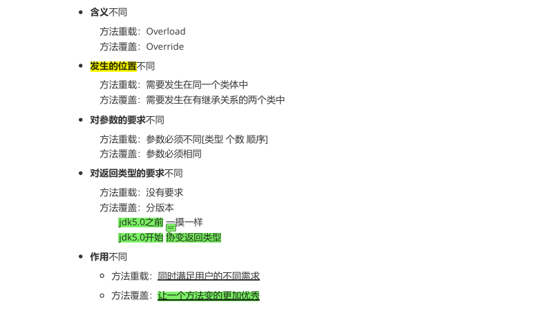

[TOC]

# 常问经典面试题JAVA

### 方法重载和方法覆盖之间的区别



> 协变返回类型：父类返回类型的子类

### 访问权限修饰符


### 抽象类和接口之间的区别


### ArrayList和LinkedList之间的区别


**什么时候用 ArrayList？**

- <font tiltle="green">适合场景</font>

  - 频繁读、很少写的场景，例如：

  - **随机访问元素**（比如根据索引访问）。
  - 数据操作主要集中在列表的末尾（**尾部插入或删除操作**）。

- <font title="blue">典型场景</font>

  - <u>缓存数据。</u>
  - <u>存储查询结果集。</u>

**什么时候用 LinkedList？**

- <font tiltle="green">适合场景</font>

  - 频繁写、很少读的场景，例如：

  - **需要频繁插入或删除元素**，特别是操作链表的头尾时。
  - **不需要随机访问**，只需要按顺序遍历。

- <font title="blue">典型场景</font>

  - <u>队列、栈的实现。</u>
  - <u>存储实时更新的动态数据。</u>

### HashMap在jdk7.0前后底层变化


**HashMap核心实现机制**

- **哈希冲突解决**：采用链表 + 红黑树。
- **扩容机制**：当负载因子超出阈值时，`HashMap` 会进行 **2 倍扩容**。

**<font title="green">ConcurrentHashMap 的详细解析</font>**

**ConcurrentHashMap** 是线程安全的哈希表实现，专为高并发设计，支持无锁或低锁的高效并发访问。

**特性**

- **线程安全**：支持多线程环境。
- **不支持 null 键和值**：插入 `null` 会抛出异常。
- **分段锁 + CAS 机制**：提供更高的并发性能。
- **存储无序**：数据存储顺序与插入顺序无关。

**核心实现机制**

- **分段锁（JDK 7）**：将数据分为若干段，每段独立加锁。
- CAS + synchronized（JDK 8）
  - CAS 处理简单更新操作。
  - synchronized 处理复杂操作（如扩容）。

### TreeMap原理


### 常用线程池


### 数据库事务(特性、隔离问题、隔离级别)


### MySQL索引失效


**遵循最左前缀原则**：
对于复合索引，查询条件必须从索引的最左列开始，否则索引可能失效。

例如，索引是`(a, b, c)`，查询条件必须包含`a`，才能有效使用索引。

🛠️ **如何排查索引效果？**

使用 `EXPLAIN` 命令来查看 MySQL 的执行计划，它能够展示 MySQL 是否使用了索引。

你可以在查询语句前加上 `EXPLAIN` 来查看具体的执行计划，例如：

```
EXPLAIN SELECT * FROM products WHERE price = 100;
```

通过 `EXPLAIN` 的输出，观察以下几个关键字段：

- **type**（访问类型）：显示查询使用的访问方法。如果是 `ALL`，说明是**全表扫描**；如果是 `index` 或 `range`，表示**使用了索引**。
- **key**（使用的索引）：显示使用的索引名。如果是 `NULL`，表示没有使用索引。
- **rows**（扫描的行数）：表示查询时扫描的行数，行数越少通常效率越高。

### SQL语句优化


💡**数据库结构优化**

✅ **选择合适的数据类型**

- `VARCHAR` 适用于**变长**字符串，`CHAR` 适用于**定长**数据。
- `INT` 代替 `BIGINT`，节省存储空间。
- 使用 `TINYINT` 存储布尔值，代替 `BOOLEAN`。

✅ **分库分表**

- **分库**：数据量大时，拆分数据库，减轻单库压力。
- **分表**：使用 **水平分表** 或 **垂直分表** 解决大表问题。

💡 **MySQL 大表优化策略**

当表的数据量过大（千万级以上）时，可以采用以下策略：

1. **分区表**：使用 MySQL `PARTITION` 特性，将表数据按照**时间**、**ID** 进行分区，提高查询效率。
2. **垂直拆分**：将表中访问频率较高的字段和较低的字段拆分到不同的表中，减少 I/O。
3. **冷热数据分离**：将历史数据存储到**归档表**中，提升主表查询效率。

### union和union all的区别


### Get和Post的区别


### Vue2数据劫持和数据代理


### JavaWeb请求和响应有哪几部分组成


### servlet生命周期


### 传统访问数据库方式


### Git文件在三大区域穿梭


### SpringMVC核心 组件


### SpringMVC执行流程


### 日志


### Spring AOP


🐘 1. **AOP 的核心思想**

AOP 的目标是将**横切关注点**（例如日志、事务、权限验证等）从具体的业务逻辑中抽离出来。

这样做可以<u>避免在多个地方重复相同的代码</u>，提高代码的**可维护性**和**模块化**。

你可以将这些跨多个功能模块的代码独立为“切面”（Aspect），并在特定时机将它们“织入”业务逻辑中。

🐬 2. **AOP 的关键概念**

AOP 主要包括以下几个重要概念：

- **切面（Aspect）**：切面<u>就是一个功能模块</u>，通常包含日志记录、事务管理、安全控制等功能，它将这些横切关注点从业务代码中分离出来。

  切面可以包含多个**通知（Advice）**，定义了在哪些时刻进行特定的操作。

- **连接点（Join Point）**：连接点是<u>程序执行过程中能够被切面的时机</u>。

  例如，一个方法的调用、抛出异常等。AOP 就是在这些时机点执行切面代码。

- **通知（Advice）**：通知是<u>定义在连接点上的操作</u>，也就是切面中要执行的具体功能。常见的通知类型包括：

  - **前置通知（Before）**：在方法执行前进行某些操作。
  - **后置通知（After）**：在方法执行后进行操作。
  - **环绕通知（Around）**：在方法执行前后都可以进行操作，甚至决定是否执行目标方法。
  - **异常通知（AfterThrowing）**：方法抛出异常时执行操作。
  - **返回通知（AfterReturning）**：方法正常返回时执行操作。

- **切入点（Pointcut）**：切入点是<u>定义通知何时执行的规则</u>，通常是一个表达式，指定在何种情况下应用通知。

  比如，可以通过切入点匹配某个包下的所有方法。

  ```java
  切面
  @Aspect
  public class LoggingAspect {
      @Before("execution(* com.example.service.*.*(..))")
      public void logBefore() {
          System.out.println("Logging before method execution");
      }
  }
  连接点
  @Before("execution(* com.example.service.*.*(..))")
  public void logBeforeMethod(JoinPoint joinPoint) {
      System.out.println("Method " + joinPoint.getSignature().getName() + " is being called");
  }
  切入点
  @Pointcut("execution(* com.example.service.*.*(..))")
  public void serviceMethods() {}
  ```

  

**Spring AOP**：基于<u>**代理模式**</u>，使用 JDK 动态代理或 CGLIB 生成代理类，**仅支持方法级别的切入**。

它适用于 Spring 管理的 Bean，动态织入，灵活性较高。

### Spring事务传播特性(七种)


### SpringBoot自动配置


### SpringBoot默认文件上传接口


### Quartz核心API


### RabbitMQ工作队列模式


### Redis持久化策略


🔄 **混合持久化模式：结合 RDB 和 AOF 的优点**

**什么是混合持久化？**

Redis 4.0 引入了混合持久化模式，通过将 RDB 和 AOF 结合：

1. **RDB** 保存全量数据快照。
2. **AOF** 记录 RDB 快照之后的增量操作。

混合持久化的文件格式为 AOF，**前半部分是 RDB 快照数据**，**后半部分是 AOF 日志**。

### Redis主从模式


### Redis哨兵模式


### Redis分片集群


### Dubbo


### Nacos


### SpringCloud中OpenFeign的使用


### Sentinel


### Spring Cloud Gateway


---

### --------分割---------

### **双亲委派策略**

1. **定义**：
   - 双亲委派策略是 Java 类加载器（ClassLoader）加载类的一种机制。
   - 当一个类加载器收到加载类的请求时，<span alt="wavy">它首先会委托给父类加载器去加载，只有父类加载器无法加载时，自己才会尝试加载。</span>
2. **加载顺序**：
   - **自底向上**：从子类加载器向父类加载器逐级委托。
   - **自顶向下**：从父类加载器向子类加载器逐级尝试加载。
3. **优点**：
   - **避免重复加载**：<span alt="wavy">确保一个类只会被加载一次，防止内存中出现多个相同的类。</span>
   - **安全性**：防止核心类库（如 `java.lang` 包）被篡改，确保 Java 核心 API 的稳定性。

### SQL慢查询

1. **开启慢查询日志**：通过设置`slow_query_log`和`long_query_time`参数，记录执行时间超过指定阈值的SQL语句，帮助定位慢查询。

2. **分析慢查询日志**：使用`mysqldumpslow`或`pt-query-digest`等工具分析日志，找出最耗时的查询。

3. **使用EXPLAIN**：通过`EXPLAIN`命令分析查询的执行计划，

   查看是否使用了索引、扫描行数等信息，判断是否存在性能瓶颈。

   **重要字段解析：**

   - **`type`**：访问类型，性能从高到低依次为：`ALL`（**全表扫描**）> `index`（索引扫描）> `range`（索引范围扫描）> `ref`（非唯一索引扫描）> `eq_ref`（唯一索引扫描）。
   - **`key`**：显示使用的索引名。如果是 `NULL`，表示没有使用索引。
   - **`rows`**：表示查询时扫描的行数，行数越少通常效率越高。

4. **优化查询**：

   - **添加索引**：确保查询条件中的字段有合适的索引，尤其是WHERE、JOIN、ORDER BY等子句中的字段。
   - **重写查询**：简化复杂查询，避免子查询、嵌套查询，或使用JOIN替代。
   - **避免全表扫描**：确保查询条件能够有效利用索引，减少全表扫描。

5. **优化表结构**：

   - **规范化与反规范化**：根据业务需求，适当进行规范化或反规范化设计。
   - **分区表**：对大表进行分区，提升查询性能。

### MySQL中你都知道哪些索引

1. **B+树索引**：
   - 最常见的索引类型，适用于等值查询、范围查询和排序操作。
   - InnoDB和MyISAM存储引擎默认使用B+树索引。
2. **全文索引**：
   - 用于全文搜索，支持对文本内容进行关键词检索。
   - 适用于`MATCH AGAINST`操作，常用于大段文本的搜索。
3. **空间索引（R树索引）**：
   - 用于地理空间数据（如经纬度），支持空间查询（如距离、范围等）。
   - 使用R树实现，适用于GIS数据类型。
4. **前缀索引**：
   - 对字符串列的前缀部分建立索引，节省存储空间。
   - 适用于较长的字符串列，但可能会影响查询精度。
5. **组合索引（复合索引）**：
   - 对多个列组合建立索引，遵循最左前缀原则。
   - 适合多条件查询，但需要注意列的顺序。
6. **唯一索引**：
   - 确保索引列的值唯一，常用于主键或唯一约束。
   - 可以加速查询并保证数据唯一性。
7. **主键索引**：
   - 特殊的唯一索引，不允许NULL值。
   - 每个表只能有一个主键索引，通常与聚簇索引结合使用。

### MySQL InnoDB引擎中**聚簇索引**与**非聚簇索引**的区别

在 MySQL 的 **InnoDB** 引擎中，**聚簇索引**和**非聚簇索引**的区别在于数据存储方式：

- **聚簇索引**：数据直接存储在索引结构中，查询时可以更快获取数据。
- **非聚簇索引**：只存储索引列和主键值，需要通过主键再查一次数据，所以速度稍慢。

每个表只能有一个 **聚簇索引**，但可以有多个 **非聚簇索引**。

### 什么OOP(面向对象编程)

OOP（Object-Oriented Programming，面向对象编程）是一种编程范式，通过**对象**来组织代码和数据。

它的核心思想是将现实世界的事物抽象为程序中的对象，对象包含**属性**（数据）和**行为**（方法）。

OOP的四大特性是：

1. **封装（Encapsulation）**：
   将数据和方法封装在对象内部，隐藏实现细节，只暴露必要的接口。
2. **继承（Inheritance）**：
   子类可以继承父类的属性和方法，实现代码复用和层次化设计。
3. **多态（Polymorphism）**：
   同一个方法在不同对象中有不同的实现，分为编译时多态（重载）和运行时多态（重写）。
4. **抽象（Abstraction）**：
   通过抽象类和接口定义通用的行为和属性，隐藏复杂性。

### 如何解决OOP问题

1. **设计良好的类结构**：
   - 根据业务需求，合理设计类和对象，确保**职责单一**（单一职责原则）。
   - 使用**继承**和**多态**实现代码复用和扩展性。
2. **遵循设计原则**：
   - **SOLID原则**：
     - **S**：单一职责原则（Single Responsibility Principle）。
     - **O**：开闭原则（Open/Closed Principle）。
     - **L**：里氏替换原则（Liskov Substitution Principle）。
     - **I**：接口隔离原则（Interface Segregation Principle）。
     - **D**：依赖倒置原则（Dependency Inversion Principle）。
3. **使用设计模式**：
   - 针对常见问题，使用设计模式（如工厂模式、单例模式、观察者模式等）提供解决方案。

### Redis数据类型和使用场景

1. **String（字符串）**：
   - **作用**：存储文本、数字或二进制数据。
   - **使用场景**：
     - 缓存简单数据（如用户信息、配置项）。
     - 计数器（如文章阅读量、点赞数）。
     - 分布式锁（通过`SETNX`实现）。
2. **Hash（哈希）**：
   - **作用**：存储键值对集合，适合存储对象。
   - **使用场景**：
     - 存储对象属性（如用户信息：`name`、`age`、`email`）。
     - 分组数据（如商品分类下的商品详情）。
3. **List（列表）**：
   - **作用**：按插入顺序存储字符串元素，支持双向操作。
   - **使用场景**：
     - 消息队列（如任务队列、日志记录）。
     - 最新消息列表（如朋友圈动态、新闻推送）。
4. **Set（集合）**：
   - **作用**：存储不重复的无序字符串集合。
   - **使用场景**：
     - 去重数据（如用户标签、好友关系）。
     - 交集、并集、差集运算（如共同好友、推荐系统）。
5. **Sorted Set（有序集合）**：
   - **作用**：存储不重复的字符串集合，并按分数排序。
   - **使用场景**：
     - 排行榜（如游戏积分、热搜榜）。
     - 范围查询（如按时间范围获取数据）。
6. **Bitmap（位图）**：
   - **作用**：通过位操作存储布尔值。
   - **使用场景**：
     - 用户签到、活跃度统计。
     - 布隆过滤器（用于去重）。

### 程序运行过程中偶尔出现SQL连接超时，过一会又正常

<font title="green">可能的原因：</font>

1. **数据库连接池问题**：
   - 连接池中的连接被耗尽，导致新请求无法获取连接。
   - 连接池配置不合理（如最大连接数过小）。
2. **数据库性能瓶颈**：
   - 数据库负载过高，导致响应变慢。
   - SQL查询性能差，执行时间过长。
3. **网络问题**：
   - 网络不稳定，导致连接超时。
   - 数据库服务器与应用程序之间的网络延迟较高。
4. **数据库连接泄漏**：
   - 程序中未正确关闭数据库连接，导致连接池中的连接被耗尽。
5. **数据库配置问题**：
   - 数据库的连接超时时间设置过短。
   - 数据库的最大连接数限制过低。

<font title="green">解决方法：</font>

1. **优化连接池配置**：
   - <span alt="wavy">增加连接池的最大连接数</span>（如`maxActive`）。
   - <span alt="wavy">设置合理的连接超时时间</span>（如`maxWait`）。
   - 使用连接池的健康检查机制，定期检测连接的有效性。
2. **优化数据库性能**：
   - 分析慢查询日志，优化SQL语句。
   - 添加索引，减少全表扫描。
   - 对数据库进行分库分表，减轻单库压力。
3. **检查网络状况**：
   - 确保数据库服务器与应用程序之间的网络稳定。
   - <span alt="wavy">使用网络监控工具排查网络延迟或丢包问题</span>。
4. **修复连接泄漏**：
   - 确保每次使用完数据库连接后，正确关闭连接（如使用`try-with-resources`或`finally`块）。
   - <span alt="wavy">使用连接池的泄漏检测功能</span>（如Druid的`removeAbandoned`）。
5. **调整数据库配置**：
   - 增加数据库的最大连接数。
   - 调整数据库的连接超时时间（如`wait_timeout`、`interactive_timeout`）。
6. **监控与报警**：
   - 使用监控工具（如Prometheus、Grafana）实时监控数据库和连接池的状态。
   - 设置报警规则，及时发现和处理问题。

### 内存泄漏

<font title="green">什么是内存泄露？</font>

内存泄露是指**程序中已分配的内存未能被正确释放，导致内存占用持续增加，最终可能引发`OutOfMemoryError`**。

在Java中，虽然垃圾回收器（GC）会自动回收无用对象，但如果对象被无意中持有引用，GC无法回收这些对象，就会导致内存泄露。

------

<font title="green">内存泄露的常见原因：</font>

1. **静态集合类**：
   - 静态集合（如`static List`、`static Map`）持有对象的引用，导致对象无法被回收。
2. **未关闭的资源**：
   - 未关闭的文件流、数据库连接、网络连接等，导致资源占用无法释放。
3. **监听器和回调**：
   - 注册了监听器或回调但未取消注册，导致对象无法被回收。
4. **内部类持有外部类引用**：
   - **非静态内部类**隐式持有外部类的引用，如果内部类对象未释放，外部类对象也无法被回收。
5. **缓存未清理**：
   - 缓存中的对象长期未被使用，但未及时清理，导致内存占用增加。

------

<font title="green">如何检测内存泄露？</font>

1. **使用工具分析**：
   - **JVisualVM**：监控堆内存使用情况，分析对象占用。
   - **MAT（Memory Analyzer Tool）**：分析堆转储文件（Heap Dump），找出内存泄露的根源。
   - **JProfiler**：实时监控内存使用，定位泄露点。
2. **查看GC日志**：
   - 启用GC日志（如`-Xloggc:gc.log`），分析内存回收情况。
3. **堆转储分析**：
   - 使用`jmap`生成堆转储文件（如`jmap -dump:format=b,file=heap.bin <pid>`），然后用工具分析。

------

<font title="green">如何解决内存泄露？</font>

1. **及时释放资源**：
   - 使用`try-with-resources`或`finally`块确保资源（如文件流、数据库连接）被正确关闭。
2. **避免静态集合类滥用**：
   - 使用弱引用（`WeakReference`）或软引用（`SoftReference`）来存储对象。
   - 定期清理不再使用的对象。
3. **取消监听器和回调**：
   - 在对象销毁时，取消注册监听器或回调。
4. **使用合适的缓存策略**：
   - 使用LRU（**最近最少使用**）等缓存淘汰策略，定期清理缓存。
   - 使用`WeakHashMap`或第三方缓存库（如Guava Cache、Ehcache）。
5. **优化代码设计**：
   - 避免非静态内部类隐式持有外部类引用，改用**静态内部类**或**弱引用**。

### 微服务Gateway网关作用

<font title="green">Spring Cloud Gateway的作用：</font>

Spring Cloud Gateway是Spring Cloud生态系统中的API网关，

主要用于**统一管理微服务架构中的请求路由、过滤和负载均衡**。

它的核心作用包括：

1. **请求路由**：
   - 根据请求路径、请求头、请求参数等条件，<u>将请求转发到对应的微服务</u>。
   - 支持动态路由配置，无需重启服务即可更新路由规则。
2. **负载均衡**：
   - 集成Ribbon或Spring Cloud LoadBalancer，实现客户端负载均衡。
   - 将请求分发到多个服务实例，提高系统的可用性和性能。
3. **请求过滤**：
   - 提供全局过滤器（Global Filter）和网关过滤器（Gateway Filter），用于在请求转发前后执行逻辑（如鉴权、日志记录、限流等）。
   - 支持自定义过滤器，满足特定业务需求。
4. **限流与熔断**：
   - 集成Resilience4j或Hystrix，实现限流和熔断功能，保护后端服务不被过载请求击垮。
5. **安全控制**：
   - 支持OAuth2、JWT等认证机制，统一管理微服务的访问权限。
   - 提供IP黑白名单、跨域（CORS）支持等功能。
6. **日志与监控**：
   - 记录请求和响应的日志，便于问题排查和性能分析。
   - 集成Micrometer，支持Prometheus等监控工具。
7. **协议转换**：
   - 支持HTTP、WebSocket等协议的转换和适配。

------

<font title="green">核心组件：</font>

1. **Route（路由）**：定义请求的转发规则，包括目标URI、断言和过滤器。
2. **Predicate（断言）**：匹配请求的条件（如路径、请求头、请求方法等）。
3. **Filter（过滤器）**：在请求转发前后执行逻辑（如修改请求头、添加参数等）。

------

<font title="green">使用场景：</font>

1. **微服务入口**：作为所有微服务的统一入口，对外隐藏内部服务细节。
2. **权限校验**：在网关层统一进行身份认证和权限校验。
3. **流量控制**：通过限流和熔断保护后端服务。
4. **日志记录**：集中记录请求和响应日志，便于监控和分析。
5. **跨域支持**：统一处理跨域请求，避免每个服务单独配置。

------

<font title="green">示例配置：</font>

```yaml
spring:
  cloud:
    gateway:
      routes:
        - id: user-service
          uri: lb://user-service
          predicates:
            - Path=/user/**
          filters:
            - AddRequestHeader=X-Request-Id, 12345
```

总结：Spring Cloud Gateway作为微服务架构中的API网关，

核心作用是**请求路由、负载均衡、请求过滤、限流熔断、安全控制**等。它简化了微服务架构的复杂性，提升了系统的可维护性和安全性。

### Java中的缓存

<font title="green">什么是缓存？</font>

缓存是一种**临时存储机制**，用于保存频繁访问的数据，以减少对**慢速存储**（如数据库、文件系统）的访问，从而提高系统性能。

------

<font title="green">Java中缓存的实现方式：</font>

1. **本地缓存**：
   - **HashMap**：最简单的缓存实现，但缺乏过期策略和容量限制。
   - **Guava Cache**：Google提供的缓存库，支持过期时间、最大容量、缓存淘汰策略（如LRU）。
   - **Caffeine**：高性能缓存库，功能类似Guava Cache，但性能更好。
   - **Ehcache**：**成熟的本地缓存框架**，支持分布式缓存。
2. **分布式缓存**：
   - **Redis**：基于内存的键值存储，支持多种数据结构（如String、Hash、List等），常用于分布式缓存。
   - **Memcached**：高性能分布式内存缓存系统，适合存储简单的键值对。
   - **Hazelcast**：分布式内存数据网格，支持分布式缓存和计算。
3. **JVM缓存**：
   - **堆内缓存**：缓存数据存储在JVM堆内存中，访问速度快，但受限于堆内存大小。
   - **堆外缓存**：缓存数据存储在JVM堆外内存中，**适合存储大量数据**（如Netty的ByteBuf）。

------

<font title="green">缓存的使用场景：</font>

1. **数据库查询缓存**：
   - 缓存频繁查询的数据库结果，减少数据库压力。
   - 例如：用户信息、商品详情。
2. **页面缓存**：
   - 缓存动态生成的页面或页面片段，减少服务器渲染开销。
   - 例如：电商网站的商品列表页。
3. **API响应缓存**：
   - 缓存API的响应结果，减少重复计算和外部服务调用。
   - 例如：天气数据、汇率信息。
4. **会话缓存**：
   - 缓存用户会话信息，减少对数据库或文件系统的访问。
   - 例如：用户登录状态、购物车数据。
5. **计算缓存**：
   - 缓存复杂计算结果，避免重复计算。
   - 例如：推荐算法结果、统计报表。

------

<font title="green">缓存的常见问题及解决方案：</font>

1. **缓存穿透**：
   - 问题：查询**不存在的数据**，导致请求直接落到数据库。
   - 解决：使用布隆过滤器（Bloom Filter）或**缓存空值**。
2. **缓存雪崩**：
   - 问题：大量缓存**同时失效**，导致数据库压力骤增。
   - 解决：设置缓存过期时间的随机值，避免同时失效。
3. **缓存击穿**：
   - 问题：**热点数据**失效后，大量请求直接落到数据库。
   - 解决：使用**互斥锁**（Mutex Lock）或**永不过期策略**。
4. **数据一致性**：
   - 问题：缓存与数据库数据不一致。
   - 解决：使用**双写策略**（先写数据库，再写缓存）或**缓存失效策略**。

------

<font title="green">示例代码（Guava Cache）：</font>

```
import com.google.common.cache.Cache;
import com.google.common.cache.CacheBuilder;

public class GuavaCacheExample {
    public static void main(String[] args) {
        // 创建缓存
        Cache<String, String> cache = CacheBuilder.newBuilder()
                .maximumSize(100) // 最大容量
                .expireAfterWrite(10, TimeUnit.MINUTES) // 过期时间
                .build();

        // 写入缓存
        cache.put("key1", "value1");

        // 读取缓存
        String value = cache.getIfPresent("key1");
        System.out.println(value); // 输出: value1
    }
}
```

总结：Java中的缓存主要用于提高系统性能，常见的实现方式包括**本地缓存**（如Guava Cache、Caffeine）和**分布式缓存**（如Redis、Memcached）。

使用缓存时需要注意<u>**缓存穿透、雪崩、击穿和数据一致性**</u>等问题。

### MySQL回表操作

<font title="green">定义</font>

**回表**是指在使用**非聚簇索引**查询时，数据库无法直接拿到所有的列数据，因为非聚簇索引只存储了索引字段和主键，而没有存储完整的行数据。

因此，在查询时，数据库需要再通过**主键**去**聚簇索引**查找完整的行数据，产生一次额外的查询操作。这个额外的查询操作就叫做“回表”。

<font title="green">优化</font>

回表不仅增加了查询的开销，还可能引发**随机 I/O**，影响性能。

通过合理的查询优化、索引设计和覆盖索引，我们可以有效减少回表操作，提高查询效率。

### MySQL中水平分表和垂直分表

<font title="green">水平分表：</font>

1. **定义**：
   - 水平分表是指**将一张表的数据按行拆分，存储到多个结构相同的表中**。
   - 每个表存储一部分数据，所有表的表结构相同。
2. **实现方式**：
   - 按某个规则（如ID范围、哈希值、时间范围）将数据分散到多个表中。
   - 例如：用户表按用户ID的哈希值分表，分成`user_0`、`user_1`、`user_2`等。
3. **使用场景**：
   - 单表数据量过大，导致查询和写入性能下降。
   - 需要分散数据存储压力，提高系统扩展性。
4. **优点**：
   - 分散单表数据量，提升查询和写入性能。
   - 支持水平扩展，适合大数据量场景。
5. **缺点**：
   - 查询时需要跨多个表，复杂度增加。
   - 数据迁移和扩容较复杂。

<font title="green">垂直分表：</font>

1. **定义**：
   - 垂直分表是指**将一张表按列拆分，存储到多个表中**。
   - 每个表存储一部分列，所有表通过主键关联。
2. **实现方式**：
   - 将**常用列**和**不常用列**分开存储。
   - 例如：用户表拆分为`user_basic`（存储用户名、密码）和`user_detail`（存储地址、电话）。
3. **使用场景**：
   - 表中包含大量不常用字段，导致单行数据过大。
   - 需要优化查询性能，减少I/O开销。
4. **优点**：
   - 减少单行数据大小，提升查询效率。
   - 按需加载数据，减少资源浪费。
5. **缺点**：
   - 查询时需要关联多个表，增加复杂度。
   - 事务一致性维护较复杂。

### 过滤器和拦截器区别

| **特性**     | **过滤器（Filter）**             | **拦截器（Interceptor）**    |
| :----------- | :------------------------------- | :--------------------------- |
| **规范**     | Servlet规范                      | Spring框架                   |
| **工作范围** | 所有请求（包括静态资源）         | 仅Controller请求             |
| **实现方式** | 实现`javax.servlet.Filter`接口   | 实现`HandlerInterceptor`接口 |
| **执行时机** | 在Servlet之前或之后执行          | 在Controller方法执行前后执行 |
| **依赖**     | 依赖Servlet容器（如Tomcat）      | 依赖Spring容器               |
| **使用场景** | 字符编码、全局权限校验、日志记录 | 登录验证、权限检查、性能监控 |

<font title="green">总结：</font>

- **过滤器**：基于Servlet规范，<u>拦截所有请求</u>，适合**全局处理**（如字符编码、权限校验）。
- **拦截器**：基于Spring框架，<u>仅拦截Controller请求</u>，适合**业务逻辑处理**（如登录验证、性能监控）。

### Java中大文件上下传

<font title="green">大文件上传：</font>

1. **分片上传**：
   - 将大文件分割成多个小文件（分片），逐个上传到服务器。
   - 服务器接收分片后，按顺序合并成完整文件。
   - **优点**：支持断点续传、减少单次上传压力。
2. **断点续传**：
   - 记录已上传的分片信息，上传中断后可以从断点继续上传。
   - 使用**文件MD5**或**唯一标识**校验文件完整性。
3. **使用流式上传**：
   - 使用`InputStream`读取文件，通过HTTP或FTP等协议流式上传。
   - 避免将整个文件加载到内存，减少内存占用。
4. **多线程上传**：
   - 使用多线程同时上传多个分片，提高上传速度。

<font title="green">大文件下载：</font>

1. **分块下载**：
   - 将大文件分成多个块，客户端逐个下载并合并。
   - 使用HTTP的`Range`头实现分块下载。
2. **断点续传**：
   - 记录已下载的文件大小，下载中断后可以从断点继续下载。
3. **使用流式下载**：
   - 使用`OutputStream`将文件流式写入本地，避免一次性加载到内存。
4. **多线程下载**：
   - 使用多线程同时下载文件的不同部分，提高下载速度。

### 反射机制核心类

Java反射机制的核心类位于`java.lang.reflect`包中，主要包括以下几个类：

1. **`Class`**：
   - 表示一个类或接口的类型信息。
   - 通过`Class`对象可以获取类的构造方法、方法、字段等信息。
   - 获取`Class`对象的方式：
     - `Class.forName("全限定类名")`。
     - `对象.getClass()`。
     - `类名.class`。
2. **`Constructor`**：
   - 表示类的构造方法。
   - 通过`Constructor`对象可以创建类的实例。
   - 示例：`Class.getDeclaredConstructor(参数类型)`。
3. **`Method`**：
   - 表示类的方法。
   - 通过`Method`对象可以调用类的方法。
   - 示例：`Class.getDeclaredMethod("方法名", 参数类型)`。
4. **`Field`**：
   - 表示类的字段（成员变量）。
   - 通过`Field`对象可以获取或设置字段的值。
   - 示例：`Class.getDeclaredField("字段名")`。
5. **`Modifier`**：
   - 提供对类、方法、字段的修饰符（如`public`、`private`、`static`等）的解析。
   - 示例：`Modifier.isPublic(method.getModifiers())`。
6. **`Array`**：
   - 提供动态创建和操作数组的方法。
   - 示例：`Array.newInstance(Class<?> componentType, int length)`。

<font title="green">反射的基本使用步骤：</font>

1. 获取`Class`对象。
2. 通过`Class`对象获取`Constructor`、`Method`、`Field`等对象。
3. 设置访问权限（如`setAccessible(true)`）。
4. 调用方法或操作字段。

<font title="green">反射的应用场景：</font>

1. **动态加载类**：在运行时加载类并创建对象。
2. **框架开发**：如Spring通过反射创建Bean并注入依赖。
3. **注解处理**：通过反射读取注解信息。
4. **测试工具**：如JUnit通过反射调用测试方法。
5. **通用工具**：如序列化、反序列化工具。

<font title="green">总结：</font>

- 反射机制的核心类包括`Class`、`Constructor`、`Method`、`Field`、`Modifier`和`Array`。
- 反射的主要作用是动态获取类的信息并操作类的成员，常用于框架开发、注解处理等场景。

### Java创建对象的方式

<font title="green">Java中创建对象的五种方式：</font>

1. **使用`new`关键字**：

   - 最常见的方式，直接调用类的构造方法创建对象。

     ```
     User user = new User();
     ```

2. **使用`Class.newInstance()`**：

   - 通过反射调用类的**无参构造方法**创建对象。

     ```
     Class<?> clazz = Class.forName("com.example.User");
     User user = (User) clazz.newInstance();
     ```

3. **使用`Constructor.newInstance()`**：

   - 通过反射调用类的**带参构造方法**创建对象。

     ```
     Class<?> clazz = Class.forName("com.example.User");
     Constructor<?> constructor = clazz.getConstructor(String.class, int.class);
     User user = (User) constructor.newInstance("Alice", 25);
     ```

4. **使用`clone()`方法**：

   - 通过实现`Cloneable`接口并重写`clone()`方法**创建对象的副本**。

     ```
     class User implements Cloneable {
         private String name;
         public User(String name) {
             this.name = name;
         }
         @Override
         protected Object clone() throws CloneNotSupportedException {
             return super.clone();
         }
     }
     
     User user1 = new User("Alice");
     User user2 = (User) user1.clone();
     ```

5. **使用反序列化**：

   - 通过`ObjectInputStream`从文件或网络中**读取字节流并反序列化为对象**。

     ```
     class User implements Serializable {
         private String name;
         public User(String name) {
             this.name = name;
         }
     }
     
     // 序列化
     try (ObjectOutputStream oos = new ObjectOutputStream(new FileOutputStream("user.ser"))) {
         oos.writeObject(new User("Alice"));
     }
     
     // 反序列化
     try (ObjectInputStream ois = new ObjectInputStream(new FileInputStream("user.ser"))) {
         User user = (User) ois.readObject();
     }
     ```

------

<font title="green">其他创建对象的方式：</font>

1. **工厂模式**：

   - 通过工厂类创建对象，隐藏对象创建的细节。

     ```
     class UserFactory {
         public static User createUser() {
             return new User();
         }
     }
     
     User user = UserFactory.createUser();
     ```

2. **依赖注入（DI）**：

   - 通过Spring等框架的**依赖注入机制**创建对象。

     ```
     @Autowired
     private User user;
     ```

3. **Lambda表达式**：

   - 通过函数式接口创建对象。

     ```
     Runnable runnable = () -> System.out.println("Hello");
     ```

------

<font title="green">总结：</font>

Java中创建对象的方式主要有：

1. `new`关键字。
2. `Class.newInstance()`。
3. `Constructor.newInstance()`。
4. `clone()`方法。
5. 反序列化。

此外，还可以通过**工厂模式**、**依赖注入**、**Lambda表达式**等方式创建对象。每种方式适用于不同的场景，选择合适的创建方式可以提高代码的灵活性和可维护性。

### 线程池的创建和使用方式

<font title="green">线程池的创建：</font>

Java中通过`java.util.concurrent.Executors`**工具类**或直接使用`ThreadPoolExecutor`**类**创建线程池。

1. **使用`Executors`工具类**：

`Executors`提供了几种常见的线程池创建方法：

- **`newFixedThreadPool`**：

  - 创建**固定大小**的线程池。

    ```
    ExecutorService executor = Executors.newFixedThreadPool(5);
    ```

- **`newCachedThreadPool`**：

  - 创建可缓存的线程池，**线程数根据任务数量动态调整**。

    ```
    ExecutorService executor = Executors.newCachedThreadPool();
    ```

- **`newSingleThreadExecutor`**：

  - 创建单线程的线程池，**保证任务按顺序执行**。

    ```
    ExecutorService executor = Executors.newSingleThreadExecutor();
    ```

- **`newScheduledThreadPool`**：

  - 创建支持**定时及周期性**任务执行的线程池。

    ```
    ScheduledExecutorService executor = Executors.newScheduledThreadPool(3);
    ```

2. **使用`ThreadPoolExecutor`类**：

`ThreadPoolExecutor`提供了更灵活的线程池配置，可以自定义核心线程数、最大线程数、任务队列等参数。

```
int corePoolSize = 5; // 核心线程数
int maxPoolSize = 10; // 最大线程数
long keepAliveTime = 60; // 空闲线程存活时间
TimeUnit unit = TimeUnit.SECONDS; // 时间单位
BlockingQueue<Runnable> workQueue = new LinkedBlockingQueue<>(100); // 任务队列

ThreadPoolExecutor executor = new ThreadPoolExecutor(
    corePoolSize, maxPoolSize, keepAliveTime, unit, workQueue
);
```

<font title="green">线程池的使用：</font>

1. **提交任务**：

   - 使用`execute()`方法提交任务（**无返回值**）。

     ```
     executor.execute(() -> System.out.println("Task executed"));
     ```

   - 使用`submit()`方法提交任务（返回`Future`对象，**可获取任务执行结果**）。

     ```
     Future<String> future = executor.submit(() -> "Task result");
     String result = future.get(); // 获取任务结果
     ```

2. **关闭线程池**：

   - 使用`shutdown()`方法平滑关闭线程池（等待已提交任务执行完成）。**排队中的任务可以执行完**

     ```
     executor.shutdown();
     ```

   - 使用`shutdownNow()`方法立即关闭线程池（尝试中断正在执行的任务）。**退回排队中的任务**

     ```
     executor.shutdownNow();
     ```

3. **监控线程池状态**：

   - 通过`ThreadPoolExecutor`的方法获取线程池状态：
     - `getPoolSize()`：当前线程池中的线程数。
     - `getActiveCount()`：正在执行任务的线程数。
     - `getCompletedTaskCount()`：已完成的任务数。

<font title="green">总结：</font>

- Java中通过`Executors`工具类或`ThreadPoolExecutor`类创建线程池。
- 线程池的核心作用是复用线程、提高资源利用率和任务执行效率。
- 使用线程池时需合理配置核心参数，并根据任务类型选择合适的线程池类型。


