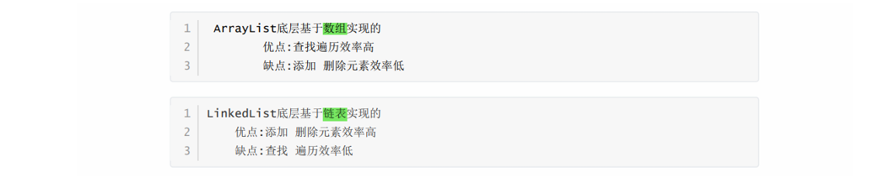

[TOC]

# 常问经典面试题JAVA

### 方法重载和方法覆盖之间的区别


> 协变返回类型：父类返回类型的子类

### 访问权限修饰符


### 抽象类和接口之间的区别


### ArrayList和LinkedList之间的区别



**什么时候用 ArrayList？**

- <font tiltle="green">适合场景</font>

  - 频繁读、很少写的场景，例如：

  - **随机访问元素**（比如根据索引访问）。
  - 数据操作主要集中在列表的末尾（**尾部插入或删除操作**）。

- <font title="blue">典型场景</font>

  - <u>缓存数据。</u>
  - <u>存储查询结果集。</u>

**什么时候用 LinkedList？**

- <font tiltle="green">适合场景</font>

  - 频繁写、很少读的场景，例如：

  - **需要频繁插入或删除元素**，特别是操作链表的头尾时。
  - **不需要随机访问**，只需要按顺序遍历。

- <font title="blue">典型场景</font>

  - <u>队列、栈的实现。</u>
  - <u>存储实时更新的动态数据。</u>

### HashMap在jdk7.0前后底层变化


**HashMap核心实现机制**

- **哈希冲突解决**：采用链表 + 红黑树。
- **扩容机制**：当负载因子超出阈值时，`HashMap` 会进行 **2 倍扩容**。

**<font title="green">ConcurrentHashMap 的详细解析</font>**

**ConcurrentHashMap** 是线程安全的哈希表实现，专为高并发设计，支持无锁或低锁的高效并发访问。

**特性**

- **线程安全**：支持多线程环境。
- **不支持 null 键和值**：插入 `null` 会抛出异常。
- **分段锁 + CAS 机制**：提供更高的并发性能。
- **存储无序**：数据存储顺序与插入顺序无关。

**核心实现机制**

- **分段锁（JDK 7）**：将数据分为若干段，每段独立加锁。
- CAS + synchronized（JDK 8）
  - CAS 处理简单更新操作。
  - synchronized 处理复杂操作（如扩容）。

### TreeMap原理


### 常用线程池


### 数据库事务(特性、隔离问题、隔离级别)


### MySQL索引失效


🛠️ **如何排查索引效果？**

使用 `EXPLAIN` 命令来查看 MySQL 的执行计划，它能够展示 MySQL 是否使用了索引。

你可以在查询语句前加上 `EXPLAIN` 来查看具体的执行计划，例如：

```
EXPLAIN SELECT * FROM products WHERE price = 100;
```

通过 `EXPLAIN` 的输出，观察以下几个关键字段：

- **type**（访问类型）：显示查询使用的访问方法。如果是 `ALL`，说明是**全表扫描**；如果是 `index` 或 `range`，表示**使用了索引**。
- **key**（使用的索引）：显示使用的索引名。如果是 `NULL`，表示没有使用索引。
- **rows**（扫描的行数）：表示查询时扫描的行数，行数越少通常效率越高。

### SQL语句优化


💡**数据库结构优化**

✅ **选择合适的数据类型**

- `VARCHAR` 适用于**变长**字符串，`CHAR` 适用于**定长**数据。
- `INT` 代替 `BIGINT`，节省存储空间。
- 使用 `TINYINT` 存储布尔值，代替 `BOOLEAN`。

✅ **分库分表**

- **分库**：数据量大时，拆分数据库，减轻单库压力。
- **分表**：使用 **水平分表** 或 **垂直分表** 解决大表问题。

💡 **MySQL 大表优化策略**

当表的数据量过大（千万级以上）时，可以采用以下策略：

1. **分区表**：使用 MySQL `PARTITION` 特性，将表数据按照**时间**、**ID** 进行分区，提高查询效率。
2. **垂直拆分**：将表中访问频率较高的字段和较低的字段拆分到不同的表中，减少 I/O。
3. **冷热数据分离**：将历史数据存储到**归档表**中，提升主表查询效率。

### union和union all的区别


### Get和Post的区别


### Vue2数据劫持和数据代理


### JavaWeb请求和响应有哪几部分组成


### servlet生命周期


### 传统访问数据库方式


### Git文件在三大区域穿梭


### SpringMVC核心 组件


### SpringMVC执行流程


### 日志


### Spring AOP


🐘 1. **AOP 的核心思想**

AOP 的目标是将**横切关注点**（例如日志、事务、权限验证等）从具体的业务逻辑中抽离出来。

这样做可以<u>避免在多个地方重复相同的代码</u>，提高代码的**可维护性**和**模块化**。

你可以将这些跨多个功能模块的代码独立为“切面”（Aspect），并在特定时机将它们“织入”业务逻辑中。

🐬 2. **AOP 的关键概念**

AOP 主要包括以下几个重要概念：

- **切面（Aspect）**：切面<u>就是一个功能模块</u>，通常包含日志记录、事务管理、安全控制等功能，它将这些横切关注点从业务代码中分离出来。

  切面可以包含多个**通知（Advice）**，定义了在哪些时刻进行特定的操作。

- **连接点（Join Point）**：连接点是<u>程序执行过程中能够被切面的时机</u>。

  例如，一个方法的调用、抛出异常等。AOP 就是在这些时机点执行切面代码。

- **通知（Advice）**：通知是<u>定义在连接点上的操作</u>，也就是切面中要执行的具体功能。常见的通知类型包括：

  - **前置通知（Before）**：在方法执行前进行某些操作。
  - **后置通知（After）**：在方法执行后进行操作。
  - **环绕通知（Around）**：在方法执行前后都可以进行操作，甚至决定是否执行目标方法。
  - **异常通知（AfterThrowing）**：方法抛出异常时执行操作。
  - **返回通知（AfterReturning）**：方法正常返回时执行操作。

- **切入点（Pointcut）**：切入点是<u>定义通知何时执行的规则</u>，通常是一个表达式，指定在何种情况下应用通知。

  比如，可以通过切入点匹配某个包下的所有方法。

  ```java
  切面
  @Aspect
  public class LoggingAspect {
      @Before("execution(* com.example.service.*.*(..))")
      public void logBefore() {
          System.out.println("Logging before method execution");
      }
  }
  连接点
  @Before("execution(* com.example.service.*.*(..))")
  public void logBeforeMethod(JoinPoint joinPoint) {
      System.out.println("Method " + joinPoint.getSignature().getName() + " is being called");
  }
  切入点
  @Pointcut("execution(* com.example.service.*.*(..))")
  public void serviceMethods() {}
  ```

  

**Spring AOP**：基于<u>**代理模式**</u>，使用 JDK 动态代理或 CGLIB 生成代理类，**仅支持方法级别的切入**。

它适用于 Spring 管理的 Bean，动态织入，灵活性较高。

### Spring事务传播特性(七种)


### SpringBoot自动配置


### SpringBoot默认文件上传接口


### Quartz核心API


### RabbitMQ工作队列模式


### Redis持久化策略


🔄 **混合持久化模式：结合 RDB 和 AOF 的优点**

**什么是混合持久化？**

Redis 4.0 引入了混合持久化模式，通过将 RDB 和 AOF 结合：

1. **RDB** 保存全量数据快照。
2. **AOF** 记录 RDB 快照之后的增量操作。

混合持久化的文件格式为 AOF，**前半部分是 RDB 快照数据**，**后半部分是 AOF 日志**。

### Redis主从模式


### Redis哨兵模式


### Redis分片集群


### Dubbo


### Nacos


### SpringCloud中OpenFeign的使用


### Sentinel


### Spring Cloud Gateway


