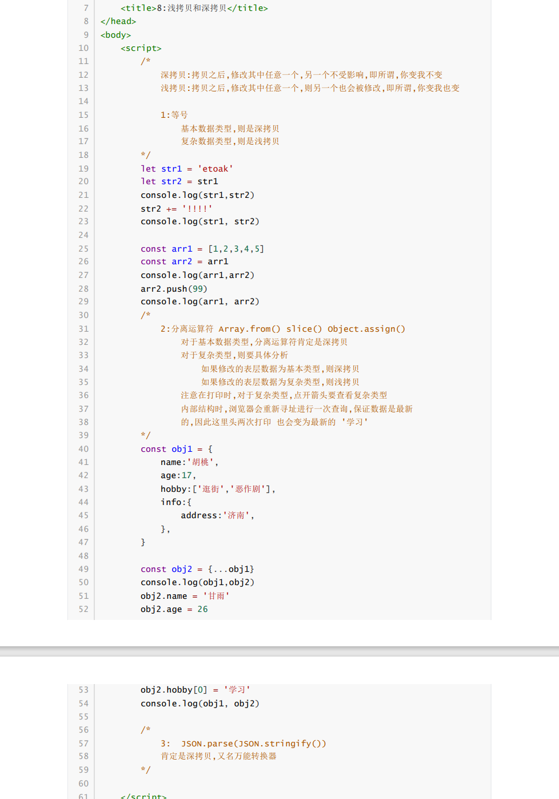

## Java面试题笔记

---


| Author   | CreateTime | Contact information |
| :------- | :--------- | :------------------ |
| Lushisan | 2024-06-19 | 2548316766@qq.com   |


---


### Review进度

```tex
Month1.pdf 已看完2024/06/21
Month2.pdf 已看完2024/06/26
Month2_db.pdf 已看完2024/06/28
Month3.pdf p59

```


---


### Month1.pdf

#### String类型常见面试题？


#### 方法重载和方法覆盖之间的区别？


#### String和StringBuffer/StringBuilder之间的区别？


#### 访问权限修饰符


#### static修饰符


#### final和abstract能不能同时修饰一个方法？


#### ==和equals之间的区别？


#### 抽象类和接口之间的区别？


#### CME异常


#### Collections：单值集合的工具类


#### ArrayList和LinkedList之间的区别？


#### ArrayList和Vector之间的区别？


#### 单值集合方法的底层流程？


#### 分别写出ArrayList HashSet TreeSet构造方法的参数分别可以传什么？


#### Map集合


#### TreeMap（原理）


#### Optional类型


#### Stream类


#### LocalDateTime类


#### 枚举：enum


#### 注解：@interface


---

### Month2.pdf

#### 内部类


#### 异常


#### throw和throws的区别


#### 线程


#### 线程池


#### 文件流


#### IO流


#### IO流核心


#### URL


#### IO流总结问题


### Month2_db.pdf

#### Oracle


#### 事务


#### 锁


#### 函数


#### 复制表


#### 连表查询


#### 视图


#### 索引


#### sql语句优化


#### MySQL


#### Oracle和MySQL


#### 常见面试题


#### Oracle优缺点


#### MySQL优缺点


#### 介绍一下你经常使用的时间函数


#### 分表知道吗


#### MySQL中如果数据量很大怎么解决


#### MySQL存储引擎


#### InnoDb逻辑存储结构


#### 加锁机制


### Month3.pdf

#### 表单提交时get和post的区别


#### flex弹性盒子


#### js能够直接修改页面的结构和样式吗？如果不能为什么？


#### var为什么别let和const取代了？


#### 字符串函数


#### 数组


#### let const


#### 分离运算符


#### 深拷贝和浅拷贝



#### jQuery和js的元素节点是同一种元素吗？如果不是为什么？两者如何进行转换？


#### js中Function是否肯定存在返回值？


#### CssFlex弹性盒子flex:1是什么意思？


