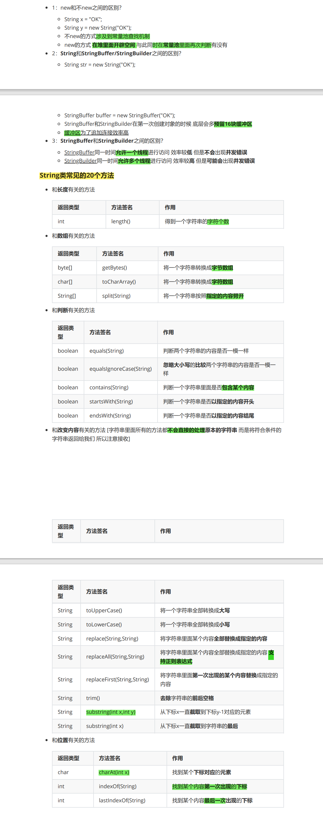

## Java面试题笔记

---


| Author   | CreateTime | Contact information |
| :------- | :--------- | :------------------ |
| Lushisan | 2024-06-19 | 2548316766@qq.com   |


---


### Review进度

```tex
Month1.pdf 已看完2024/06/21
Month2.pdf p22 线程池

```


---


### Month1.pdf

#### String类型常见面试题？



#### 方法重载和方法覆盖之间的区别？


#### String和StringBuffer/StringBuilder之间的区别？


#### 访问权限修饰符


#### static修饰符


#### final和abstract能不能同时修饰一个方法？


#### ==和equals之间的区别？


#### 抽象类和接口之间的区别？


#### CME异常


#### Collections：单值集合的工具类


#### ArrayList和LinkedList之间的区别？


#### ArrayList和Vector之间的区别？


#### 单值集合方法的底层流程？


#### 分别写出ArrayList HashSet TreeSet构造方法的参数分别可以传什么？


#### Map集合


#### TreeMap（原理）


#### Optional类型


#### Stream类


#### LocalDateTime类


#### 枚举：enum


#### 注解：@interface


---

### Month2.pdf


