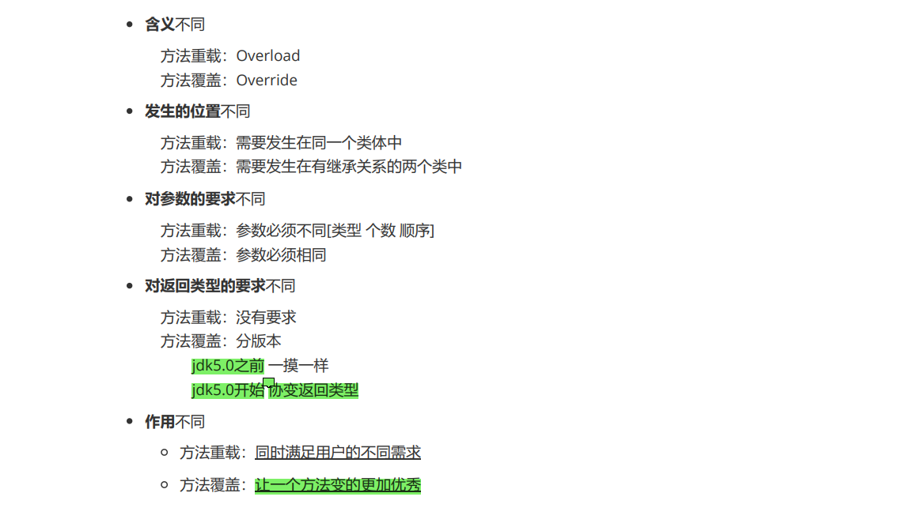
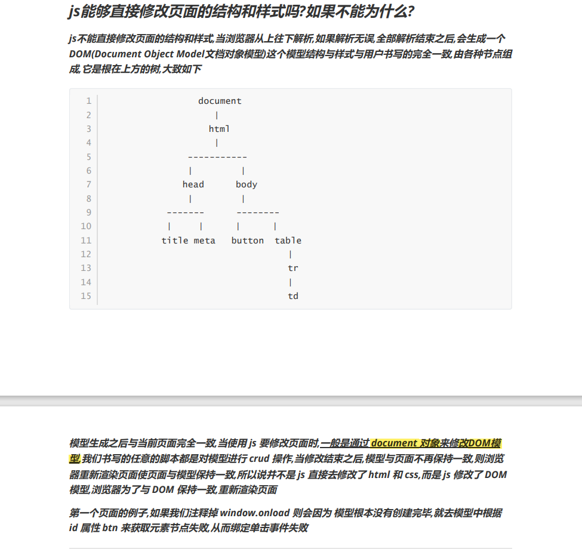
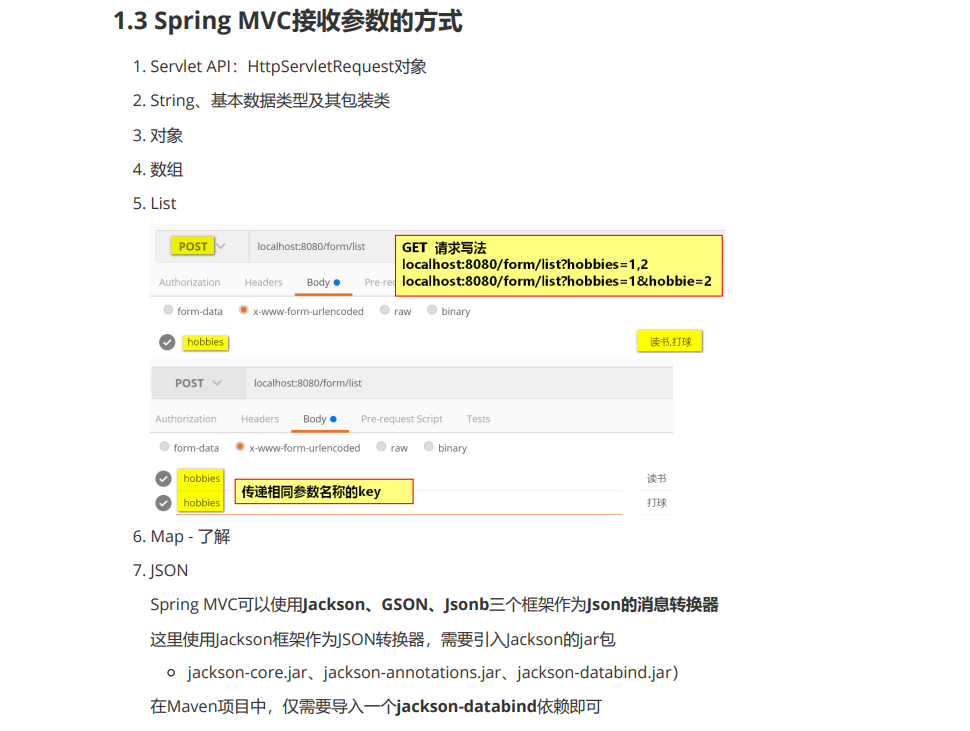
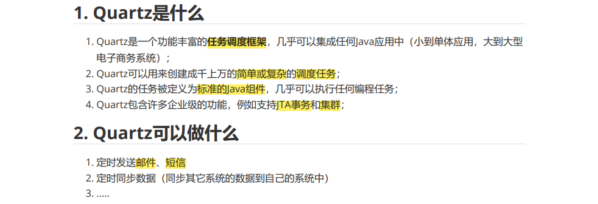
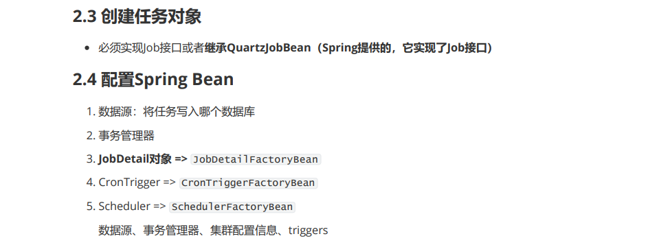
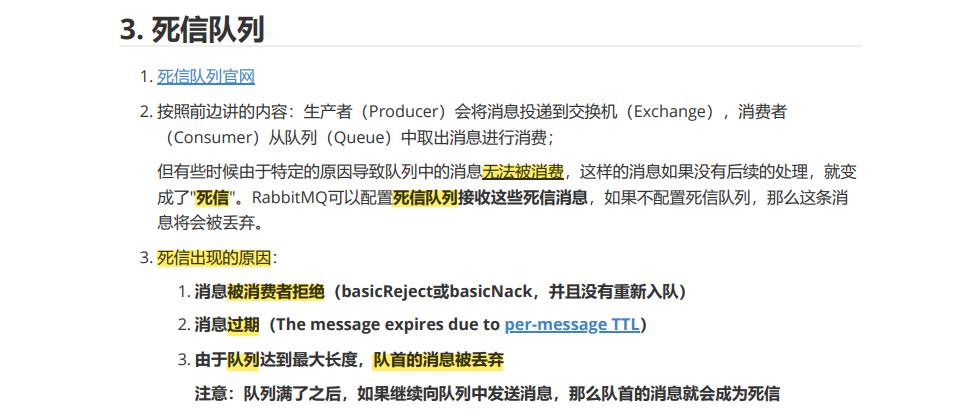
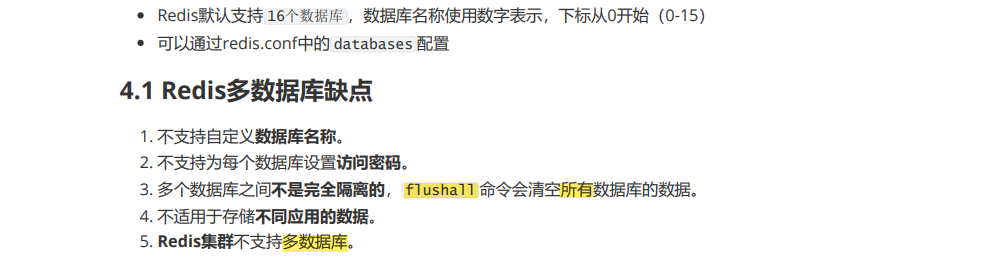
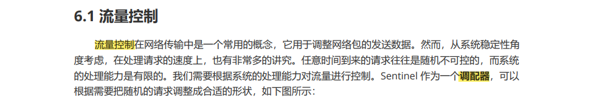

## Java面试题笔记

---


| Author   | CreateTime | Contact information |
| :------- | :--------- | :------------------ |
| Lushisan | 2024-06-19 | 2548316766@qq.com   |


---


### Review进度

```tex
Month1.pdf 已看完2024/06/21
Month2.pdf 已看完2024/06/26
Month2_db.pdf 已看完2024/06/28
Month3.pdf 已看完2024/07/04
Month04.pdf 已看完2024/07/05
Month05.pdf 已看完2024/07/09


```


---


### Month1.pdf

#### String类型常见面试题？


#### 方法重载和方法覆盖之间的区别？



#### String和StringBuffer/StringBuilder之间的区别？


#### 访问权限修饰符


#### static修饰符


#### final和abstract能不能同时修饰一个方法？


#### ==和equals之间的区别？


#### 抽象类和接口之间的区别？


#### CME异常


#### Collections：单值集合的工具类


#### ArrayList和LinkedList之间的区别？


#### ArrayList和Vector之间的区别？


#### 单值集合方法的底层流程？


#### 分别写出ArrayList HashSet TreeSet构造方法的参数分别可以传什么？


#### Map集合


#### TreeMap（原理）


#### Optional类型


#### Stream类


#### LocalDateTime类


#### 枚举：enum


#### 注解：@interface


---

### Month2.pdf

#### 内部类


#### 异常


#### throw和throws的区别


#### 线程


#### 线程池


#### 文件流


#### IO流


#### IO流核心


#### URL


#### IO流总结问题


### Month2_db.pdf

#### Oracle


#### 事务


#### 锁


#### 函数


#### 复制表


#### 连表查询


#### 视图


#### 索引


#### sql语句优化


#### MySQL


#### Oracle和MySQL


#### 常见面试题


#### Oracle优缺点


#### MySQL优缺点


#### 介绍一下你经常使用的时间函数


#### 分表知道吗


#### MySQL中如果数据量很大怎么解决


#### MySQL存储引擎


#### InnoDb逻辑存储结构


#### 加锁机制


### Month3.pdf

#### 表单提交时get和post的区别


#### flex弹性盒子


#### js能够直接修改页面的结构和样式吗？如果不能为什么？



#### var为什么别let和const取代了？


#### 字符串函数


#### 数组


#### let const


#### 分离运算符


#### 深拷贝和浅拷贝


#### jQuery和js的元素节点是同一种元素吗？如果不是为什么？两者如何进行转换？


#### js中Function是否肯定存在返回值？


#### CssFlex弹性盒子flex:1是什么意思？


#### 理解JSON如何进行转换？


#### vue的工作原理简化版


#### 什么是单向绑定？什么是双向绑定？


#### Vue2如何进行样式渲染？


#### 说明 函数 计算属性 侦听器的不同和使用场所？


#### Vue2条件渲染的方式？


#### 如何使用事件原型获取元素节点？


#### 简述你使用过的事件修饰符？


#### Vue如何进行列表渲染（迭代数组，迭代对象）


#### 使用过滤器应该注意什么？


#### 简述你使用过的指令元素？


#### Vue2实例对用户书写的data对象做了哪些处理？


#### 指令补遗，闪现问题


#### Vue2实现数组可响应式


#### localStorage和sessionStorage


#### Vue2如何实现对象的可响应式？如何实现数组的可响应式？


#### 如何进行组件传值？


#### Vue组件通讯规则


#### PubSubJs（任意组件传值）


#### Vue2中插槽slot的作用


#### $router与$route的不同


#### 什么是分页


#### 请简述Vue2中函数如何激发？（2种）计算属性如何激发？（1种）侦听器如何激发？（2种）


#### 在Vue中，如何获取DOM，从而操作DOM


#### 请写出VueComponent传值方式，写出关键脚本，描述作用


#### 如何进行列表渲染


#### 生命周期


#### 第三周部分考试题


### Month04.pdf

#### Servlet的生命周期


#### Statement和PreparedStatement的区别？


#### JDBC的流程


#### JavaWeb中请求和响应分别有那几部分组成并举例说明？


#### 注册Servlet对象/Filter/Listener给Tomcat的方式


#### Spring的IOC容器属性赋值的方式


#### Spring中的注解


#### SPI的简介


#### 传统的访问数据库的方式


#### Mapper方式实现Mybatis？


### Month05.pdf

#### git文件在三大区域穿梭


#### 什么是Web MVC？


#### 什么是Spring MVC？


#### Spring MVC的核心组件


#### Spring MVC执行流程


#### 第四个Spring MVC工程


#### Spring MVC参数传递-接受参数


#### Spring MVC接受参数的方式



#### 解决Post请求中文乱码问题


#### Spring容器和Spring MVC容器之间的关系

Spring 容器和 Spring MVC 容器之间存在 **包含和扩展** 的关系。
Spring 容器是整个 Spring 框架的核心，它负责管理**应用中的对象（Bean）**的<u>创建、配置和生命周期</u>。
Spring MVC 是基于 Spring 框架的一个 Web 开发框架。Spring MVC 容器是 Spring 容器的一个**扩展**。
Spring 容器负责创建和管理<u>应用中的各种服务层、数据访问层等组件的 Bean</u>。
而 Spring MVC 容器除了依赖于 Spring 容器提供的<u>基础服务</u>，还专门管理与 Web 相关的组件，如控制器（Controller）、视图解析器（View Resolver）等。

例如，在一个 Spring MVC 应用中，服务层的 Bean 可能在 Spring 容器中创建和管理，而<u>控制器</u>的 Bean 则在 Spring MVC 容器中创建和管理。

总的来说，Spring MVC 容器建立在 Spring 容器的基础之上，二者协同工作，共同构建一个完整的 Web 应用。


#### 日志


#### Spring AOP


#### Spring事务


#### 事务的隔离级别


#### 事务管理器PlatformTransactionManager


#### @Transactional注解属性说明


#### Spring事务的隔离级别


#### Spring事务传播特性（七种）


#### Spring MVC使用拦截器验证登录


#### Spring Boot是什么


#### JDK SPI和工厂加载机制


#### Spring Boot的自动配置


#### Spring Boot默认文件上传接口


#### Quartz是什么



#### Quartz的核心API


#### Quartz集群




#### 解决集群任务不能使用Spring容器中的对象的问题


#### 使用Spring Task创建定时任务


#### Spring Task（Boot）


#### Linux CentOS的目录


#### su和su - 的区别


#### Linux常用指令


#### 消息中间件


#### AMQP协议


#### RabbitMQ概述


#### RabbitMQ工作队列模式


#### 消费者确认模式（ACK模式）


#### RabbitMQ交换机


#### 死信队列




#### 延迟队列


#### Redis概况


#### Redis的多数据库特点



#### Redis常用的全局命令


#### Redis常用的五个数据类型


#### Redis的持久化策略


#### Redis的事务


#### Redis事务过程中的错误处理


#### Redis事务扩展-乐观锁


#### Redis的集群模式


#### Redis哨兵模式


#### Redis分片集群


#### Dubbo是什么


#### 分布式服务架构（RPC）


#### RPC


#### Dubbo架构


#### Dubbo控制台


#### Dubbo的注册中心有哪些


#### Dubbo服务在Zookeeper中的存储结构


#### Dubbo配置加载流程


#### 直连提供者


#### 服务分组


#### Dubbo负载均衡策略


#### Dubbo服务降级


#### Dubbo整合Spring MVC时出现的问题


#### Spring Cloud是什么


#### Spring Cloud常用组件


#### Spring Cloud Alibaba


#### Nacos概述


#### Nacos基本架构和概念


#### Spring Cloud中OpenFeign的使用


#### 动态刷新Nacos注册中心的配置项


#### Sentinel概述


#### Sentinel的组成


#### Sentinel流量控制




#### Sentinel控制台


#### Sentinel流量控制


#### Sentinel熔断降级


#### Sentinel自定义限流和降级返回结果


#### Spring Cloud Gateway网关


#### Gateway代理Spring Cloud服务


